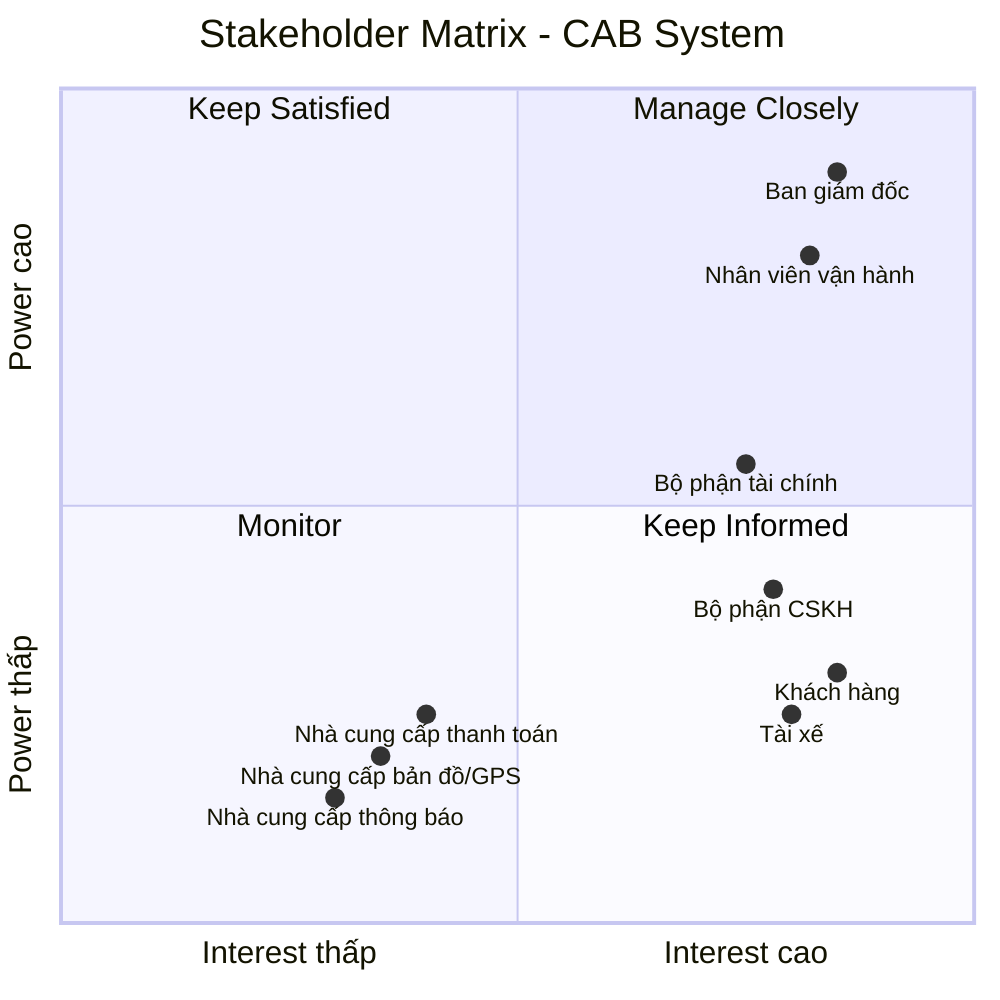

# 23634501_TranHuynhMinhNhat_Cabsystem
## Business Requirements
### Hiện tại, doanh nghiệp ABC đang cung cấp dịch vụ đặt xe nhưng hệ thống hiện có còn nhiều hạn chế. Việc phân công tài xế chủ yếu được thực hiện thủ công, gây mất thời gian, dễ xảy ra sai sót và khó xử lý khi số lượng khách hàng và tài xế tăng cao. Khách hàng khó theo dõi trạng thái chuyến đi, không biết hệ thống đang tìm tài xế, tài xế nào đã nhận chuyến hoặc chuyến đang ở trạng thái nào. Bên cạnh đó, thông tin thanh toán chưa được quản lý tập trung, gây khó khăn trong việc tra cứu và xử lý các giao dịch. Bộ phận vận hành cũng gặp khó khăn khi theo dõi các chuyến đang diễn ra, quản lý tài xế, xử lý các trường hợp chuyến bị lỗi và tổng hợp báo cáo.
### Vì vậy, doanh nghiệp có nhu cầu xây dựng một hệ thống CAB mới nhằm tự động hóa toàn bộ quy trình đặt xe, từ khi khách hàng tạo yêu cầu, hệ thống tìm và phân công tài xế, tài xế thực hiện chuyến, tính cước, thanh toán đến đánh giá sau chuyến. Hệ thống cần hỗ trợ khách hàng, tài xế và nhân viên vận hành, giúp quản lý tập trung thông tin và nâng cao hiệu quả hoạt động. Đồng thời, hệ thống phải ổn định, bảo mật, có khả năng mở rộng khi số lượng người dùng tăng và cho phép doanh nghiệp dễ dàng bổ sung các loại dịch vụ, phương thức thanh toán hoặc kênh thông báo mới trong tương lai.

## Stakeholder

| Stakeholder | Vai trò |
|---|---|
| **Ban giám đốc** | Đưa ra mục tiêu, yêu cầu kinh doanh; phê duyệt phạm vi và định hướng phát triển hệ thống; theo dõi báo cáo và hiệu quả hoạt động. |
| **Khách hàng** | Sử dụng hệ thống để đăng ký, đặt xe, theo dõi chuyến, thanh toán, xem lịch sử và đánh giá tài xế. |
| **Tài xế** | Nhận và thực hiện chuyến; cập nhật trạng thái hoạt động, thông tin phương tiện, vị trí và trạng thái chuyến đi. |
| **Nhà cung cấp thanh toán** | Xử lý thanh toán điện tử và trả kết quả giao dịch. |
| **Nhà cung cấp bản đồ/GPS** | Cung cấp vị trí, bản đồ, khoảng cách và ETA. |
| **Bộ phận CSKH** | Tiếp nhận khiếu nại, hỗ trợ khách hàng/tài xế, xử lý vấn đề chuyến đi. |
| **Nhà cung cấp thông báo** | Gửi SMS, email, push notification. |
| **Nhân viên vận hành** | Quản lý khách hàng, tài xế, phương tiện và chuyến đi; theo dõi hoạt động và xử lý các trường hợp chuyến bị lỗi. |
| **Bộ phận tài chính** | Theo dõi, kiểm tra và đối soát các giao dịch thanh toán, doanh thu từ các chuyến đi. |

## Stakeholder Matrix

Stakeholder Matrix được xây dựng dựa trên hai tiêu chí:

- **Power:** Mức độ quyền lực và khả năng ảnh hưởng đến dự án.
- **Interest:** Mức độ quan tâm và tham gia vào hệ thống CAB.


## Business Goals

| ID | Business Goal | Mô tả |
|---|---|---|
| **BG-01** | **Tự động hóa quy trình đặt xe** | Giảm việc tiếp nhận và phân công tài xế thủ công bằng cách tự động hóa quy trình đặt xe và tìm kiếm tài xế. |
| **BG-02** | **Nâng cao trải nghiệm khách hàng** | Giúp khách hàng dễ dàng đặt xe, theo dõi trạng thái chuyến, biết thông tin tài xế, thời gian dự kiến đến và đánh giá sau chuyến. |
| **BG-03** | **Tối ưu hóa việc phân công tài xế** | Tự động tìm và ưu tiên tài xế phù hợp, gần khách hàng; tiếp tục tìm tài xế khác nếu tài xế không phản hồi hoặc từ chối chuyến. |
| **BG-04** | **Hỗ trợ đa dạng phương thức thanh toán** | Cho phép khách hàng thanh toán bằng **tiền mặt hoặc thanh toán điện tử/chuyển khoản**, đồng thời tích hợp với nhà cung cấp thanh toán bên ngoài để xử lý giao dịch điện tử. |
| **BG-05** | **Quản lý tập trung hoạt động kinh doanh** | Tập trung quản lý thông tin khách hàng, tài xế, phương tiện, chuyến đi, thanh toán và lịch sử giao dịch trên một hệ thống. |
| **BG-06** | **Nâng cao hiệu quả vận hành** | Hỗ trợ nhân viên vận hành theo dõi chuyến đi, trạng thái tài xế, xử lý các trường hợp bất thường và tra cứu thông tin cần thiết. |


# B4. Xác định phạm vi dự án trong 7 tuần (MVP Scope)

## 1. Nguyên tắc xác định phạm vi MVP

Trong thời gian giới hạn **7 tuần**, dự án tập trung xây dựng **MVP (Minimum Viable Product)** nhằm chứng minh tính khả thi của mô hình và tự động hóa quy trình nghiệp vụ cốt lõi:

**Đăng ký → Đăng nhập → Đặt xe → Tìm tài xế → Thực hiện chuyến → Tính cước → Thanh toán → Đánh giá**

### Tiêu chí xác định phạm vi

* **In-Scope / Must Have:** Các chức năng cốt lõi bắt buộc để một chuyến xe có thể diễn ra thành công.
* **Should Have:** Các chức năng cần thiết nhưng có thể triển khai sau các chức năng cốt lõi nếu còn thời gian.
* **Out-of-Scope / Phase 2:** Các chức năng nâng cao chưa cần thiết cho MVP 7 tuần.


## 2. MVP Scope theo mô hình MoSCoW

| Module                           | Chức năng MVP                          | Mức độ      |
| -------------------------------- | -------------------------------------- | ----------- |
| **Quản lý người dùng**           | Đăng ký tài khoản                      | Must Have   |
|                                  | Đăng nhập / đăng xuất                  | Must Have   |
|                                  | Phân quyền 3 vai trò                   | Must Have   |
|                                  | Cập nhật thông tin cá nhân             | Should Have |
| **Quản lý tài xế & phương tiện** | Quản lý thông tin tài xế và xe         | Must Have   |
|                                  | Bật / tắt trạng thái nhận chuyến       | Must Have   |
|                                  | Ghi nhận tọa độ GPS                    | Must Have   |
|                                  | Khóa / kích hoạt tài khoản tài xế      | Should Have |
| **Quản lý chuyến đi**            | Chọn điểm đón và điểm đến              | Must Have   |
|                                  | Lựa chọn loại dịch vụ                  | Must Have   |
|                                  | Tạo yêu cầu đặt xe                     | Must Have   |
|                                  | Cập nhật tiến trình chuyến             | Must Have   |
|                                  | Theo dõi xe trên bản đồ                | Must Have   |
|                                  | Hủy chuyến                             | Should Have |
|                                  | Xem lịch sử chuyến                     | Should Have |
| **Phân công tài xế**             | Tìm tài xế gần nhất                    | Must Have   |
|                                  | Gửi yêu cầu nhận chuyến                | Must Have   |
|                                  | Tài xế chấp nhận / từ chối             | Must Have   |
|                                  | Tự động chuyển tài xế tiếp theo        | Must Have   |
|                                  | Thông báo khi không tìm được tài xế    | Must Have   |
| **Quản lý cước & thanh toán**    | Tính cước theo km và loại xe           | Must Have   |
|                                  | Hiển thị cước dự kiến / thực tế        | Must Have   |
|                                  | Thanh toán tiền mặt                    | Must Have   |
|                                  | Tích hợp 01 cổng thanh toán trực tuyến | Must Have   |
|                                  | Xử lý giao dịch thất bại               | Must Have   |
| **Thông báo**                    | Thông báo trạng thái chuyến            | Must Have   |
|                                  | Thông báo phát cuốc cho tài xế         | Must Have   |
|                                  | Thông báo kết quả thanh toán           | Must Have   |
| **Quản lý vận hành**             | Giám sát chuyến đang diễn ra           | Must Have   |
|                                  | Theo dõi trạng thái tài xế             | Must Have   |
|                                  | Can thiệp xử lý chuyến lỗi             | Must Have   |
|                                  | Tra cứu lịch sử chuyến và giao dịch    | Should Have |
| **Đánh giá & báo cáo**           | Đánh giá tài xế 1–5 sao                | Must Have   |
|                                  | Tính điểm đánh giá trung bình          | Must Have   |
|                                  | Thống kê số lượng chuyến               | Should Have |
|                                  | Thống kê doanh thu cơ bản              | Should Have |
| **Bảo mật & quản trị**           | Xác thực tài khoản                     | Must Have   |
|                                  | Kiểm soát quyền truy cập               | Must Have   |
|                                  | Bảo vệ dữ liệu cá nhân và vị trí       | Must Have   |
|                                  | Không lưu thông tin thẻ                | Must Have   |
|                                  | Lưu mã tham chiếu giao dịch            | Must Have   |

---

## 3. Lộ trình triển khai 7 tuần

```text
[Tuần 1] Phân tích yêu cầu, thiết kế CSDL, Setup môi trường
    │
[Tuần 2] Module Người dùng & Phân quyền
    │
[Tuần 3] Module Tài xế, GPS & Bản đồ
    │
[Tuần 4] Module Chuyến đi & Matching
    │
[Tuần 5] Tính cước, Thanh toán & Đánh giá
    │
[Tuần 6] Portal Vận hành & Báo cáo cơ bản
    │
[Tuần 7] Kiểm thử End-to-End, sửa lỗi & đóng gói
```

---

# B5. Chuyển các yêu cầu thành yêu cầu nghiệp vụ

## 1. Quản lý người dùng

| ID        | Yêu cầu nghiệp vụ                                                                                                   | Mức độ      |
| --------- | ------------------------------------------------------------------------------------------------------------------- | ----------- |
| **BR-01** | Khách hàng và Tài xế có thể đăng ký, đăng nhập và đăng xuất khỏi hệ thống. Tài khoản Vận hành được cấp phát nội bộ. | Must Have   |
| **BR-02** | Hệ thống xác thực và phân quyền truy cập theo 3 vai trò: **Khách hàng**, **Tài xế** và **Nhân viên vận hành**.      | Must Have   |
| **BR-03** | Người dùng có thể cập nhật thông tin cá nhân cơ bản.                                                                | Should Have |

## 2. Quản lý tài xế & phương tiện

| ID        | Yêu cầu nghiệp vụ                                                                                 | Mức độ      |
| --------- | ------------------------------------------------------------------------------------------------- | ----------- |
| **BR-04** | Hệ thống cho phép quản lý hồ sơ tài xế và thông tin phương tiện liên kết.                         | Must Have   |
| **BR-05** | Tài xế có thể bật hoặc tắt trạng thái sẵn sàng nhận chuyến và hệ thống ghi nhận vị trí hoạt động. | Must Have   |
| **BR-06** | Nhân viên vận hành có thể khóa hoặc kích hoạt lại tài khoản tài xế.                               | Should Have |

## 3. Quản lý chuyến đi

| ID        | Yêu cầu nghiệp vụ                                                                                                                | Mức độ      |
| --------- | -------------------------------------------------------------------------------------------------------------------------------- | ----------- |
| **BR-07** | Khách hàng có thể chọn điểm đón, điểm đến, loại dịch vụ và tạo yêu cầu đặt chuyến.                                               | Must Have   |
| **BR-08** | Khách hàng có thể theo dõi tiến trình chuyến đi; Tài xế có thể cập nhật trạng thái chuyến từ lúc nhận chuyến đến khi hoàn thành. | Must Have   |
| **BR-09** | Khách hàng hoặc Tài xế có thể hủy chuyến trước khi chuyến đi bắt đầu; hệ thống ghi nhận lý do.                                   | Should Have |
| **BR-10** | Khách hàng và Tài xế có thể xem lịch sử các chuyến đi đã thực hiện.                                                              | Should Have |

## 4. Phân công tài xế

| ID        | Yêu cầu nghiệp vụ                                                                                     | Mức độ    |
| --------- | ----------------------------------------------------------------------------------------------------- | --------- |
| **BR-11** | Hệ thống tự động tìm tài xế đang sẵn sàng trong bán kính gần điểm đón và phát yêu cầu nhận chuyến.    | Must Have |
| **BR-12** | Tài xế có thể chấp nhận hoặc từ chối yêu cầu nhận chuyến trong thời gian quy định.                    | Must Have |
| **BR-13** | Hệ thống tự động chuyển yêu cầu sang tài xế tiếp theo nếu tài xế từ chối hoặc hết thời gian phản hồi. | Must Have |

## 5. Quản lý cước & thanh toán

| ID        | Yêu cầu nghiệp vụ                                                                          | Mức độ    |
| --------- | ------------------------------------------------------------------------------------------ | --------- |
| **BR-14** | Hệ thống tự động tính toán, hiển thị và lưu cước phí dựa trên khoảng cách và loại dịch vụ. | Must Have |
| **BR-15** | Hệ thống hỗ trợ thanh toán bằng tiền mặt hoặc qua 01 cổng thanh toán trực tuyến.           | Must Have |
| **BR-16** | Hệ thống ghi nhận kết quả thanh toán và xử lý trường hợp giao dịch trực tuyến thất bại.    | Must Have |

## 6. Thông báo

| ID        | Yêu cầu nghiệp vụ                                                                          | Mức độ    |
| --------- | ------------------------------------------------------------------------------------------ | --------- |
| **BR-17** | Hệ thống gửi thông báo cập nhật tiến trình chuyến đi và kết quả thanh toán cho Khách hàng. | Must Have |
| **BR-18** | Hệ thống gửi thông báo phát cuốc xe mới và thông báo khi chuyến bị hủy cho Tài xế.         | Must Have |

## 7. Quản lý vận hành & đánh giá

| ID        | Yêu cầu nghiệp vụ                                                                           | Mức độ      |
| --------- | ------------------------------------------------------------------------------------------- | ----------- |
| **BR-19** | Nhân viên vận hành có thể giám sát các chuyến đi đang hoạt động và xử lý các chuyến bị lỗi. | Must Have   |
| **BR-20** | Khách hàng có thể chấm điểm 1–5 sao và để lại nhận xét cho tài xế sau chuyến đi.            | Must Have   |
| **BR-21** | Hệ thống cung cấp báo cáo số lượng chuyến và doanh thu cơ bản theo thời gian.               | Should Have |

## 8. Bảo mật & an toàn dữ liệu

| ID        | Yêu cầu nghiệp vụ                                                                                      | Mức độ    |
| --------- | ------------------------------------------------------------------------------------------------------ | --------- |
| **BR-22** | Hệ thống kiểm soát quyền truy cập và bảo vệ thông tin cá nhân, dữ liệu chuyến đi và vị trí người dùng. | Must Have |
| **BR-23** | Hệ thống không lưu trữ thông tin thẻ thanh toán nhạy cảm, chỉ lưu mã tham chiếu giao dịch.             | Must Have |

---

# B6. Yêu cầu chức năng (Functional Requirements)

## 1. Quản lý người dùng

### BR-01, BR-02 & BR-03 - Tài khoản, xác thực & phân quyền

| ID        | Functional Requirement | Mô tả                                                                                   |
| --------- | ---------------------- | --------------------------------------------------------------------------------------- |
| **FR-01** | Đăng ký tài khoản      | Khách hàng và Tài xế có thể đăng ký tài khoản mới bằng số điện thoại/email và mật khẩu. |
| **FR-02** | Đăng nhập / Đăng xuất  | Người dùng có thể đăng nhập và đăng xuất phiên làm việc.                                |
| **FR-03** | Phân quyền 3 vai trò   | Hệ thống kiểm soát quyền truy cập theo `Customer`, `Driver`, `Operator`.                |
| **FR-04** | Cập nhật hồ sơ cá nhân | Người dùng có thể xem và chỉnh sửa thông tin cá nhân cơ bản.                            |

---

# 2. Quản lý tài xế & phương tiện

### BR-04, BR-05 & BR-06 - Hồ sơ xe, trạng thái & vị trí

| ID        | Functional Requirement          | Mô tả                                                                               |
| --------- | ------------------------------- | ----------------------------------------------------------------------------------- |
| **FR-05** | Quản lý thông tin tài xế & xe   | Operator có thể thêm, cập nhật hồ sơ tài xế và thông tin phương tiện.               |
| **FR-06** | Bật/tắt trạng thái nhận chuyến  | Tài xế có thể chuyển đổi trạng thái `Online`, `Busy` hoặc `Offline`.                |
| **FR-07** | Cập nhật tọa độ GPS             | Thiết bị tài xế gửi dữ liệu tọa độ định kỳ khi `Online` hoặc đang thực hiện chuyến. |
| **FR-08** | Khóa/Kích hoạt tài khoản tài xế | Operator có thể khóa hoặc kích hoạt lại tài khoản tài xế.                           |

---

# 3. Quản lý chuyến đi

### BR-07, BR-08, BR-09 & BR-10 - Vòng đời chuyến đi

| ID        | Functional Requirement        | Mô tả                                                                 |
| --------- | ----------------------------- | --------------------------------------------------------------------- |
| **FR-09** | Chọn lộ trình di chuyển       | Khách hàng chọn điểm đón và điểm đến thông qua bản đồ số.             |
| **FR-10** | Lựa chọn loại dịch vụ         | Khách hàng lựa chọn loại phương tiện: xe máy hoặc ô tô.               |
| **FR-11** | Tạo yêu cầu đặt xe            | Hệ thống tạo bản ghi chuyến và chuyển sang trạng thái tìm tài xế.     |
| **FR-12** | Cập nhật tiến trình đón khách | Tài xế cập nhật trạng thái đang đến điểm đón và đã có mặt.            |
| **FR-13** | Bắt đầu và hoàn thành cuốc    | Tài xế xác nhận bắt đầu và hoàn thành chuyến đi.                      |
| **FR-14** | Theo dõi xe trên bản đồ       | Khách hàng xem vị trí xe tài xế theo thời gian thực trong chuyến đi.  |
| **FR-15** | Hủy chuyến đi                 | Khách hàng hoặc Tài xế có thể hủy chuyến trước khi bắt đầu di chuyển. |
| **FR-16** | Xem lịch sử chuyến            | Khách hàng và Tài xế có thể xem lịch sử chuyến đi.                    |

> **Lưu ý:** ETA theo traffic thời gian thực đã được loại khỏi MVP, do đó không có Functional Requirement riêng cho ETA.

---

# 4. Phân công tài xế (Matching)

### BR-11, BR-12 & BR-13 - Tìm và gán tài xế

| ID        | Functional Requirement    | Mô tả                                                                              |
| --------- | ------------------------- | ---------------------------------------------------------------------------------- |
| **FR-17** | Quét tài xế gần nhất      | Hệ thống lọc tài xế `Online`, đúng loại xe và gần điểm đón trong bán kính cố định. |
| **FR-18** | Phát yêu cầu nhận chuyến  | Hệ thống gửi thông tin chuyến đến tài xế phù hợp kèm thời gian đếm ngược.          |
| **FR-19** | Phản hồi nhận chuyến      | Tài xế có thể chấp nhận hoặc từ chối yêu cầu.                                      |
| **FR-20** | Tự động chuyển tài xế     | Hệ thống chuyển yêu cầu sang tài xế tiếp theo nếu tài xế từ chối hoặc hết giờ.     |
| **FR-21** | Thông báo không có tài xế | Hệ thống thông báo cho khách hàng khi không tìm được tài xế.                       |

---

# 5. Quản lý cước & thanh toán

### BR-14, BR-15 & BR-16 - Tính giá & xử lý thanh toán

| ID        | Functional Requirement       | Mô tả                                                                                          |
| --------- | ---------------------------- | ---------------------------------------------------------------------------------------------- |
| **FR-22** | Tính cước cố định            | Hệ thống tính giá theo công thức: `Cước = Giá mở cửa + (Quãng đường × Đơn giá/km)`.            |
| **FR-23** | Hiển thị & lưu cước phí      | Hệ thống hiển thị cước dự kiến trước khi đặt xe và lưu cước thực tế sau khi hoàn thành chuyến. |
| **FR-24** | Chọn phương thức thanh toán  | Khách hàng lựa chọn tiền mặt hoặc thanh toán trực tuyến.                                       |
| **FR-25** | Xác nhận thanh toán tiền mặt | Tài xế xác nhận đã thu đủ tiền mặt khi hoàn thành chuyến.                                      |
| **FR-26** | Xử lý thanh toán trực tuyến  | Hệ thống gửi yêu cầu đến cổng thanh toán và tiếp nhận kết quả.                                 |
| **FR-27** | Quản lý trạng thái giao dịch | Hệ thống lưu trạng thái `Pending`, `Success`, `Failed` của giao dịch.                          |
| **FR-28** | Xử lý thanh toán lỗi         | Hệ thống thông báo giao dịch thất bại và cho phép thực hiện lại hoặc đổi phương thức.          |

---

# 6. Thông báo

### BR-17 & BR-18 - Thông báo sự kiện

| ID        | Functional Requirement            | Mô tả                                                          |
| --------- | --------------------------------- | -------------------------------------------------------------- |
| **FR-29** | Thông báo nhận chuyến             | Hệ thống thông báo cho khách hàng khi tài xế chấp nhận chuyến. |
| **FR-30** | Thông báo tài xế đến điểm đón     | Hệ thống thông báo khi tài xế đã có mặt tại điểm đón.          |
| **FR-31** | Thông báo hoàn thành & thanh toán | Hệ thống thông báo kết thúc chuyến và kết quả thanh toán.      |
| **FR-32** | Thông báo phát cuốc cho tài xế    | Hệ thống thông báo cho tài xế khi có yêu cầu chuyến mới.       |
| **FR-33** | Thông báo hủy chuyến              | Hệ thống thông báo cho bên còn lại khi chuyến bị hủy.          |

---

# 7. Quản lý vận hành, đánh giá & báo cáo

### BR-19, BR-20 & BR-21 - Giám sát, đánh giá & báo cáo

| ID        | Functional Requirement             | Mô tả                                                                            |
| --------- | ---------------------------------- | -------------------------------------------------------------------------------- |
| **FR-34** | Giám sát chuyến đang diễn ra       | Operator có thể xem danh sách và tiến trình các chuyến đang hoạt động.           |
| **FR-35** | Giám sát trạng thái tài xế         | Operator có thể theo dõi tài xế `Online`, `Busy`, `Offline`.                     |
| **FR-36** | Can thiệp xử lý chuyến lỗi         | Operator có thể hủy hoặc kết thúc chuyến gặp sự cố.                              |
| **FR-37** | Lưu vết xử lý sự cố                | Hệ thống ghi nhận người xử lý, thời gian và kết quả xử lý.                       |
| **FR-38** | Tra cứu lịch sử chuyến & giao dịch | Operator có thể tìm kiếm và xem lịch sử chuyến và giao dịch.                     |
| **FR-39** | Đánh giá sau chuyến đi             | Khách hàng có thể chấm điểm 1–5 sao và để lại nhận xét.                          |
| **FR-40** | Tính điểm đánh giá trung bình      | Hệ thống tự động tính điểm đánh giá trung bình của tài xế.                       |
| **FR-41** | Báo cáo số lượng chuyến            | Hệ thống thống kê số chuyến hoàn thành và hủy theo thời gian.                    |
| **FR-42** | Báo cáo tổng doanh thu             | Hệ thống thống kê doanh thu từ các chuyến hoàn thành theo ngày, tuần hoặc tháng. |

---

# 8. Bảo mật & an toàn dữ liệu

### BR-22 & BR-23 - An toàn dữ liệu

| ID        | Functional Requirement            | Mô tả                                                                        |
| --------- | --------------------------------- | ---------------------------------------------------------------------------- |
| **FR-43** | Xác thực trước khi thực thi       | Hệ thống kiểm tra phiên đăng nhập trước khi thực hiện tác vụ nghiệp vụ.      |
| **FR-44** | Kiểm soát quyền truy cập dữ liệu  | Hệ thống ngăn người dùng xem hoặc chỉnh sửa dữ liệu không thuộc quyền.       |
| **FR-45** | Bảo vệ dữ liệu vị trí             | Tọa độ GPS chỉ được chia sẻ cho khách hàng liên kết với chuyến đang diễn ra. |
| **FR-46** | Không lưu thông tin thẻ ngân hàng | Hệ thống không lưu số thẻ, ngày hết hạn hoặc mã bảo mật thẻ.                 |
| **FR-47** | Lưu mã tham chiếu giao dịch       | Hệ thống chỉ lưu mã tham chiếu do cổng thanh toán cung cấp để tra soát.      |

---


