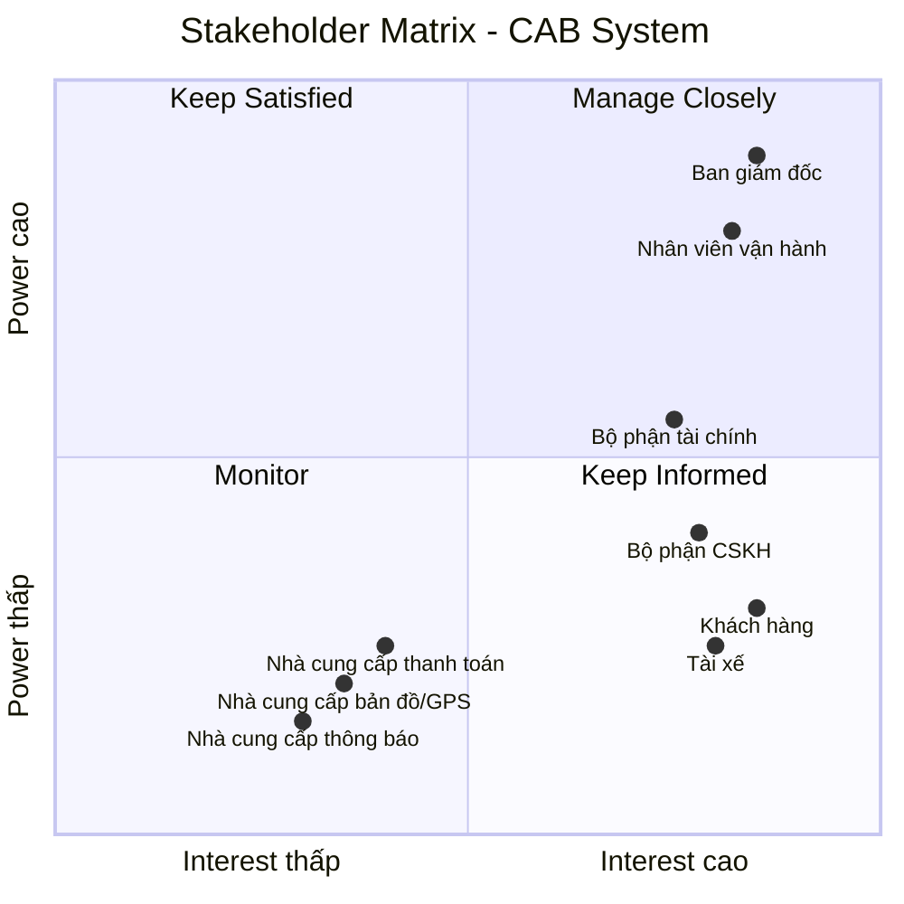

# 23634501_TranHuynhMinhNhat_Cabsystem
## Business Requirements
### Hiện tại, doanh nghiệp ABC đang cung cấp dịch vụ đặt xe nhưng hệ thống hiện có còn nhiều hạn chế. Việc phân công tài xế chủ yếu được thực hiện thủ công, gây mất thời gian, dễ xảy ra sai sót và khó xử lý khi số lượng khách hàng và tài xế tăng cao. Khách hàng khó theo dõi trạng thái chuyến đi, không biết hệ thống đang tìm tài xế, tài xế nào đã nhận chuyến hoặc chuyến đang ở trạng thái nào. Bên cạnh đó, thông tin thanh toán chưa được quản lý tập trung, gây khó khăn trong việc tra cứu và xử lý các giao dịch. Bộ phận vận hành cũng gặp khó khăn khi theo dõi các chuyến đang diễn ra, quản lý tài xế, xử lý các trường hợp chuyến bị lỗi và tổng hợp báo cáo.
### Vì vậy, doanh nghiệp có nhu cầu xây dựng một hệ thống CAB mới nhằm tự động hóa toàn bộ quy trình đặt xe, từ khi khách hàng tạo yêu cầu, hệ thống tìm và phân công tài xế, tài xế thực hiện chuyến, tính cước, thanh toán đến đánh giá sau chuyến. Hệ thống cần hỗ trợ khách hàng, tài xế và nhân viên vận hành, giúp quản lý tập trung thông tin và nâng cao hiệu quả hoạt động. Đồng thời, hệ thống phải ổn định, bảo mật, có khả năng mở rộng khi số lượng người dùng tăng và cho phép doanh nghiệp dễ dàng bổ sung các loại dịch vụ, phương thức thanh toán hoặc kênh thông báo mới trong tương lai.

## Stakeholder

| Stakeholder | Vai trò |
|---|---|
| **Ban giám đốc** | Đưa ra mục tiêu, yêu cầu kinh doanh; phê duyệt phạm vi và định hướng phát triển hệ thống; theo dõi báo cáo và hiệu quả hoạt động. |
| **Khách hàng** | Sử dụng hệ thống để đăng ký, đặt xe, theo dõi chuyến, thanh toán, xem lịch sử và đánh giá tài xế. |
| **Tài xế** | Nhận và thực hiện chuyến; cập nhật trạng thái hoạt động, thông tin phương tiện, vị trí và trạng thái chuyến đi. |
| **Nhà cung cấp thanh toán** | Xử lý thanh toán điện tử và trả kết quả giao dịch. |
| **Nhà cung cấp bản đồ/GPS** | Cung cấp vị trí, bản đồ, khoảng cách và ETA. |
| **Bộ phận CSKH** | Tiếp nhận khiếu nại, hỗ trợ khách hàng/tài xế, xử lý vấn đề chuyến đi. |
| **Nhà cung cấp thông báo** | Gửi SMS, email, push notification. |
| **Nhân viên vận hành** | Quản lý khách hàng, tài xế, phương tiện và chuyến đi; theo dõi hoạt động và xử lý các trường hợp chuyến bị lỗi. |
| **Bộ phận tài chính** | Theo dõi, kiểm tra và đối soát các giao dịch thanh toán, doanh thu từ các chuyến đi. |

## Stakeholder Matrix

Stakeholder Matrix được xây dựng dựa trên hai tiêu chí:

- **Power:** Mức độ quyền lực và khả năng ảnh hưởng đến dự án.
- **Interest:** Mức độ quan tâm và tham gia vào hệ thống CAB.

## Business Goals

| ID | Business Goal | Mô tả |
|---|---|---|
| **BG-01** | **Tự động hóa quy trình đặt xe** | Giảm việc tiếp nhận và phân công tài xế thủ công bằng cách tự động hóa quy trình đặt xe và tìm kiếm tài xế. |
| **BG-02** | **Nâng cao trải nghiệm khách hàng** | Giúp khách hàng dễ dàng đặt xe, theo dõi trạng thái chuyến, biết thông tin tài xế, thời gian dự kiến đến và đánh giá sau chuyến. |
| **BG-03** | **Tối ưu hóa việc phân công tài xế** | Tự động tìm và ưu tiên tài xế phù hợp, gần khách hàng; tiếp tục tìm tài xế khác nếu tài xế không phản hồi hoặc từ chối chuyến. |
| **BG-04** | **Hỗ trợ đa dạng phương thức thanh toán** | Cho phép khách hàng thanh toán bằng **tiền mặt hoặc thanh toán điện tử/chuyển khoản**, đồng thời tích hợp với nhà cung cấp thanh toán bên ngoài để xử lý giao dịch điện tử. |
| **BG-05** | **Quản lý tập trung hoạt động kinh doanh** | Tập trung quản lý thông tin khách hàng, tài xế, phương tiện, chuyến đi, thanh toán và lịch sử giao dịch trên một hệ thống. |
| **BG-06** | **Nâng cao hiệu quả vận hành** | Hỗ trợ nhân viên vận hành theo dõi chuyến đi, trạng thái tài xế, xử lý các trường hợp bất thường và tra cứu thông tin cần thiết. |

## Phạm vi MVP trong 7 tuần

MVP tập trung vào các chức năng cốt lõi cần thiết để hệ thống CAB có thể vận hành quy trình:

**Đăng ký → Đặt xe → Tìm tài xế → Thực hiện chuyến → Tính cước → Thanh toán → Đánh giá**

| Module | Chức năng MVP | Mức độ |
|---|---|---|
| **Quản lý người dùng** | Đăng ký tài khoản | Must Have |
| | Đăng nhập / đăng xuất | Must Have |
| | Cập nhật thông tin cá nhân | Must Have |
| | Xác thực người dùng | Must Have |
| | Phân quyền cơ bản | Must Have |
| **Quản lý tài xế** | Quản lý thông tin tài xế | Must Have |
| | Quản lý thông tin phương tiện | Must Have |
| | Bật / tắt trạng thái sẵn sàng nhận chuyến | Must Have |
| | Cập nhật trạng thái hoạt động | Must Have |
| | Ghi nhận vị trí tài xế | Must Have |
| **Quản lý chuyến đi** | Nhập điểm đón và điểm đến | Must Have |
| | Lựa chọn loại xe | Must Have |
| | Tạo yêu cầu đặt xe | Must Have |
| | Theo dõi trạng thái chuyến | Must Have |
| | Cập nhật trạng thái chuyến | Must Have |
| | Xem lịch sử chuyến đi | Must Have |
| | Hủy chuyến | Should Have |
| **Phân công tài xế** | Tìm tài xế đang sẵn sàng | Must Have |
| | Ưu tiên tài xế phù hợp và gần khách hàng | Must Have |
| | Gửi yêu cầu chuyến cho tài xế | Must Have |
| | Tài xế chấp nhận / từ chối chuyến | Must Have |
| | Tìm tài xế khác khi bị từ chối / không phản hồi | Must Have |
| | Thông báo khi không tìm được tài xế | Must Have |
| **Quản lý cước** | Tính cước chuyến đi | Must Have |
| | Xác định số tiền khách hàng phải trả | Must Have |
| | Lưu thông tin cước | Must Have |
| **Thanh toán** | Thanh toán tiền mặt | Must Have |
| | Thanh toán điện tử | Must Have |
| | Tích hợp một nhà cung cấp thanh toán | Must Have |
| | Ghi nhận kết quả thanh toán | Must Have |
| | Xử lý thanh toán thất bại | Should Have |
| **Thông báo** | Thông báo tiếp nhận yêu cầu đặt xe | Must Have |
| | Thông báo tài xế nhận chuyến | Must Have |
| | Thông báo tài xế đến điểm đón | Must Have |
| | Thông báo hoàn thành chuyến | Must Have |
| | Thông báo kết quả thanh toán | Must Have |
| | Thông báo chuyến mới cho tài xế | Must Have |
| **Quản lý vận hành** | Quản lý khách hàng | Must Have |
| | Quản lý tài xế và phương tiện | Must Have |
| | Theo dõi chuyến đang diễn ra | Must Have |
| | Theo dõi trạng thái tài xế | Must Have |
| | Xử lý chuyến bị lỗi | Must Have |
| | Tra cứu lịch sử chuyến | Should Have |
| | Tra cứu lịch sử giao dịch | Should Have |
| **Đánh giá** | Khách hàng đánh giá tài xế sau chuyến | Must Have |
| | Lưu kết quả đánh giá | Must Have |
| **Báo cáo** | Báo cáo số lượng chuyến | Should Have |
| | Báo cáo doanh thu | Should Have |
| | Báo cáo tỷ lệ hoàn thành / hủy | Should Have |
| | Báo cáo hiệu quả tài xế | Could Have |

Các chức năng Out of Scope sẽ được xem xét ở giai đoạn sau khi hệ thống MVP đã hoàn thành và vận hành ổn định.
| **BG-07** | **Xây dựng nền tảng có khả năng mở rộng** | Đảm bảo hệ thống có thể phục vụ số lượng lớn khách hàng và tài xế, đồng thời dễ dàng bổ sung dịch vụ, phương thức thanh toán, kênh thông báo và tính năng mới trong tương lai. |

## B5. Chuyển các yêu cầu thành yêu cầu nghiệp vụ

### 1. Quản lý người dùng

| ID | Yêu cầu nghiệp vụ |
|---|---|
| BR-01 | Người dùng có thể đăng ký tài khoản. |
| BR-02 | Người dùng có thể đăng nhập và đăng xuất. |
| BR-03 | Người dùng có thể cập nhật thông tin cá nhân. |
| BR-04 | Hệ thống có thể xác thực người dùng. |
| BR-05 | Hệ thống có thể phân quyền người dùng theo vai trò. |

### 2. Quản lý tài xế

| ID | Yêu cầu nghiệp vụ |
|---|---|
| BR-06 | Tài xế có thể quản lý thông tin cá nhân. |
| BR-07 | Tài xế có thể quản lý thông tin phương tiện. |
| BR-08 | Tài xế có thể bật hoặc tắt trạng thái sẵn sàng nhận chuyến. |
| BR-09 | Tài xế có thể cập nhật trạng thái hoạt động. |
| BR-10 | Hệ thống có thể ghi nhận vị trí của tài xế. |

### 3. Quản lý chuyến đi

| ID | Yêu cầu nghiệp vụ |
|---|---|
| BR-11 | Khách hàng có thể nhập điểm đón và điểm đến. |
| BR-12 | Khách hàng có thể lựa chọn loại xe. |
| BR-13 | Khách hàng có thể tạo yêu cầu đặt xe. |
| BR-14 | Khách hàng có thể theo dõi trạng thái chuyến đi. |
| BR-15 | Tài xế có thể cập nhật trạng thái chuyến đi. |
| BR-16 | Khách hàng có thể xem lịch sử chuyến đi. |

### 4. Phân công tài xế

| ID | Yêu cầu nghiệp vụ |
|---|---|
| BR-17 | Hệ thống có thể tìm tài xế đang sẵn sàng nhận chuyến. |
| BR-18 | Hệ thống ưu tiên tài xế phù hợp và gần khách hàng. |
| BR-19 | Hệ thống có thể gửi yêu cầu chuyến đến tài xế phù hợp. |
| BR-20 | Tài xế có thể chấp nhận hoặc từ chối chuyến. |
| BR-21 | Hệ thống có thể tìm tài xế khác khi tài xế từ chối hoặc không phản hồi. |
| BR-22 | Hệ thống thông báo cho khách hàng khi không tìm được tài xế. |

### 5. Quản lý cước

| ID | Yêu cầu nghiệp vụ |
|---|---|
| BR-23 | Hệ thống có thể tính cước chuyến đi. |
| BR-24 | Hệ thống xác định số tiền khách hàng phải trả. |
| BR-25 | Hệ thống lưu thông tin cước của chuyến đi. |

### 6. Thanh toán

| ID | Yêu cầu nghiệp vụ |
|---|---|
| BR-26 | Khách hàng có thể thanh toán bằng tiền mặt. |
| BR-27 | Khách hàng có thể thanh toán bằng phương thức điện tử. |
| BR-28 | Hệ thống có thể xử lý thanh toán điện tử thông qua một nhà cung cấp thanh toán. |
| BR-29 | Hệ thống có thể ghi nhận kết quả thanh toán. |

### 7. Thông báo

| ID | Yêu cầu nghiệp vụ |
|---|---|
| BR-30 | Khách hàng nhận được thông báo khi yêu cầu đặt xe được tiếp nhận. |
| BR-31 | Khách hàng nhận được thông báo khi tài xế nhận chuyến. |
| BR-32 | Khách hàng nhận được thông báo khi tài xế đến điểm đón. |
| BR-33 | Khách hàng nhận được thông báo khi chuyến đi hoàn thành. |
| BR-34 | Khách hàng nhận được thông báo về kết quả thanh toán. |
| BR-35 | Tài xế nhận được thông báo khi có chuyến mới. |

### 8. Quản lý vận hành

| ID | Yêu cầu nghiệp vụ |
|---|---|
| BR-36 | Nhân viên vận hành có thể quản lý thông tin khách hàng. |
| BR-37 | Nhân viên vận hành có thể quản lý thông tin tài xế và phương tiện. |
| BR-38 | Nhân viên vận hành có thể theo dõi các chuyến đang diễn ra. |
| BR-39 | Nhân viên vận hành có thể theo dõi trạng thái tài xế. |
| BR-40 | Nhân viên vận hành có thể xử lý các chuyến bị lỗi. |

### 9. Đánh giá

| ID | Yêu cầu nghiệp vụ |
|---|---|
| BR-41 | Khách hàng có thể đánh giá tài xế sau khi hoàn thành chuyến. |
| BR-42 | Hệ thống lưu kết quả đánh giá. |

### 10. Báo cáo

| ID | Yêu cầu nghiệp vụ |
|---|---|
| BR-47 | Hệ thống tổng hợp số lượng chuyến đi để người quản lý theo dõi tình hình hoạt động. |
| BR-48 | Hệ thống tổng hợp doanh thu từ các chuyến đi để người quản lý theo dõi kết quả kinh doanh. |
| BR-49 | Hệ thống tính toán tỷ lệ chuyến hoàn thành và tỷ lệ chuyến hủy để người quản lý đánh giá chất lượng vận hành. |
| BR-50 | Hệ thống tổng hợp dữ liệu hoạt động của tài xế để người quản lý đánh giá hiệu quả làm việc. |
