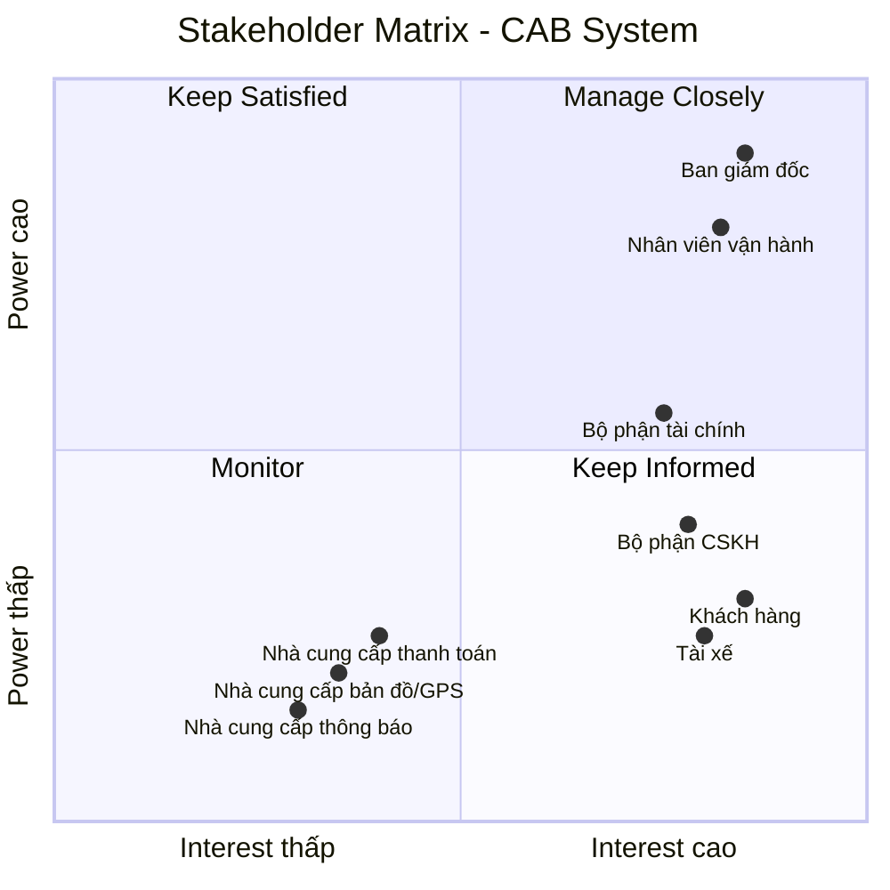

# 23634501_TranHuynhMinhNhat_Cabsystem
## Business Requirements
### Hiện tại, doanh nghiệp ABC đang cung cấp dịch vụ đặt xe nhưng hệ thống hiện có còn nhiều hạn chế. Việc phân công tài xế chủ yếu được thực hiện thủ công, gây mất thời gian, dễ xảy ra sai sót và khó xử lý khi số lượng khách hàng và tài xế tăng cao. Khách hàng khó theo dõi trạng thái chuyến đi, không biết hệ thống đang tìm tài xế, tài xế nào đã nhận chuyến hoặc chuyến đang ở trạng thái nào. Bên cạnh đó, thông tin thanh toán chưa được quản lý tập trung, gây khó khăn trong việc tra cứu và xử lý các giao dịch. Bộ phận vận hành cũng gặp khó khăn khi theo dõi các chuyến đang diễn ra, quản lý tài xế, xử lý các trường hợp chuyến bị lỗi và tổng hợp báo cáo.
### Vì vậy, doanh nghiệp có nhu cầu xây dựng một hệ thống CAB mới nhằm tự động hóa toàn bộ quy trình đặt xe, từ khi khách hàng tạo yêu cầu, hệ thống tìm và phân công tài xế, tài xế thực hiện chuyến, tính cước, thanh toán đến đánh giá sau chuyến. Hệ thống cần hỗ trợ khách hàng, tài xế và nhân viên vận hành, giúp quản lý tập trung thông tin và nâng cao hiệu quả hoạt động. Đồng thời, hệ thống phải ổn định, bảo mật, có khả năng mở rộng khi số lượng người dùng tăng và cho phép doanh nghiệp dễ dàng bổ sung các loại dịch vụ, phương thức thanh toán hoặc kênh thông báo mới trong tương lai.

## Stakeholder

| Stakeholder | Vai trò |
|---|---|
| **Ban giám đốc** | Đưa ra mục tiêu, yêu cầu kinh doanh; phê duyệt phạm vi và định hướng phát triển hệ thống; theo dõi báo cáo và hiệu quả hoạt động. |
| **Khách hàng** | Sử dụng hệ thống để đăng ký, đặt xe, theo dõi chuyến, thanh toán, xem lịch sử và đánh giá tài xế. |
| **Tài xế** | Nhận và thực hiện chuyến; cập nhật trạng thái hoạt động, thông tin phương tiện, vị trí và trạng thái chuyến đi. |
| **Nhà cung cấp thanh toán** | Xử lý thanh toán điện tử và trả kết quả giao dịch. |
| **Nhà cung cấp bản đồ/GPS** | Cung cấp vị trí, bản đồ, khoảng cách và ETA. |
| **Bộ phận CSKH** | Tiếp nhận khiếu nại, hỗ trợ khách hàng/tài xế, xử lý vấn đề chuyến đi. |
| **Nhà cung cấp thông báo** | Gửi SMS, email, push notification. |
| **Nhân viên vận hành** | Quản lý khách hàng, tài xế, phương tiện và chuyến đi; theo dõi hoạt động và xử lý các trường hợp chuyến bị lỗi. |
| **Bộ phận tài chính** | Theo dõi, kiểm tra và đối soát các giao dịch thanh toán, doanh thu từ các chuyến đi. |

## Stakeholder Matrix

Stakeholder Matrix được xây dựng dựa trên hai tiêu chí:

- **Power:** Mức độ quyền lực và khả năng ảnh hưởng đến dự án.
- **Interest:** Mức độ quan tâm và tham gia vào hệ thống CAB.

## Business Goals

| ID | Business Goal | Mô tả |
|---|---|---|
| **BG-01** | **Tự động hóa quy trình đặt xe** | Giảm việc tiếp nhận và phân công tài xế thủ công bằng cách tự động hóa quy trình đặt xe và tìm kiếm tài xế. |
| **BG-02** | **Nâng cao trải nghiệm khách hàng** | Giúp khách hàng dễ dàng đặt xe, theo dõi trạng thái chuyến, biết thông tin tài xế, thời gian dự kiến đến và đánh giá sau chuyến. |
| **BG-03** | **Tối ưu hóa việc phân công tài xế** | Tự động tìm và ưu tiên tài xế phù hợp, gần khách hàng; tiếp tục tìm tài xế khác nếu tài xế không phản hồi hoặc từ chối chuyến. |
| **BG-04** | **Hỗ trợ đa dạng phương thức thanh toán** | Cho phép khách hàng thanh toán bằng **tiền mặt hoặc thanh toán điện tử/chuyển khoản**, đồng thời tích hợp với nhà cung cấp thanh toán bên ngoài để xử lý giao dịch điện tử. |
| **BG-05** | **Quản lý tập trung hoạt động kinh doanh** | Tập trung quản lý thông tin khách hàng, tài xế, phương tiện, chuyến đi, thanh toán và lịch sử giao dịch trên một hệ thống. |
| **BG-06** | **Nâng cao hiệu quả vận hành** | Hỗ trợ nhân viên vận hành theo dõi chuyến đi, trạng thái tài xế, xử lý các trường hợp bất thường và tra cứu thông tin cần thiết. |
| **BG-07** | **Xây dựng nền tảng có khả năng mở rộng** | Đảm bảo hệ thống có thể phục vụ số lượng lớn khách hàng và tài xế, đồng thời dễ dàng bổ sung dịch vụ, phương thức thanh toán, kênh thông báo và tính năng mới trong tương lai. |

## Phạm vi dự án trong 7 tuần

Dự án tập trung xây dựng các module cốt lõi để hệ thống CAB có thể vận hành đầy đủ quy trình:

**Đăng nhập → Đặt xe → Tìm tài xế → Thực hiện chuyến → Tính cước → Thanh toán → Hoàn thành.**

### 1. Authentication & User Management

**Mục tiêu:** Quản lý tài khoản và xác thực người dùng.

**In Scope:**
- Đăng ký tài khoản khách hàng.
- Đăng nhập/đăng xuất.
- Cập nhật thông tin cá nhân.
- Xác thực người dùng.
- Phân quyền cơ bản cho các nhóm người dùng.

**Đối tượng:** Khách hàng, Tài xế, Nhân viên vận hành.

---

### 2. Driver & Vehicle Management

**Mục tiêu:** Quản lý tài xế và phương tiện phục vụ việc nhận chuyến.

**In Scope:**
- Quản lý hồ sơ tài xế.
- Quản lý thông tin phương tiện.
- Cập nhật trạng thái tài xế.
- Bật/tắt trạng thái sẵn sàng nhận chuyến.
- Ghi nhận vị trí tài xế.

**Đối tượng:** Tài xế, Nhân viên vận hành.

---

### 3. Booking Management

**Mục tiêu:** Cho phép khách hàng tạo và quản lý yêu cầu đặt xe.

**In Scope:**
- Nhập điểm đón.
- Nhập điểm đến.
- Lựa chọn loại xe.
- Tạo yêu cầu đặt xe.
- Xem trạng thái yêu cầu.
- Hủy chuyến theo chính sách đã được xác nhận.

**Đối tượng:** Khách hàng.

---

### 4. Driver Matching & Dispatch

**Mục tiêu:** Tự động tìm kiếm và phân công tài xế cho chuyến đi.

**In Scope:**
- Xác định tài xế đang sẵn sàng.
- Tìm tài xế phù hợp và gần khách hàng.
- Gửi yêu cầu chuyến đến tài xế.
- Tài xế chấp nhận/từ chối chuyến.
- Tiếp tục tìm tài xế khác khi tài xế không phản hồi hoặc từ chối.
- Thông báo cho khách hàng khi không tìm được tài xế.

**Đối tượng:** Khách hàng, Tài xế, Nhân viên vận hành.

---

### 5. Trip Management

**Mục tiêu:** Quản lý toàn bộ vòng đời của chuyến đi.

**In Scope:**
- Tài xế đã nhận chuyến.
- Tài xế đang đến điểm đón.
- Tài xế đã đến.
- Đã đón khách.
- Đang di chuyển.
- Hoàn thành chuyến.
- Hủy chuyến và xử lý các trường hợp bất thường.
- Theo dõi vị trí và ETA cơ bản.

**Đối tượng:** Khách hàng, Tài xế, Nhân viên vận hành.

---

### 6. Fare & Payment

**Mục tiêu:** Tính cước và xử lý thanh toán.

**In Scope:**
- Tính cước dựa trên loại dịch vụ và thông tin chuyến.
- Hỗ trợ thanh toán tiền mặt.
- Hỗ trợ thanh toán điện tử.
- Tích hợp một nhà cung cấp thanh toán.
- Nhận kết quả giao dịch.
- Xử lý thanh toán thành công/thất bại.
- Cho phép xử lý lại thanh toán theo chính sách doanh nghiệp.

**Đối tượng:** Khách hàng, Tài xế, Bộ phận tài chính.

---

### 7. Notification

**Mục tiêu:** Đảm bảo khách hàng và tài xế nhận được thông tin cần thiết trong quá trình sử dụng dịch vụ.

**In Scope:**
- Thông báo tiếp nhận yêu cầu đặt xe.
- Thông báo tài xế nhận chuyến.
- Thông báo tài xế đến điểm đón.
- Thông báo hoàn thành chuyến.
- Thông báo kết quả thanh toán.
- Thông báo chuyến mới cho tài xế.

**Đối tượng:** Khách hàng, Tài xế.

---

### 8. Operation & Reporting

**Mục tiêu:** Hỗ trợ nhân viên vận hành quản lý và giám sát hệ thống.

**In Scope:**
- Quản lý khách hàng.
- Quản lý tài xế.
- Quản lý phương tiện.
- Theo dõi chuyến đang diễn ra.
- Theo dõi trạng thái tài xế.
- Hỗ trợ xử lý chuyến bị lỗi.
- Tra cứu lịch sử chuyến và giao dịch.
- Báo cáo cơ bản: số chuyến, doanh thu, tỷ lệ hoàn thành, tỷ lệ hủy.
- Phân quyền nhân viên.
- Lưu vết các thao tác quan trọng.

**Đối tượng:** Nhân viên vận hành, Bộ phận tài chính, Ban giám đốc.

---

## Out of Scope – Giai đoạn sau

Các chức năng sau chưa thực hiện trong phạm vi 7 tuần:

- AI/ML dự đoán nhu cầu.
- AI tối ưu điều phối tài xế.
- Dynamic Pricing nâng cao.
- Voucher/Khuyến mãi.
- Loyalty/Điểm thưởng.
- Báo cáo và BI nâng cao.
- Các loại dịch vụ vận chuyển mới.
- Tích hợp nhiều nhà cung cấp thanh toán.
- Tích hợp nhiều nhà cung cấp thông báo.
- Các tính năng nâng cao khác chưa được khách hàng yêu cầu.

Các chức năng Out of Scope sẽ được xem xét phát triển ở các giai đoạn tiếp theo dựa trên nhu cầu thực tế và mức độ ưu tiên của khách hàng.
