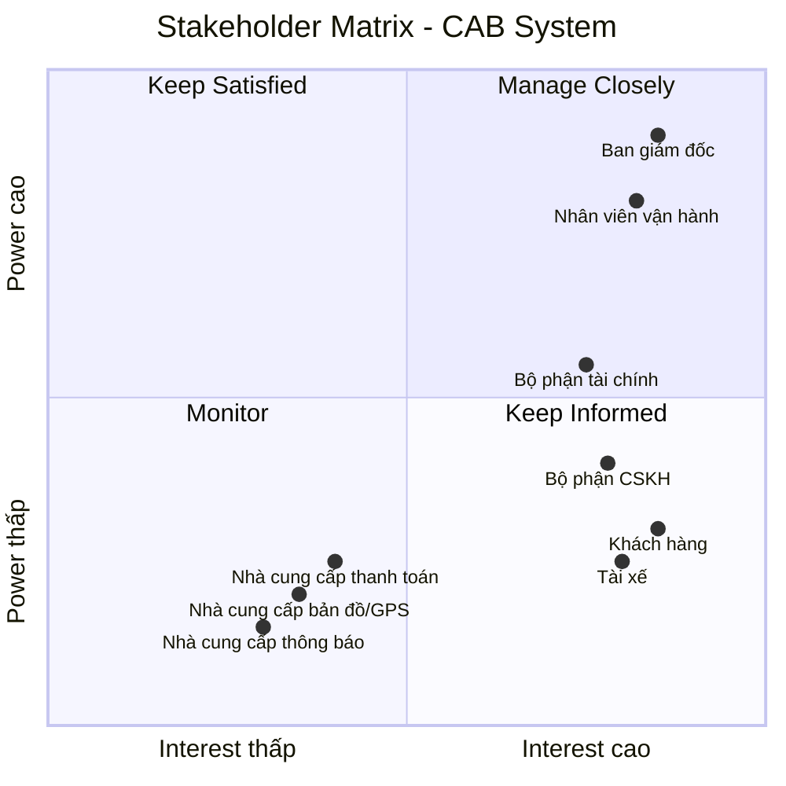

# 23634501_TranHuynhMinhNhat_Cabsystem
## Business Requirements
### Hiện tại, doanh nghiệp ABC đang cung cấp dịch vụ đặt xe nhưng hệ thống hiện có còn nhiều hạn chế. Việc phân công tài xế chủ yếu được thực hiện thủ công, gây mất thời gian, dễ xảy ra sai sót và khó xử lý khi số lượng khách hàng và tài xế tăng cao. Khách hàng khó theo dõi trạng thái chuyến đi, không biết hệ thống đang tìm tài xế, tài xế nào đã nhận chuyến hoặc chuyến đang ở trạng thái nào. Bên cạnh đó, thông tin thanh toán chưa được quản lý tập trung, gây khó khăn trong việc tra cứu và xử lý các giao dịch. Bộ phận vận hành cũng gặp khó khăn khi theo dõi các chuyến đang diễn ra, quản lý tài xế, xử lý các trường hợp chuyến bị lỗi và tổng hợp báo cáo.
### Vì vậy, doanh nghiệp có nhu cầu xây dựng một hệ thống CAB mới nhằm tự động hóa toàn bộ quy trình đặt xe, từ khi khách hàng tạo yêu cầu, hệ thống tìm và phân công tài xế, tài xế thực hiện chuyến, tính cước, thanh toán đến đánh giá sau chuyến. Hệ thống cần hỗ trợ khách hàng, tài xế và nhân viên vận hành, giúp quản lý tập trung thông tin và nâng cao hiệu quả hoạt động. Đồng thời, hệ thống phải ổn định, bảo mật, có khả năng mở rộng khi số lượng người dùng tăng và cho phép doanh nghiệp dễ dàng bổ sung các loại dịch vụ, phương thức thanh toán hoặc kênh thông báo mới trong tương lai.

## Stakeholder

| Stakeholder | Vai trò |
|---|---|
| **Ban giám đốc** | Đưa ra mục tiêu, yêu cầu kinh doanh; phê duyệt phạm vi và định hướng phát triển hệ thống; theo dõi báo cáo và hiệu quả hoạt động. |
| **Khách hàng** | Sử dụng hệ thống để đăng ký, đặt xe, theo dõi chuyến, thanh toán, xem lịch sử và đánh giá tài xế. |
| **Tài xế** | Nhận và thực hiện chuyến; cập nhật trạng thái hoạt động, thông tin phương tiện, vị trí và trạng thái chuyến đi. |
| **Nhà cung cấp thanh toán** | Xử lý thanh toán điện tử và trả kết quả giao dịch. |
| **Nhà cung cấp bản đồ/GPS** | Cung cấp vị trí, bản đồ, khoảng cách và ETA. |
| **Bộ phận CSKH** | Tiếp nhận khiếu nại, hỗ trợ khách hàng/tài xế, xử lý vấn đề chuyến đi. |
| **Nhà cung cấp thông báo** | Gửi SMS, email, push notification. |
| **Nhân viên vận hành** | Quản lý khách hàng, tài xế, phương tiện và chuyến đi; theo dõi hoạt động và xử lý các trường hợp chuyến bị lỗi. |
| **Bộ phận tài chính** | Theo dõi, kiểm tra và đối soát các giao dịch thanh toán, doanh thu từ các chuyến đi. |

## Stakeholder Matrix

Stakeholder Matrix được xây dựng dựa trên hai tiêu chí:

- **Power:** Mức độ quyền lực và khả năng ảnh hưởng đến dự án.
- **Interest:** Mức độ quan tâm và tham gia vào hệ thống CAB.

## Business Goals

| ID | Business Goal | Mô tả |
|---|---|---|
| **BG-01** | **Tự động hóa quy trình đặt xe** | Giảm việc tiếp nhận và phân công tài xế thủ công bằng cách tự động hóa quy trình đặt xe và tìm kiếm tài xế. |
| **BG-02** | **Nâng cao trải nghiệm khách hàng** | Giúp khách hàng dễ dàng đặt xe, theo dõi trạng thái chuyến, biết thông tin tài xế, thời gian dự kiến đến và đánh giá sau chuyến. |
| **BG-03** | **Tối ưu hóa việc phân công tài xế** | Tự động tìm và ưu tiên tài xế phù hợp, gần khách hàng; tiếp tục tìm tài xế khác nếu tài xế không phản hồi hoặc từ chối chuyến. |
| **BG-04** | **Hỗ trợ đa dạng phương thức thanh toán** | Cho phép khách hàng thanh toán bằng **tiền mặt hoặc thanh toán điện tử/chuyển khoản**, đồng thời tích hợp với nhà cung cấp thanh toán bên ngoài để xử lý giao dịch điện tử. |
| **BG-05** | **Quản lý tập trung hoạt động kinh doanh** | Tập trung quản lý thông tin khách hàng, tài xế, phương tiện, chuyến đi, thanh toán và lịch sử giao dịch trên một hệ thống. |
| **BG-06** | **Nâng cao hiệu quả vận hành** | Hỗ trợ nhân viên vận hành theo dõi chuyến đi, trạng thái tài xế, xử lý các trường hợp bất thường và tra cứu thông tin cần thiết. |

## Phạm vi MVP trong 7 tuần

Trong thời gian 7 tuần, dự án tập trung xây dựng **MVP (Minimum Viable Product)** với các chức năng cốt lõi để hệ thống CAB có thể vận hành đầy đủ quy trình:

**Đăng ký → Đăng nhập → Đặt xe → Tìm tài xế → Thực hiện chuyến → Tính cước → Thanh toán → Đánh giá**

## MVP Scope

| Module | Chức năng MVP | Mức độ |
|---|---|---|
| **Quản lý người dùng** | Đăng ký tài khoản | Must Have |
| | Đăng nhập / đăng xuất | Must Have |
| | Cập nhật thông tin cá nhân | Must Have |
| | Xác thực người dùng | Must Have |
| | Phân quyền cơ bản | Must Have |
| **Quản lý tài xế** | Quản lý thông tin tài xế | Must Have |
| | Quản lý thông tin phương tiện | Must Have |
| | Bật / tắt trạng thái sẵn sàng nhận chuyến | Must Have |
| | Cập nhật trạng thái hoạt động | Must Have |
| | Ghi nhận vị trí tài xế | Must Have |
| **Quản lý chuyến đi** | Nhập điểm đón và điểm đến | Must Have |
| | Lựa chọn loại xe | Must Have |
| | Tạo yêu cầu đặt xe | Must Have |
| | Theo dõi trạng thái chuyến | Must Have |
| | Cập nhật trạng thái chuyến | Must Have |
| | Xem lịch sử chuyến đi | Must Have |
| | Hủy chuyến | Should Have |
| **Phân công tài xế** | Tìm tài xế đang sẵn sàng | Must Have |
| | Ưu tiên tài xế phù hợp và gần khách hàng | Must Have |
| | Gửi yêu cầu chuyến cho tài xế | Must Have |
| | Tài xế chấp nhận / từ chối chuyến | Must Have |
| | Tìm tài xế khác khi bị từ chối / không phản hồi | Must Have |
| | Thông báo khi không tìm được tài xế | Must Have |
| **Quản lý cước** | Tính cước chuyến đi | Must Have |
| | Xác định số tiền khách hàng phải trả | Must Have |
| | Lưu thông tin cước | Must Have |
| **Thanh toán** | Thanh toán tiền mặt | Must Have |
| | Thanh toán điện tử | Must Have |
| | Tích hợp một nhà cung cấp thanh toán | Must Have |
| | Ghi nhận kết quả thanh toán | Must Have |
| | Xử lý thanh toán thất bại | Should Have |
| **Thông báo** | Thông báo tiếp nhận yêu cầu đặt xe | Must Have |
| | Thông báo tài xế nhận chuyến | Must Have |
| | Thông báo tài xế đến điểm đón | Must Have |
| | Thông báo hoàn thành chuyến | Must Have |
| | Thông báo kết quả thanh toán | Must Have |
| | Thông báo chuyến mới cho tài xế | Must Have |
| **Quản lý vận hành** | Quản lý khách hàng | Must Have |
| | Quản lý tài xế và phương tiện | Must Have |
| | Theo dõi chuyến đang diễn ra | Must Have |
| | Theo dõi trạng thái tài xế | Must Have |
| | Xử lý chuyến bị lỗi | Must Have |
| | Tra cứu lịch sử chuyến | Should Have |
| | Tra cứu lịch sử giao dịch | Should Have |
| **Đánh giá** | Khách hàng đánh giá tài xế sau chuyến | Must Have |
| | Lưu kết quả đánh giá | Must Have |
| **Báo cáo** | Báo cáo số lượng chuyến | Should Have |
| | Báo cáo doanh thu | Should Have |
| | Báo cáo tỷ lệ hoàn thành / hủy | Should Have |
| | Báo cáo hiệu quả tài xế | Could Have |
| **Bảo mật & Quản trị** | Xác thực người dùng | Must Have |
| | Phân quyền người dùng theo vai trò | Must Have |
| | Bảo vệ thông tin cá nhân và dữ liệu giao dịch | Must Have |
| | Không lưu trực tiếp thông tin nhạy cảm của thẻ / tài khoản thanh toán | Must Have |
| | Lưu vết các thao tác quản trị quan trọng | Should Have |

# B5. Chuyển các yêu cầu thành yêu cầu nghiệp vụ

### 1. Quản lý người dùng

| ID | Yêu cầu nghiệp vụ | Mức độ |
|---|---|---|
| BR-01 | Người dùng có thể đăng ký, đăng nhập, đăng xuất và cập nhật thông tin tài khoản. | Must Have |
| BR-02 | Hệ thống có thể xác thực người dùng trước khi sử dụng các chức năng yêu cầu tài khoản. | Must Have |
| BR-03 | Hệ thống có thể phân quyền người dùng theo vai trò. | Must Have |

### 2. Quản lý tài xế

| ID | Yêu cầu nghiệp vụ | Mức độ |
|---|---|---|
| BR-04 | Hệ thống cho phép quản lý thông tin tài xế và phương tiện. | Must Have |
| BR-05 | Tài xế có thể bật hoặc tắt trạng thái sẵn sàng và cập nhật trạng thái hoạt động. | Must Have |
| BR-06 | Hệ thống có thể ghi nhận vị trí hiện tại của tài xế. | Must Have |

### 3. Quản lý chuyến đi

| ID | Yêu cầu nghiệp vụ | Mức độ |
|---|---|---|
| BR-07 | Khách hàng có thể nhập điểm đón, điểm đến và lựa chọn loại xe khi đặt xe. | Must Have |
| BR-08 | Khách hàng có thể tạo yêu cầu đặt xe. | Must Have |
| BR-09 | Khách hàng có thể theo dõi trạng thái chuyến đi. | Must Have |
| BR-10 | Tài xế có thể cập nhật trạng thái chuyến đi trong quá trình thực hiện chuyến. | Must Have |
| BR-11 | Khách hàng có thể xem lịch sử chuyến đi. | Must Have |
| BR-12 | Khách hàng có thể hủy chuyến theo chính sách của doanh nghiệp. | Should Have |

### 4. Phân công tài xế

| ID | Yêu cầu nghiệp vụ | Mức độ |
|---|---|---|
| BR-13 | Hệ thống tự động tìm và ưu tiên tài xế phù hợp, gần khách hàng và đang sẵn sàng nhận chuyến. | Must Have |
| BR-14 | Hệ thống gửi yêu cầu chuyến đến tài xế phù hợp và cho phép tài xế chấp nhận hoặc từ chối chuyến. | Must Have |
| BR-15 | Hệ thống tiếp tục tìm tài xế khác khi tài xế từ chối hoặc không phản hồi. | Must Have |
| BR-16 | Hệ thống thông báo cho khách hàng khi không tìm được tài xế. | Must Have |

### 5. Quản lý cước

| ID | Yêu cầu nghiệp vụ | Mức độ |
|---|---|---|
| BR-17 | Hệ thống có thể tính cước dựa trên loại dịch vụ và thông tin chuyến đi. | Must Have |
| BR-18 | Hệ thống xác định và lưu số tiền khách hàng phải thanh toán. | Must Have |

> **Lưu ý:** Công thức tính cước cụ thể cần được khách hàng xác nhận trước khi triển khai.

### 6. Thanh toán

| ID | Yêu cầu nghiệp vụ | Mức độ |
|---|---|---|
| BR-19 | Khách hàng có thể thanh toán bằng tiền mặt hoặc phương thức điện tử. | Must Have |
| BR-20 | Hệ thống tích hợp với một nhà cung cấp thanh toán bên ngoài để xử lý giao dịch điện tử. | Must Have |
| BR-21 | Hệ thống ghi nhận kết quả giao dịch thanh toán. | Must Have |
| BR-22 | Hệ thống hỗ trợ xử lý lại giao dịch thanh toán thất bại theo chính sách doanh nghiệp. | Should Have |

### 7. Thông báo

| ID | Yêu cầu nghiệp vụ | Mức độ |
|---|---|---|
| BR-23 | Hệ thống thông báo cho khách hàng về các sự kiện quan trọng của chuyến đi như tiếp nhận yêu cầu, tài xế nhận chuyến, tài xế đến điểm đón và hoàn thành chuyến. | Must Have |
| BR-24 | Hệ thống thông báo cho khách hàng về kết quả thanh toán. | Must Have |
| BR-25 | Hệ thống thông báo cho tài xế khi có chuyến mới hoặc thay đổi quan trọng liên quan đến chuyến. | Must Have |

### 8. Quản lý vận hành

| ID | Yêu cầu nghiệp vụ | Mức độ |
|---|---|---|
| BR-26 | Nhân viên vận hành có thể quản lý thông tin khách hàng, tài xế và phương tiện. | Must Have |
| BR-27 | Nhân viên vận hành có thể theo dõi các chuyến đang diễn ra và trạng thái tài xế. | Must Have |
| BR-28 | Nhân viên vận hành có thể xử lý các chuyến bị lỗi. | Must Have |
| BR-29 | Nhân viên vận hành có thể tra cứu lịch sử chuyến đi và giao dịch. | Should Have |

### 9. Đánh giá

| ID | Yêu cầu nghiệp vụ | Mức độ |
|---|---|---|
| BR-30 | Khách hàng có thể đánh giá tài xế sau khi hoàn thành chuyến. | Must Have |
| BR-31 | Hệ thống lưu kết quả đánh giá để phục vụ theo dõi chất lượng dịch vụ. | Must Have |

### 10. Báo cáo

| ID | Yêu cầu nghiệp vụ | Mức độ |
|---|---|---|
| BR-32 | Hệ thống cung cấp báo cáo về số lượng chuyến đi. | Should Have |
| BR-33 | Hệ thống cung cấp báo cáo về doanh thu. | Should Have |
| BR-34 | Hệ thống cung cấp báo cáo về tỷ lệ chuyến hoàn thành và tỷ lệ chuyến hủy. | Should Have |
| BR-35 | Hệ thống cung cấp báo cáo về hiệu quả hoạt động của tài xế. | Could Have |

### 11. Bảo mật & Quản trị

| ID | Yêu cầu nghiệp vụ | Mức độ |
|---|---|---|
| BR-36 | Hệ thống kiểm soát quyền truy cập theo vai trò người dùng. | Must Have |
| BR-37 | Hệ thống bảo vệ thông tin cá nhân, thông tin phương tiện và dữ liệu vị trí. | Must Have |
| BR-38 | Hệ thống bảo vệ dữ liệu giao dịch và thông tin thanh toán. | Must Have |
| BR-39 | Hệ thống không lưu trực tiếp thông tin nhạy cảm của thẻ hoặc tài khoản thanh toán. | Must Have |
| BR-40 | Hệ thống lưu vết các thao tác quản trị quan trọng để phục vụ kiểm tra và xử lý sự cố. | Should Have |

# B6. Functional Requirements

## 1. Quản lý người dùng

### BR-01 - Quản lý tài khoản

| ID    | Functional Requirement       | Mô tả                                                |
| ----- | ---------------------------- | ---------------------------------------------------- |
| FR-01 | Đăng ký tài khoản            | Hệ thống cho phép người dùng đăng ký tài khoản.      |
| FR-02 | Đăng nhập/đăng xuất          | Hệ thống cho phép người dùng đăng nhập và đăng xuất. |
| FR-03 | Quản lý thông tin cá nhân    | Người dùng có thể xem và cập nhật thông tin cá nhân. |
| FR-04 | Quản lý trạng thái tài khoản | Hệ thống quản lý trạng thái hoạt động của tài khoản. |

### BR-02 - Xác thực người dùng

| ID    | Functional Requirement     | Mô tả                                                                   |
| ----- | -------------------------- | ----------------------------------------------------------------------- |
| FR-05 | Xác thực tài khoản         | Hệ thống xác thực thông tin người dùng trước khi cho phép truy cập.     |
| FR-06 | Xác thực thông tin đăng ký | Hệ thống xác thực các thông tin cần thiết như email hoặc số điện thoại. |
| FR-07 | Kiểm tra tài khoản         | Hệ thống kiểm tra tài khoản có hợp lệ và đang hoạt động hay không.      |

### BR-03 - Phân quyền người dùng

| ID    | Functional Requirement | Mô tả                                                                           |
| ----- | ---------------------- | ------------------------------------------------------------------------------- |
| FR-08 | Quản lý vai trò        | Hệ thống hỗ trợ các vai trò Customer, Driver, Operator, CSKH, Finance và Admin. |
| FR-09 | Phân quyền chức năng   | Hệ thống giới hạn chức năng người dùng được phép sử dụng theo vai trò.          |
| FR-10 | Phân quyền dữ liệu     | Hệ thống giới hạn dữ liệu người dùng được phép xem và thay đổi theo vai trò.    |

---

# 2. Quản lý tài xế

### BR-04 - Quản lý tài xế và phương tiện

| ID    | Functional Requirement     | Mô tả                                                            |
| ----- | -------------------------- | ---------------------------------------------------------------- |
| FR-11 | Quản lý thông tin tài xế   | Nhân viên vận hành có thể thêm, xem, cập nhật thông tin tài xế.  |
| FR-12 | Quản lý phương tiện        | Hệ thống cho phép quản lý thông tin phương tiện của tài xế.      |
| FR-13 | Gán phương tiện cho tài xế | Hệ thống cho phép xác định phương tiện đang được tài xế sử dụng. |
| FR-14 | Quản lý trạng thái tài xế  | Hệ thống quản lý trạng thái hoạt động của tài xế.                |

### BR-05 - Quản lý trạng thái sẵn sàng

| ID    | Functional Requirement          | Mô tả                                                            |
| ----- | ------------------------------- | ---------------------------------------------------------------- |
| FR-15 | Bật/tắt trạng thái sẵn sàng     | Tài xế có thể bật hoặc tắt trạng thái sẵn sàng nhận chuyến.      |
| FR-16 | Cập nhật trạng thái hoạt động   | Tài xế có thể cập nhật trạng thái online, offline hoặc đang bận. |
| FR-17 | Kiểm tra trạng thái nhận chuyến | Hệ thống xác định tài xế có đủ điều kiện nhận chuyến hay không.  |

### BR-06 - Ghi nhận vị trí tài xế

| ID    | Functional Requirement | Mô tả                                                                              |
| ----- | ---------------------- | ---------------------------------------------------------------------------------- |
| FR-18 | Cập nhật vị trí tài xế | Hệ thống ghi nhận vị trí hiện tại của tài xế.                                      |
| FR-19 | Theo dõi vị trí tài xế | Hệ thống cập nhật vị trí tài xế trong quá trình hoạt động.                         |
| FR-20 | Cung cấp vị trí tài xế | Hệ thống cung cấp vị trí tài xế cho khách hàng hoặc nhân viên vận hành theo quyền. |

---

# 3. Quản lý chuyến đi

### BR-07 - Nhập thông tin chuyến

| ID    | Functional Requirement      | Mô tả                                                                             |
| ----- | --------------------------- | --------------------------------------------------------------------------------- |
| FR-21 | Nhập điểm đón               | Khách hàng có thể nhập hoặc chọn điểm đón.                                        |
| FR-22 | Nhập điểm đến               | Khách hàng có thể nhập hoặc chọn điểm đến.                                        |
| FR-23 | Lựa chọn loại xe            | Khách hàng có thể lựa chọn loại xe/dịch vụ.                                       |
| FR-24 | Xác định thông tin địa điểm | Hệ thống xác định tọa độ và thông tin địa điểm thông qua nhà cung cấp bản đồ/GPS. |

### BR-08 - Tạo yêu cầu đặt xe

| ID    | Functional Requirement     | Mô tả                                                                                     |
| ----- | -------------------------- | ----------------------------------------------------------------------------------------- |
| FR-25 | Tạo yêu cầu đặt xe         | Hệ thống cho phép khách hàng tạo yêu cầu đặt xe.                                          |
| FR-26 | Lưu thông tin đặt xe       | Hệ thống lưu thông tin khách hàng, điểm đón, điểm đến, loại xe và phương thức thanh toán. |
| FR-27 | Khởi tạo trạng thái chuyến | Hệ thống tạo chuyến với trạng thái ban đầu phù hợp.                                       |
| FR-28 | Kích hoạt tìm tài xế       | Hệ thống tự động bắt đầu quá trình tìm tài xế sau khi tạo yêu cầu.                        |

### BR-09 - Theo dõi trạng thái chuyến

| ID    | Functional Requirement     | Mô tả                                                                             |
| ----- | -------------------------- | --------------------------------------------------------------------------------- |
| FR-29 | Xem trạng thái chuyến      | Khách hàng có thể xem trạng thái hiện tại của chuyến.                             |
| FR-30 | Cập nhật trạng thái chuyến | Hệ thống cập nhật trạng thái theo tiến trình thực tế của chuyến.                  |
| FR-31 | Xem thông tin tài xế       | Khách hàng có thể xem thông tin tài xế và phương tiện sau khi tài xế nhận chuyến. |
| FR-32 | Xem ETA                    | Hệ thống hiển thị thời gian dự kiến tài xế đến điểm đón nếu có dữ liệu GPS.       |

### BR-10 - Cập nhật trạng thái chuyến

| ID    | Functional Requirement      | Mô tả                                                          |
| ----- | --------------------------- | -------------------------------------------------------------- |
| FR-33 | Cập nhật trạng thái đến đón | Tài xế có thể cập nhật trạng thái đang di chuyển đến điểm đón. |
| FR-34 | Xác nhận đã đến             | Tài xế có thể xác nhận đã đến điểm đón.                        |
| FR-35 | Bắt đầu chuyến              | Tài xế có thể xác nhận bắt đầu chuyến.                         |
| FR-36 | Hoàn thành chuyến           | Tài xế có thể xác nhận hoàn thành chuyến.                      |

### BR-11 - Lịch sử chuyến

| ID    | Functional Requirement | Mô tả                                                  |
| ----- | ---------------------- | ------------------------------------------------------ |
| FR-37 | Lưu lịch sử chuyến     | Hệ thống lưu thông tin các chuyến đã tạo và thực hiện. |
| FR-38 | Xem lịch sử chuyến     | Khách hàng có thể xem danh sách các chuyến của mình.   |
| FR-39 | Xem chi tiết chuyến    | Khách hàng có thể xem chi tiết từng chuyến.            |

### BR-12 - Hủy chuyến

| ID    | Functional Requirement  | Mô tả                                                              |
| ----- | ----------------------- | ------------------------------------------------------------------ |
| FR-40 | Yêu cầu hủy chuyến      | Khách hàng có thể yêu cầu hủy chuyến.                              |
| FR-41 | Kiểm tra điều kiện hủy  | Hệ thống kiểm tra trạng thái chuyến và chính sách hủy.             |
| FR-42 | Cập nhật trạng thái hủy | Hệ thống chuyển chuyến sang trạng thái `CANCELLED` khi hủy hợp lệ. |
| FR-43 | Ghi nhận lý do hủy      | Hệ thống lưu người hủy, thời gian và lý do hủy.                    |

---

# 4. Phân công tài xế

### BR-13 - Tìm và ưu tiên tài xế

| ID    | Functional Requirement     | Mô tả                                                                                    |
| ----- | -------------------------- | ---------------------------------------------------------------------------------------- |
| FR-44 | Xác định vị trí khách hàng | Hệ thống xác định vị trí điểm đón của khách hàng.                                        |
| FR-45 | Lọc tài xế phù hợp         | Hệ thống lọc tài xế theo trạng thái sẵn sàng, loại xe và vị trí hiện tại.                |
| FR-46 | Tính khoảng cách và ETA    | Hệ thống tính khoảng cách và thời gian dự kiến từ tài xế đến điểm đón.                   |
| FR-47 | Xếp hạng tài xế            | Hệ thống ưu tiên tài xế dựa trên khoảng cách, ETA, rating và các tiêu chí được cấu hình. |
| FR-48 | Chọn tài xế                | Hệ thống chọn tài xế phù hợp nhất để gửi yêu cầu chuyến.                                 |

### BR-14 - Gửi yêu cầu nhận chuyến

| ID    | Functional Requirement    | Mô tả                                                            |
| ----- | ------------------------- | ---------------------------------------------------------------- |
| FR-49 | Gửi yêu cầu chuyến        | Hệ thống gửi yêu cầu nhận chuyến đến tài xế được chọn.           |
| FR-50 | Hiển thị thông tin chuyến | Tài xế có thể xem thông tin cần thiết của chuyến.                |
| FR-51 | Chấp nhận chuyến          | Tài xế có thể chấp nhận yêu cầu trong thời gian quy định.        |
| FR-52 | Từ chối chuyến            | Tài xế có thể từ chối yêu cầu chuyến.                            |
| FR-53 | Gán tài xế cho chuyến     | Hệ thống gán tài xế cho booking khi tài xế chấp nhận thành công. |

### BR-15 - Tìm tài xế khác

| ID    | Functional Requirement           | Mô tả                                                                        |
| ----- | -------------------------------- | ---------------------------------------------------------------------------- |
| FR-54 | Theo dõi thời gian phản hồi      | Hệ thống theo dõi thời gian tài xế phản hồi yêu cầu.                         |
| FR-55 | Xử lý từ chối hoặc hết thời gian | Hệ thống ghi nhận tài xế từ chối hoặc không phản hồi.                        |
| FR-56 | Tìm tài xế tiếp theo             | Hệ thống tiếp tục tìm tài xế khác khi yêu cầu bị từ chối hoặc hết thời gian. |
| FR-57 | Giới hạn tìm kiếm                | Hệ thống dừng tìm kiếm khi đạt giới hạn được cấu hình.                       |

### BR-16 - Không tìm được tài xế

| ID    | Functional Requirement   | Mô tả                                                        |
| ----- | ------------------------ | ------------------------------------------------------------ |
| FR-58 | Xác định không có tài xế | Hệ thống xác định không còn tài xế phù hợp để phân công.     |
| FR-59 | Cập nhật trạng thái      | Hệ thống cập nhật booking sang trạng thái `NO_DRIVER_FOUND`. |
| FR-60 | Thông báo khách hàng     | Hệ thống thông báo cho khách hàng khi không tìm được tài xế. |

---

# 5. Quản lý cước

### BR-17 - Tính cước chuyến đi

| ID    | Functional Requirement       | Mô tả                                                             |
| ----- | ---------------------------- | ----------------------------------------------------------------- |
| FR-61 | Xác định thông tin tính cước | Hệ thống xác định loại xe, khoảng cách và thời gian chuyến.       |
| FR-62 | Lấy cấu hình giá             | Hệ thống lấy bảng giá tương ứng với loại dịch vụ.                 |
| FR-63 | Tính cước                    | Hệ thống tính cước dựa trên công thức được doanh nghiệp cấu hình. |
| FR-64 | Tính phụ phí/giảm giá        | Hệ thống áp dụng phụ phí hoặc giảm giá nếu có.                    |

### BR-18 - Lưu thông tin cước

| ID    | Functional Requirement | Mô tả                                                      |
| ----- | ---------------------- | ---------------------------------------------------------- |
| FR-65 | Lưu chi tiết cước      | Hệ thống lưu các thành phần tạo nên giá chuyến.            |
| FR-66 | Lưu tổng tiền          | Hệ thống lưu số tiền cuối cùng khách hàng phải thanh toán. |
| FR-67 | Hiển thị cước          | Hệ thống hiển thị số tiền phải thanh toán cho khách hàng.  |

> **Note:** Công thức tính cước cụ thể cần được Business xác nhận trước khi triển khai.

---

# 6. Thanh toán

### BR-19 - Phương thức thanh toán

| ID    | Functional Requirement       | Mô tả                                                    |
| ----- | ---------------------------- | -------------------------------------------------------- |
| FR-68 | Chọn phương thức thanh toán  | Khách hàng có thể chọn tiền mặt hoặc thanh toán điện tử. |
| FR-69 | Ghi nhận thanh toán tiền mặt | Hệ thống ghi nhận kết quả thanh toán bằng tiền mặt.      |
| FR-70 | Khởi tạo thanh toán điện tử  | Hệ thống tạo giao dịch thanh toán điện tử cho chuyến.    |

### BR-20 - Tích hợp nhà cung cấp thanh toán

| ID    | Functional Requirement  | Mô tả                                                                 |
| ----- | ----------------------- | --------------------------------------------------------------------- |
| FR-71 | Gửi yêu cầu thanh toán  | Hệ thống gửi yêu cầu thanh toán đến nhà cung cấp thanh toán.          |
| FR-72 | Nhận kết quả thanh toán | Hệ thống nhận và xử lý kết quả giao dịch từ nhà cung cấp.             |
| FR-73 | Xử lý callback/webhook  | Hệ thống tiếp nhận callback/webhook để cập nhật trạng thái giao dịch. |

### BR-21 - Quản lý giao dịch

| ID    | Functional Requirement        | Mô tả                                                                  |
| ----- | ----------------------------- | ---------------------------------------------------------------------- |
| FR-74 | Tạo giao dịch                 | Hệ thống tạo mã giao dịch duy nhất cho mỗi lần thanh toán.             |
| FR-75 | Lưu trạng thái giao dịch      | Hệ thống lưu trạng thái thanh toán như `PENDING`, `SUCCESS`, `FAILED`. |
| FR-76 | Liên kết giao dịch với chuyến | Hệ thống liên kết giao dịch với booking/trip tương ứng.                |
| FR-77 | Tra cứu giao dịch             | Người có quyền có thể tra cứu thông tin giao dịch.                     |

### BR-22 - Thanh toán thất bại

| ID    | Functional Requirement        | Mô tả                                                                   |
| ----- | ----------------------------- | ----------------------------------------------------------------------- |
| FR-78 | Xử lý thanh toán thất bại     | Hệ thống cập nhật trạng thái khi thanh toán thất bại.                   |
| FR-79 | Thông báo thanh toán thất bại | Hệ thống thông báo kết quả thanh toán cho khách hàng.                   |
| FR-80 | Thực hiện lại thanh toán      | Khách hàng có thể thực hiện lại giao dịch theo chính sách doanh nghiệp. |

---

# 7. Thông báo

### BR-23 - Thông báo trạng thái chuyến

| ID    | Functional Requirement       | Mô tả                                                 |
| ----- | ---------------------------- | ----------------------------------------------------- |
| FR-81 | Thông báo tiếp nhận đặt xe   | Hệ thống thông báo khi yêu cầu đặt xe được tiếp nhận. |
| FR-82 | Thông báo tài xế nhận chuyến | Hệ thống thông báo khi tài xế nhận chuyến.            |
| FR-83 | Thông báo tài xế đến         | Hệ thống thông báo khi tài xế đến điểm đón.           |
| FR-84 | Thông báo hoàn thành chuyến  | Hệ thống thông báo khi chuyến hoàn thành.             |

### BR-24 - Thông báo thanh toán

| ID    | Functional Requirement       | Mô tả                                                                          |
| ----- | ---------------------------- | ------------------------------------------------------------------------------ |
| FR-85 | Thông báo kết quả thanh toán | Hệ thống thông báo cho khách hàng kết quả thanh toán thành công hoặc thất bại. |

### BR-25 - Thông báo cho tài xế

| ID    | Functional Requirement    | Mô tả                                                            |
| ----- | ------------------------- | ---------------------------------------------------------------- |
| FR-86 | Thông báo chuyến mới      | Hệ thống thông báo cho tài xế khi có chuyến mới.                 |
| FR-87 | Thông báo thay đổi chuyến | Hệ thống thông báo cho tài xế khi chuyến có thay đổi quan trọng. |

---

# 8. Quản lý vận hành

### BR-26 - Quản lý khách hàng, tài xế và phương tiện

| ID    | Functional Requirement | Mô tả                                                            |
| ----- | ---------------------- | ---------------------------------------------------------------- |
| FR-88 | Quản lý khách hàng     | Operator có thể xem và cập nhật thông tin khách hàng theo quyền. |
| FR-89 | Quản lý tài xế         | Operator có thể xem và cập nhật thông tin tài xế.                |
| FR-90 | Quản lý phương tiện    | Operator có thể xem và cập nhật thông tin phương tiện.           |
| FR-91 | Tìm kiếm dữ liệu       | Operator có thể tìm kiếm khách hàng, tài xế và phương tiện.      |

### BR-27 - Theo dõi chuyến và tài xế

| ID    | Functional Requirement       | Mô tả                                                    |
| ----- | ---------------------------- | -------------------------------------------------------- |
| FR-92 | Theo dõi chuyến đang diễn ra | Operator có thể xem danh sách các chuyến đang hoạt động. |
| FR-93 | Theo dõi trạng thái tài xế   | Operator có thể xem trạng thái hoạt động của tài xế.     |
| FR-94 | Theo dõi vị trí tài xế       | Operator có thể xem vị trí tài xế đang thực hiện chuyến. |
| FR-95 | Xem chi tiết chuyến          | Operator có thể xem thông tin chi tiết của chuyến.       |

### BR-28 - Xử lý chuyến lỗi

| ID    | Functional Requirement | Mô tả                                                                  |
| ----- | ---------------------- | ---------------------------------------------------------------------- |
| FR-96 | Phát hiện chuyến lỗi   | Hệ thống xác định và hiển thị các chuyến có trạng thái bất thường.     |
| FR-97 | Xem thông tin lỗi      | Operator có thể xem nguyên nhân và thông tin liên quan đến chuyến lỗi. |
| FR-98 | Xử lý chuyến lỗi       | Operator có thể thực hiện các thao tác xử lý theo quyền được cấp.      |
| FR-99 | Ghi nhận xử lý         | Hệ thống lưu thông tin người xử lý, thời gian và kết quả xử lý.        |

### BR-29 - Tra cứu lịch sử

| ID     | Functional Requirement    | Mô tả                                                                     |
| ------ | ------------------------- | ------------------------------------------------------------------------- |
| FR-100 | Tra cứu lịch sử chuyến    | Operator có thể tìm kiếm và xem lịch sử chuyến.                           |
| FR-101 | Tra cứu lịch sử giao dịch | Operator/Finance có thể tìm kiếm và xem lịch sử thanh toán.               |
| FR-102 | Lọc dữ liệu lịch sử       | Hệ thống hỗ trợ lọc theo thời gian, trạng thái và các tiêu chí liên quan. |

---

# 9. Đánh giá

### BR-30 - Đánh giá tài xế

| ID     | Functional Requirement      | Mô tả                                                                |
| ------ | --------------------------- | -------------------------------------------------------------------- |
| FR-103 | Kiểm tra điều kiện đánh giá | Hệ thống chỉ cho phép khách hàng đánh giá sau khi chuyến hoàn thành. |
| FR-104 | Đánh giá tài xế             | Khách hàng có thể đánh giá tài xế theo thang điểm được quy định.     |
| FR-105 | Nhập nhận xét               | Khách hàng có thể nhập nhận xét về chuyến đi/tài xế.                 |
| FR-106 | Ngăn đánh giá trùng         | Hệ thống không cho phép đánh giá nhiều lần cho cùng một chuyến.      |

### BR-31 - Lưu kết quả đánh giá

| ID     | Functional Requirement | Mô tả                                                           |
| ------ | ---------------------- | --------------------------------------------------------------- |
| FR-107 | Lưu đánh giá           | Hệ thống lưu điểm đánh giá và nhận xét của khách hàng.          |
| FR-108 | Liên kết đánh giá      | Hệ thống liên kết đánh giá với khách hàng, tài xế và chuyến đi. |
| FR-109 | Tính rating tài xế     | Hệ thống tính rating trung bình của tài xế từ các đánh giá.     |

---

# 10. Báo cáo

### BR-32 - Báo cáo số lượng chuyến

| ID     | Functional Requirement   | Mô tả                                                               |
| ------ | ------------------------ | ------------------------------------------------------------------- |
| FR-110 | Thống kê số lượng chuyến | Hệ thống thống kê số lượng chuyến theo khoảng thời gian.            |
| FR-111 | Phân loại chuyến         | Hệ thống phân loại chuyến theo trạng thái hoàn thành, hủy hoặc lỗi. |

### BR-33 - Báo cáo doanh thu

| ID     | Functional Requirement       | Mô tả                                                                   |
| ------ | ---------------------------- | ----------------------------------------------------------------------- |
| FR-112 | Thống kê doanh thu           | Hệ thống tổng hợp doanh thu từ các chuyến.                              |
| FR-113 | Lọc doanh thu theo thời gian | Hệ thống cho phép xem doanh thu theo ngày, tháng hoặc khoảng thời gian. |
| FR-114 | Phân loại doanh thu          | Hệ thống có thể thống kê doanh thu theo phương thức thanh toán.         |

### BR-34 - Báo cáo hoàn thành/hủy

| ID     | Functional Requirement | Mô tả                                                           |
| ------ | ---------------------- | --------------------------------------------------------------- |
| FR-115 | Tính tỷ lệ hoàn thành  | Hệ thống tính tỷ lệ chuyến hoàn thành.                          |
| FR-116 | Tính tỷ lệ hủy         | Hệ thống tính tỷ lệ chuyến bị hủy.                              |
| FR-117 | Hiển thị thống kê      | Hệ thống hiển thị kết quả thống kê dưới dạng bảng hoặc biểu đồ. |

### BR-35 - Báo cáo hiệu quả tài xế

| ID     | Functional Requirement      | Mô tả                                                       |
| ------ | --------------------------- | ----------------------------------------------------------- |
| FR-118 | Thống kê chuyến theo tài xế | Hệ thống thống kê số chuyến của từng tài xế.                |
| FR-119 | Thống kê tỷ lệ nhận chuyến  | Hệ thống thống kê tỷ lệ tài xế chấp nhận và từ chối chuyến. |
| FR-120 | Thống kê rating tài xế      | Hệ thống thống kê rating trung bình của tài xế.             |

---

# 11. Bảo mật & Quản trị

### BR-36 - Kiểm soát quyền truy cập

| ID     | Functional Requirement       | Mô tả                                                                          |
| ------ | ---------------------------- | ------------------------------------------------------------------------------ |
| FR-121 | Xác thực người dùng          | Hệ thống yêu cầu người dùng xác thực trước khi truy cập chức năng được bảo vệ. |
| FR-122 | Kiểm tra quyền               | Hệ thống kiểm tra quyền trước khi cho phép thực hiện chức năng.                |
| FR-123 | Kiểm soát quyền theo vai trò | Hệ thống giới hạn chức năng và dữ liệu theo vai trò người dùng.                |

### BR-37 - Bảo vệ dữ liệu

| ID     | Functional Requirement     | Mô tả                                                                 |
| ------ | -------------------------- | --------------------------------------------------------------------- |
| FR-124 | Bảo vệ thông tin cá nhân   | Hệ thống giới hạn quyền truy cập thông tin cá nhân.                   |
| FR-125 | Bảo vệ dữ liệu vị trí      | Hệ thống giới hạn quyền truy cập dữ liệu vị trí tài xế.               |
| FR-126 | Kiểm soát truy cập dữ liệu | Hệ thống ngăn người dùng truy cập dữ liệu không thuộc quyền của mình. |

### BR-38 - Bảo vệ dữ liệu giao dịch

| ID     | Functional Requirement     | Mô tả                                                                   |
| ------ | -------------------------- | ----------------------------------------------------------------------- |
| FR-127 | Bảo vệ thông tin giao dịch | Hệ thống giới hạn quyền truy cập thông tin giao dịch thanh toán.        |
| FR-128 | Bảo vệ dữ liệu thanh toán  | Hệ thống bảo vệ dữ liệu thanh toán trong quá trình lưu trữ và trao đổi. |

### BR-39 - Không lưu thông tin thanh toán nhạy cảm

| ID     | Functional Requirement         | Mô tả                                                                               |
| ------ | ------------------------------ | ----------------------------------------------------------------------------------- |
| FR-129 | Không lưu dữ liệu thẻ nhạy cảm | Hệ thống không lưu trực tiếp số thẻ, CVV hoặc thông tin thanh toán nhạy cảm.        |
| FR-130 | Lưu thông tin tham chiếu       | Hệ thống chỉ lưu transaction ID, reference hoặc token do Payment Provider cung cấp. |

### BR-40 - Audit Log

| ID     | Functional Requirement     | Mô tả                                                                         |
| ------ | -------------------------- | ----------------------------------------------------------------------------- |
| FR-131 | Ghi nhận thao tác quản trị | Hệ thống lưu các thao tác quản trị quan trọng.                                |
| FR-132 | Lưu thông tin audit        | Audit log lưu người thực hiện, thời gian, hành động và đối tượng bị tác động. |
| FR-133 | Tra cứu audit log          | Người có quyền có thể tìm kiếm và xem lịch sử thao tác quản trị.              |

---

# 12. Tổng hợp số lượng Functional Requirements

| Module             |            BR | Số lượng FR |
| ------------------ | ------------: | ----------: |
| Quản lý người dùng | BR-01 → BR-03 |          10 |
| Quản lý tài xế     | BR-04 → BR-06 |          10 |
| Quản lý chuyến đi  | BR-07 → BR-12 |          23 |
| Phân công tài xế   | BR-13 → BR-16 |          17 |
| Quản lý cước       | BR-17 → BR-18 |           7 |
| Thanh toán         | BR-19 → BR-22 |          13 |
| Thông báo          | BR-23 → BR-25 |           7 |
| Quản lý vận hành   | BR-26 → BR-29 |          15 |
| Đánh giá           | BR-30 → BR-31 |           7 |
| Báo cáo            | BR-32 → BR-35 |          11 |
| Bảo mật & Quản trị | BR-36 → BR-40 |          13 |
| **Tổng cộng**      |     **40 BR** |  **133 FR** |

---

