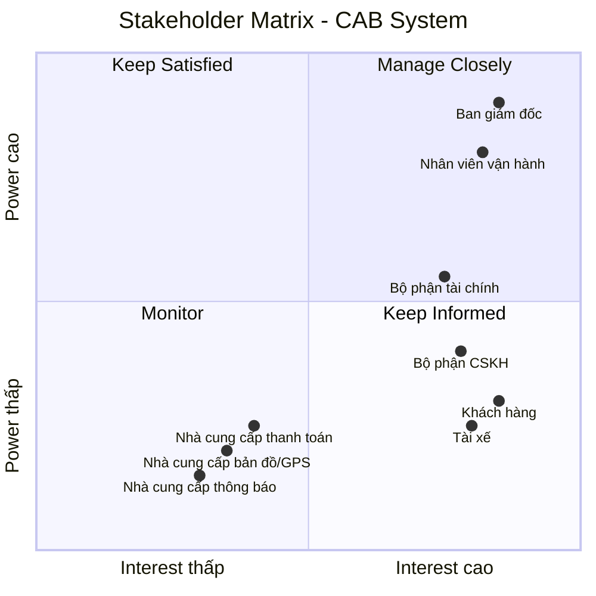

# 23634501_TranHuynhMinhNhat_Cabsystem
## Business Requirements
### Hiện tại, doanh nghiệp ABC đang cung cấp dịch vụ đặt xe nhưng hệ thống hiện có còn nhiều hạn chế. Việc phân công tài xế chủ yếu được thực hiện thủ công, gây mất thời gian, dễ xảy ra sai sót và khó xử lý khi số lượng khách hàng và tài xế tăng cao. Khách hàng khó theo dõi trạng thái chuyến đi, không biết hệ thống đang tìm tài xế, tài xế nào đã nhận chuyến hoặc chuyến đang ở trạng thái nào. Bên cạnh đó, thông tin thanh toán chưa được quản lý tập trung, gây khó khăn trong việc tra cứu và xử lý các giao dịch. Bộ phận vận hành cũng gặp khó khăn khi theo dõi các chuyến đang diễn ra, quản lý tài xế, xử lý các trường hợp chuyến bị lỗi và tổng hợp báo cáo.
### Vì vậy, doanh nghiệp có nhu cầu xây dựng một hệ thống CAB mới nhằm tự động hóa toàn bộ quy trình đặt xe, từ khi khách hàng tạo yêu cầu, hệ thống tìm và phân công tài xế, tài xế thực hiện chuyến, tính cước, thanh toán đến đánh giá sau chuyến. Hệ thống cần hỗ trợ khách hàng, tài xế và nhân viên vận hành, giúp quản lý tập trung thông tin và nâng cao hiệu quả hoạt động. Đồng thời, hệ thống phải ổn định, bảo mật, có khả năng mở rộng khi số lượng người dùng tăng và cho phép doanh nghiệp dễ dàng bổ sung các loại dịch vụ, phương thức thanh toán hoặc kênh thông báo mới trong tương lai.

## Stakeholder

| Stakeholder | Vai trò |
|---|---|
| **Ban giám đốc** | Đưa ra mục tiêu, yêu cầu kinh doanh; phê duyệt phạm vi và định hướng phát triển hệ thống; theo dõi báo cáo và hiệu quả hoạt động. |
| **Khách hàng** | Sử dụng hệ thống để đăng ký, đặt xe, theo dõi chuyến, thanh toán, xem lịch sử và đánh giá tài xế. |
| **Tài xế** | Nhận và thực hiện chuyến; cập nhật trạng thái hoạt động, thông tin phương tiện, vị trí và trạng thái chuyến đi. |
| **Nhà cung cấp thanh toán** | Xử lý thanh toán điện tử và trả kết quả giao dịch. |
| **Nhà cung cấp bản đồ/GPS** | Cung cấp vị trí, bản đồ, khoảng cách và ETA. |
| **Bộ phận CSKH** | Tiếp nhận khiếu nại, hỗ trợ khách hàng/tài xế, xử lý vấn đề chuyến đi. |
| **Nhà cung cấp thông báo** | Gửi SMS, email, push notification. |
| **Nhân viên vận hành** | Quản lý khách hàng, tài xế, phương tiện và chuyến đi; theo dõi hoạt động và xử lý các trường hợp chuyến bị lỗi. |
| **Bộ phận tài chính** | Theo dõi, kiểm tra và đối soát các giao dịch thanh toán, doanh thu từ các chuyến đi. |

## Stakeholder Matrix

Stakeholder Matrix được xây dựng dựa trên hai tiêu chí:

- **Power:** Mức độ quyền lực và khả năng ảnh hưởng đến dự án.
- **Interest:** Mức độ quan tâm và tham gia vào hệ thống CAB.


## Business Goals

| ID | Business Goal | Mô tả |
|---|---|---|
| **BG-01** | **Tự động hóa quy trình đặt xe** | Giảm việc tiếp nhận và phân công tài xế thủ công bằng cách tự động hóa quy trình đặt xe và tìm kiếm tài xế. |
| **BG-02** | **Nâng cao trải nghiệm khách hàng** | Giúp khách hàng dễ dàng đặt xe, theo dõi trạng thái chuyến, biết thông tin tài xế, thời gian dự kiến đến và đánh giá sau chuyến. |
| **BG-03** | **Tối ưu hóa việc phân công tài xế** | Tự động tìm và ưu tiên tài xế phù hợp, gần khách hàng; tiếp tục tìm tài xế khác nếu tài xế không phản hồi hoặc từ chối chuyến. |
| **BG-04** | **Hỗ trợ đa dạng phương thức thanh toán** | Cho phép khách hàng thanh toán bằng **tiền mặt hoặc thanh toán điện tử/chuyển khoản**, đồng thời tích hợp với nhà cung cấp thanh toán bên ngoài để xử lý giao dịch điện tử. |
| **BG-05** | **Quản lý tập trung hoạt động kinh doanh** | Tập trung quản lý thông tin khách hàng, tài xế, phương tiện, chuyến đi, thanh toán và lịch sử giao dịch trên một hệ thống. |
| **BG-06** | **Nâng cao hiệu quả vận hành** | Hỗ trợ nhân viên vận hành theo dõi chuyến đi, trạng thái tài xế, xử lý các trường hợp bất thường và tra cứu thông tin cần thiết. |


# B4. Xác định phạm vi dự án trong 7 tuần (MVP Scope)

## 1. Nguyên tắc xác định phạm vi MVP

Trong thời gian giới hạn **7 tuần**, dự án tập trung xây dựng **MVP (Minimum Viable Product)** nhằm chứng minh tính khả thi của mô hình và tự động hóa quy trình nghiệp vụ cốt lõi:

**Đăng ký → Đăng nhập → Đặt xe → Tìm tài xế → Thực hiện chuyến → Tính cước → Thanh toán → Đánh giá**

### Tiêu chí xác định phạm vi

* **In-Scope / Must Have:** Các chức năng cốt lõi bắt buộc để một chuyến xe có thể diễn ra thành công.
* **Should Have:** Các chức năng cần thiết nhưng có thể triển khai sau các chức năng cốt lõi nếu còn thời gian.
* **Out-of-Scope / Phase 2:** Các chức năng nâng cao chưa cần thiết cho MVP 7 tuần.


## 2. MVP Scope theo mô hình MoSCoW

| Module                           | Chức năng MVP                          | Mức độ      |
| -------------------------------- | -------------------------------------- | ----------- |
| **Quản lý người dùng**           | Đăng ký tài khoản                      | Must Have   |
|                                  | Đăng nhập / đăng xuất                  | Must Have   |
|                                  | Phân quyền 3 vai trò                   | Must Have   |
|                                  | Cập nhật thông tin cá nhân             | Should Have |
| **Quản lý tài xế & phương tiện** | Quản lý thông tin tài xế và xe         | Must Have   |
|                                  | Bật / tắt trạng thái nhận chuyến       | Must Have   |
|                                  | Ghi nhận tọa độ GPS                    | Must Have   |
|                                  | Khóa / kích hoạt tài khoản tài xế      | Should Have |
| **Quản lý chuyến đi**            | Chọn điểm đón và điểm đến              | Must Have   |
|                                  | Lựa chọn loại dịch vụ                  | Must Have   |
|                                  | Tạo yêu cầu đặt xe                     | Must Have   |
|                                  | Cập nhật tiến trình chuyến             | Must Have   |
|                                  | Theo dõi xe trên bản đồ                | Must Have   |
|                                  | Hủy chuyến                             | Should Have |
|                                  | Xem lịch sử chuyến                     | Should Have |
| **Phân công tài xế**             | Tìm tài xế gần nhất                    | Must Have   |
|                                  | Gửi yêu cầu nhận chuyến                | Must Have   |
|                                  | Tài xế chấp nhận / từ chối             | Must Have   |
|                                  | Tự động chuyển tài xế tiếp theo        | Must Have   |
|                                  | Thông báo khi không tìm được tài xế    | Must Have   |
| **Quản lý cước & thanh toán**    | Tính cước theo km và loại xe           | Must Have   |
|                                  | Hiển thị cước dự kiến / thực tế        | Must Have   |
|                                  | Thanh toán tiền mặt                    | Must Have   |
|                                  | Tích hợp 01 cổng thanh toán trực tuyến | Must Have   |
|                                  | Xử lý giao dịch thất bại               | Must Have   |
| **Thông báo**                    | Thông báo trạng thái chuyến            | Must Have   |
|                                  | Thông báo phát cuốc cho tài xế         | Must Have   |
|                                  | Thông báo kết quả thanh toán           | Must Have   |
| **Quản lý vận hành**             | Giám sát chuyến đang diễn ra           | Must Have   |
|                                  | Theo dõi trạng thái tài xế             | Must Have   |
|                                  | Can thiệp xử lý chuyến lỗi             | Must Have   |
|                                  | Tra cứu lịch sử chuyến và giao dịch    | Should Have |
| **Đánh giá & báo cáo**           | Đánh giá tài xế 1–5 sao                | Must Have   |
|                                  | Tính điểm đánh giá trung bình          | Must Have   |
|                                  | Thống kê số lượng chuyến               | Should Have |
|                                  | Thống kê doanh thu cơ bản              | Should Have |
| **Bảo mật & quản trị**           | Xác thực tài khoản                     | Must Have   |
|                                  | Kiểm soát quyền truy cập               | Must Have   |
|                                  | Bảo vệ dữ liệu cá nhân và vị trí       | Must Have   |
|                                  | Không lưu thông tin thẻ                | Must Have   |
|                                  | Lưu mã tham chiếu giao dịch            | Must Have   |

---

## 3. Lộ trình triển khai 7 tuần

```text
[Tuần 1] Phân tích yêu cầu, thiết kế CSDL, Setup môi trường
    │
[Tuần 2] Module Người dùng & Phân quyền
    │
[Tuần 3] Module Tài xế, GPS & Bản đồ
    │
[Tuần 4] Module Chuyến đi & Matching
    │
[Tuần 5] Tính cước, Thanh toán & Đánh giá
    │
[Tuần 6] Portal Vận hành & Báo cáo cơ bản
    │
[Tuần 7] Kiểm thử End-to-End, sửa lỗi & đóng gói
```

---

# B5. Chuyển các yêu cầu thành yêu cầu nghiệp vụ

## 1. Quản lý người dùng

| ID        | Yêu cầu nghiệp vụ                                                                                                   | Mức độ      |
| --------- | ------------------------------------------------------------------------------------------------------------------- | ----------- |
| **BR-01** | Khách hàng và Tài xế có thể đăng ký, đăng nhập và đăng xuất khỏi hệ thống. Tài khoản Vận hành được cấp phát nội bộ. | Must Have   |
| **BR-02** | Hệ thống xác thực và phân quyền truy cập theo 3 vai trò: **Khách hàng**, **Tài xế** và **Nhân viên vận hành**.      | Must Have   |
| **BR-03** | Người dùng có thể cập nhật thông tin cá nhân cơ bản.                                                                | Should Have |

## 2. Quản lý tài xế & phương tiện

| ID        | Yêu cầu nghiệp vụ                                                                                 | Mức độ      |
| --------- | ------------------------------------------------------------------------------------------------- | ----------- |
| **BR-04** | Hệ thống cho phép quản lý hồ sơ tài xế và thông tin phương tiện liên kết.                         | Must Have   |
| **BR-05** | Tài xế có thể bật hoặc tắt trạng thái sẵn sàng nhận chuyến và hệ thống ghi nhận vị trí hoạt động. | Must Have   |
| **BR-06** | Nhân viên vận hành có thể khóa hoặc kích hoạt lại tài khoản tài xế.                               | Should Have |

## 3. Quản lý chuyến đi

| ID        | Yêu cầu nghiệp vụ                                                                                                                | Mức độ      |
| --------- | -------------------------------------------------------------------------------------------------------------------------------- | ----------- |
| **BR-07** | Khách hàng có thể chọn điểm đón, điểm đến, loại dịch vụ và tạo yêu cầu đặt chuyến.                                               | Must Have   |
| **BR-08** | Khách hàng có thể theo dõi tiến trình chuyến đi; Tài xế có thể cập nhật trạng thái chuyến từ lúc nhận chuyến đến khi hoàn thành. | Must Have   |
| **BR-09** | Khách hàng hoặc Tài xế có thể hủy chuyến trước khi chuyến đi bắt đầu; hệ thống ghi nhận lý do.                                   | Should Have |
| **BR-10** | Khách hàng và Tài xế có thể xem lịch sử các chuyến đi đã thực hiện.                                                              | Should Have |

## 4. Phân công tài xế

| ID        | Yêu cầu nghiệp vụ                                                                                     | Mức độ    |
| --------- | ----------------------------------------------------------------------------------------------------- | --------- |
| **BR-11** | Hệ thống tự động tìm tài xế đang sẵn sàng trong bán kính gần điểm đón và phát yêu cầu nhận chuyến.    | Must Have |
| **BR-12** | Tài xế có thể chấp nhận hoặc từ chối yêu cầu nhận chuyến trong thời gian quy định.                    | Must Have |
| **BR-13** | Hệ thống tự động chuyển yêu cầu sang tài xế tiếp theo nếu tài xế từ chối hoặc hết thời gian phản hồi. | Must Have |

## 5. Quản lý cước & thanh toán

| ID        | Yêu cầu nghiệp vụ                                                                          | Mức độ    |
| --------- | ------------------------------------------------------------------------------------------ | --------- |
| **BR-14** | Hệ thống tự động tính toán, hiển thị và lưu cước phí dựa trên khoảng cách và loại dịch vụ. | Must Have |
| **BR-15** | Hệ thống hỗ trợ thanh toán bằng tiền mặt hoặc qua 01 cổng thanh toán trực tuyến.           | Must Have |
| **BR-16** | Hệ thống ghi nhận kết quả thanh toán và xử lý trường hợp giao dịch trực tuyến thất bại.    | Must Have |

## 6. Thông báo

| ID        | Yêu cầu nghiệp vụ                                                                          | Mức độ    |
| --------- | ------------------------------------------------------------------------------------------ | --------- |
| **BR-17** | Hệ thống gửi thông báo cập nhật tiến trình chuyến đi và kết quả thanh toán cho Khách hàng. | Must Have |
| **BR-18** | Hệ thống gửi thông báo phát cuốc xe mới và thông báo khi chuyến bị hủy cho Tài xế.         | Must Have |

## 7. Quản lý vận hành & đánh giá

| ID        | Yêu cầu nghiệp vụ                                                                           | Mức độ      |
| --------- | ------------------------------------------------------------------------------------------- | ----------- |
| **BR-19** | Nhân viên vận hành có thể giám sát các chuyến đi đang hoạt động và xử lý các chuyến bị lỗi. | Must Have   |
| **BR-20** | Khách hàng có thể chấm điểm 1–5 sao và để lại nhận xét cho tài xế sau chuyến đi.            | Must Have   |
| **BR-21** | Hệ thống cung cấp báo cáo số lượng chuyến và doanh thu cơ bản theo thời gian.               | Should Have |

## 8. Bảo mật & an toàn dữ liệu

| ID        | Yêu cầu nghiệp vụ                                                                                      | Mức độ    |
| --------- | ------------------------------------------------------------------------------------------------------ | --------- |
| **BR-22** | Hệ thống kiểm soát quyền truy cập và bảo vệ thông tin cá nhân, dữ liệu chuyến đi và vị trí người dùng. | Must Have |
| **BR-23** | Hệ thống không lưu trữ thông tin thẻ thanh toán nhạy cảm, chỉ lưu mã tham chiếu giao dịch.             | Must Have |

---

# B6. Yêu cầu chức năng (Functional Requirements)

## 1. Quản lý người dùng

### BR-01, BR-02 & BR-03 - Tài khoản, xác thực & phân quyền

| ID        | Functional Requirement | Mô tả                                                                                   |
| --------- | ---------------------- | --------------------------------------------------------------------------------------- |
| **FR-01** | Đăng ký tài khoản      | Khách hàng và Tài xế có thể đăng ký tài khoản mới bằng số điện thoại/email và mật khẩu. |
| **FR-02** | Đăng nhập / Đăng xuất  | Người dùng có thể đăng nhập và đăng xuất phiên làm việc.                                |
| **FR-03** | Phân quyền 3 vai trò   | Hệ thống kiểm soát quyền truy cập theo `Customer`, `Driver`, `Operator`.                |
| **FR-04** | Cập nhật hồ sơ cá nhân | Người dùng có thể xem và chỉnh sửa thông tin cá nhân cơ bản.                            |

---

# 2. Quản lý tài xế & phương tiện

### BR-04, BR-05 & BR-06 - Hồ sơ xe, trạng thái & vị trí

| ID        | Functional Requirement          | Mô tả                                                                               |
| --------- | ------------------------------- | ----------------------------------------------------------------------------------- |
| **FR-05** | Quản lý thông tin tài xế & xe   | Operator có thể thêm, cập nhật hồ sơ tài xế và thông tin phương tiện.               |
| **FR-06** | Bật/tắt trạng thái nhận chuyến  | Tài xế có thể chuyển đổi trạng thái `Online`, `Busy` hoặc `Offline`.                |
| **FR-07** | Cập nhật tọa độ GPS             | Thiết bị tài xế gửi dữ liệu tọa độ định kỳ khi `Online` hoặc đang thực hiện chuyến. |
| **FR-08** | Khóa/Kích hoạt tài khoản tài xế | Operator có thể khóa hoặc kích hoạt lại tài khoản tài xế.                           |

---

# 3. Quản lý chuyến đi

### BR-07, BR-08, BR-09 & BR-10 - Vòng đời chuyến đi

| ID        | Functional Requirement        | Mô tả                                                                 |
| --------- | ----------------------------- | --------------------------------------------------------------------- |
| **FR-09** | Chọn lộ trình di chuyển       | Khách hàng chọn điểm đón và điểm đến thông qua bản đồ số.             |
| **FR-10** | Lựa chọn loại dịch vụ         | Khách hàng lựa chọn loại phương tiện: xe máy hoặc ô tô.               |
| **FR-11** | Tạo yêu cầu đặt xe            | Hệ thống tạo bản ghi chuyến và chuyển sang trạng thái tìm tài xế.     |
| **FR-12** | Cập nhật tiến trình đón khách | Tài xế cập nhật trạng thái đang đến điểm đón và đã có mặt.            |
| **FR-13** | Bắt đầu và hoàn thành cuốc    | Tài xế xác nhận bắt đầu và hoàn thành chuyến đi.                      |
| **FR-14** | Theo dõi xe trên bản đồ       | Khách hàng xem vị trí xe tài xế theo thời gian thực trong chuyến đi.  |
| **FR-15** | Hủy chuyến đi                 | Khách hàng hoặc Tài xế có thể hủy chuyến trước khi bắt đầu di chuyển. |
| **FR-16** | Xem lịch sử chuyến            | Khách hàng và Tài xế có thể xem lịch sử chuyến đi.                    |

> **Lưu ý:** ETA theo traffic thời gian thực đã được loại khỏi MVP, do đó không có Functional Requirement riêng cho ETA.

---

# 4. Phân công tài xế (Matching)

### BR-11, BR-12 & BR-13 - Tìm và gán tài xế

| ID        | Functional Requirement    | Mô tả                                                                              |
| --------- | ------------------------- | ---------------------------------------------------------------------------------- |
| **FR-17** | Quét tài xế gần nhất      | Hệ thống lọc tài xế `Online`, đúng loại xe và gần điểm đón trong bán kính cố định. |
| **FR-18** | Phát yêu cầu nhận chuyến  | Hệ thống gửi thông tin chuyến đến tài xế phù hợp kèm thời gian đếm ngược.          |
| **FR-19** | Phản hồi nhận chuyến      | Tài xế có thể chấp nhận hoặc từ chối yêu cầu.                                      |
| **FR-20** | Tự động chuyển tài xế     | Hệ thống chuyển yêu cầu sang tài xế tiếp theo nếu tài xế từ chối hoặc hết giờ.     |
| **FR-21** | Thông báo không có tài xế | Hệ thống thông báo cho khách hàng khi không tìm được tài xế.                       |

---

# 5. Quản lý cước & thanh toán

### BR-14, BR-15 & BR-16 - Tính giá & xử lý thanh toán

| ID        | Functional Requirement       | Mô tả                                                                                          |
| --------- | ---------------------------- | ---------------------------------------------------------------------------------------------- |
| **FR-22** | Tính cước cố định            | Hệ thống tính giá theo công thức: `Cước = Giá mở cửa + (Quãng đường × Đơn giá/km)`.            |
| **FR-23** | Hiển thị & lưu cước phí      | Hệ thống hiển thị cước dự kiến trước khi đặt xe và lưu cước thực tế sau khi hoàn thành chuyến. |
| **FR-24** | Chọn phương thức thanh toán  | Khách hàng lựa chọn tiền mặt hoặc thanh toán trực tuyến.                                       |
| **FR-25** | Xác nhận thanh toán tiền mặt | Tài xế xác nhận đã thu đủ tiền mặt khi hoàn thành chuyến.                                      |
| **FR-26** | Xử lý thanh toán trực tuyến  | Hệ thống gửi yêu cầu đến cổng thanh toán và tiếp nhận kết quả.                                 |
| **FR-27** | Quản lý trạng thái giao dịch | Hệ thống lưu trạng thái `Pending`, `Success`, `Failed` của giao dịch.                          |
| **FR-28** | Xử lý thanh toán lỗi         | Hệ thống thông báo giao dịch thất bại và cho phép thực hiện lại hoặc đổi phương thức.          |

---

# 6. Thông báo

### BR-17 & BR-18 - Thông báo sự kiện

| ID        | Functional Requirement            | Mô tả                                                          |
| --------- | --------------------------------- | -------------------------------------------------------------- |
| **FR-29** | Thông báo nhận chuyến             | Hệ thống thông báo cho khách hàng khi tài xế chấp nhận chuyến. |
| **FR-30** | Thông báo tài xế đến điểm đón     | Hệ thống thông báo khi tài xế đã có mặt tại điểm đón.          |
| **FR-31** | Thông báo hoàn thành & thanh toán | Hệ thống thông báo kết thúc chuyến và kết quả thanh toán.      |
| **FR-32** | Thông báo phát cuốc cho tài xế    | Hệ thống thông báo cho tài xế khi có yêu cầu chuyến mới.       |
| **FR-33** | Thông báo hủy chuyến              | Hệ thống thông báo cho bên còn lại khi chuyến bị hủy.          |

---

# 7. Quản lý vận hành, đánh giá & báo cáo

### BR-19, BR-20 & BR-21 - Giám sát, đánh giá & báo cáo

| ID        | Functional Requirement             | Mô tả                                                                            |
| --------- | ---------------------------------- | -------------------------------------------------------------------------------- |
| **FR-34** | Giám sát chuyến đang diễn ra       | Operator có thể xem danh sách và tiến trình các chuyến đang hoạt động.           |
| **FR-35** | Giám sát trạng thái tài xế         | Operator có thể theo dõi tài xế `Online`, `Busy`, `Offline`.                     |
| **FR-36** | Can thiệp xử lý chuyến lỗi         | Operator có thể hủy hoặc kết thúc chuyến gặp sự cố.                              |
| **FR-37** | Lưu vết xử lý sự cố                | Hệ thống ghi nhận người xử lý, thời gian và kết quả xử lý.                       |
| **FR-38** | Tra cứu lịch sử chuyến & giao dịch | Operator có thể tìm kiếm và xem lịch sử chuyến và giao dịch.                     |
| **FR-39** | Đánh giá sau chuyến đi             | Khách hàng có thể chấm điểm 1–5 sao và để lại nhận xét.                          |
| **FR-40** | Tính điểm đánh giá trung bình      | Hệ thống tự động tính điểm đánh giá trung bình của tài xế.                       |
| **FR-41** | Báo cáo số lượng chuyến            | Hệ thống thống kê số chuyến hoàn thành và hủy theo thời gian.                    |
| **FR-42** | Báo cáo tổng doanh thu             | Hệ thống thống kê doanh thu từ các chuyến hoàn thành theo ngày, tuần hoặc tháng. |

---

# 8. Bảo mật & an toàn dữ liệu

### BR-22 & BR-23 - An toàn dữ liệu

| ID        | Functional Requirement            | Mô tả                                                                        |
| --------- | --------------------------------- | ---------------------------------------------------------------------------- |
| **FR-43** | Xác thực trước khi thực thi       | Hệ thống kiểm tra phiên đăng nhập trước khi thực hiện tác vụ nghiệp vụ.      |
| **FR-44** | Kiểm soát quyền truy cập dữ liệu  | Hệ thống ngăn người dùng xem hoặc chỉnh sửa dữ liệu không thuộc quyền.       |
| **FR-45** | Bảo vệ dữ liệu vị trí             | Tọa độ GPS chỉ được chia sẻ cho khách hàng liên kết với chuyến đang diễn ra. |
| **FR-46** | Không lưu thông tin thẻ ngân hàng | Hệ thống không lưu số thẻ, ngày hết hạn hoặc mã bảo mật thẻ.                 |
| **FR-47** | Lưu mã tham chiếu giao dịch       | Hệ thống chỉ lưu mã tham chiếu do cổng thanh toán cung cấp để tra soát.      |

# ĐẶC TẢ USE CASE – CAB SYSTEM

> **Tổng số Use Case: 19**
>
> Lưu ý: **“Hệ thống” không phải Actor** trong UML. Với các UC được hệ thống tự động thực hiện như tính cước, gửi thông báo, Actor chính có thể ghi **Không có actor trực tiếp**. Các dịch vụ bên ngoài như nhà cung cấp thanh toán, bản đồ/GPS, thông báo là **Actor phụ**.

---

# UC01 – Đăng ký tài khoản

| **Đăng ký tài khoản** |                                                |
| --------------------- | ---------------------------------------------- |
| **Mã Use Case**       | UC01                                           |
| **Tiền điều kiện**    | Người dùng chưa có tài khoản trên hệ thống.    |
| **Hậu điều kiện**     | Tài khoản được tạo thành công và lưu vào CSDL. |
| **Actor chính**       | Khách hàng / Tài xế                            |
| **Actor phụ**         | Không                                          |
| **Mức độ**            | Must Have                                      |

## Basic Flow

| **Khách hàng / Tài xế**                  | **Hệ thống**                                  |
| ---------------------------------------- | --------------------------------------------- |
| 1. Chọn chức năng **Đăng ký tài khoản**. | 2. Hiển thị biểu mẫu đăng ký.                 |
| 3. Nhập số điện thoại/email và mật khẩu. | 4. Kiểm tra dữ liệu nhập.                     |
|                                          | 5. Kiểm tra số điện thoại/email chưa tồn tại. |
|                                          | 6. Kiểm tra mật khẩu hợp lệ.                  |
| 7. Xác nhận đăng ký.                     | 8. Tạo tài khoản mới.                         |
|                                          | 9. Lưu thông tin tài khoản vào CSDL.          |
|                                          | 10. Thông báo đăng ký thành công.             |

## Alternative Flow

### 3.1. Người dùng đã có tài khoản

1. Người dùng nhập số điện thoại/email đã đăng ký.
2. Hệ thống thông báo tài khoản đã tồn tại.
3. Quay lại bước 3.

### 4.1. Mật khẩu không hợp lệ

1. Hệ thống thông báo mật khẩu không hợp lệ.
2. Người dùng nhập lại mật khẩu.
3. Quay lại bước 3.

## Exception Flow

### 8.1. Lỗi khi lưu tài khoản

1. Hệ thống không thể lưu tài khoản.
2. Thông báo đăng ký thất bại.
3. Kết thúc Use Case.

---

# UC02 – Đăng nhập / Đăng xuất

| **Đăng nhập / Đăng xuất** |                                                                                        |
| ------------------------- | -------------------------------------------------------------------------------------- |
| **Mã Use Case**           | UC02                                                                                   |
| **Tiền điều kiện**        | Người dùng đã có tài khoản để đăng nhập.                                               |
| **Hậu điều kiện**         | Đăng nhập thành công tạo phiên làm việc; đăng xuất thành công kết thúc phiên làm việc. |
| **Actor chính**           | Khách hàng / Tài xế / Nhân viên vận hành                                               |
| **Actor phụ**             | Không                                                                                  |
| **Mức độ**                | Must Have                                                                              |

## Basic Flow – Đăng nhập

| **Người dùng**                           | **Hệ thống**                                  |
| ---------------------------------------- | --------------------------------------------- |
| 1. Chọn **Đăng nhập**.                   | 2. Hiển thị biểu mẫu đăng nhập.               |
| 3. Nhập số điện thoại/email và mật khẩu. | 4. Kiểm tra thông tin đăng nhập.              |
|                                          | 5. Xác thực tài khoản.                        |
|                                          | 6. Xác định vai trò người dùng.               |
|                                          | 7. Tạo phiên đăng nhập.                       |
|                                          | 8. Chuyển người dùng đến giao diện tương ứng. |

## Alternative Flow

### 3.1. Sai thông tin đăng nhập

1. Hệ thống thông báo thông tin đăng nhập không chính xác.
2. Người dùng nhập lại thông tin.
3. Quay lại bước 3.

## Basic Flow – Đăng xuất

| **Người dùng**         | **Hệ thống**                          |
| ---------------------- | ------------------------------------- |
| 1. Chọn **Đăng xuất**. | 2. Xác nhận phiên đăng nhập hiện tại. |
|                        | 3. Hủy phiên đăng nhập.               |
|                        | 4. Chuyển về màn hình đăng nhập.      |

## Exception Flow

### 4.1. Phiên đăng nhập không hợp lệ

1. Hệ thống phát hiện phiên đã hết hạn.
2. Hệ thống yêu cầu người dùng đăng nhập lại.
3. Kết thúc Use Case.

---

# UC03 – Quản lý hồ sơ cá nhân

| **Quản lý hồ sơ cá nhân** |                                                      |
| ------------------------- | ---------------------------------------------------- |
| **Mã Use Case**           | UC03                                                 |
| **Tiền điều kiện**        | Người dùng đã đăng nhập thành công.                  |
| **Hậu điều kiện**         | Thông tin cá nhân được cập nhật thành công vào CSDL. |
| **Actor chính**           | Khách hàng / Tài xế                                  |
| **Actor phụ**             | Không                                                |
| **Mức độ**                | Should Have                                          |

## Basic Flow

| **Người dùng**             | **Hệ thống**                            |
| -------------------------- | --------------------------------------- |
| 1. Chọn **Hồ sơ cá nhân**. | 2. Hiển thị thông tin cá nhân hiện tại. |
| 3. Chỉnh sửa thông tin.    | 4. Kiểm tra dữ liệu nhập.               |
| 5. Chọn **Lưu**.           | 6. Cập nhật thông tin vào CSDL.         |
|                            | 7. Thông báo cập nhật thành công.       |

## Alternative Flow

### 3.1. Dữ liệu không hợp lệ

1. Hệ thống thông báo trường dữ liệu không hợp lệ.
2. Người dùng sửa thông tin.
3. Quay lại bước 3.

## Exception Flow

### 6.1. Không thể cập nhật dữ liệu

1. Hệ thống thông báo cập nhật thất bại.
2. Giữ nguyên thông tin cũ.
3. Kết thúc Use Case.

---

# UC04 – Quản lý tài xế & phương tiện

| **Quản lý tài xế & phương tiện** |                                                                       |
| -------------------------------- | --------------------------------------------------------------------- |
| **Mã Use Case**                  | UC04                                                                  |
| **Tiền điều kiện**               | Nhân viên vận hành đã đăng nhập và có quyền quản lý tài xế.           |
| **Hậu điều kiện**                | Thông tin tài xế/phương tiện được thêm, cập nhật hoặc lưu thành công. |
| **Actor chính**                  | Nhân viên vận hành                                                    |
| **Actor phụ**                    | Không                                                                 |
| **Mức độ**                       | Must Have                                                             |

## Basic Flow

| **Nhân viên vận hành**                    | **Hệ thống**                                 |
| ----------------------------------------- | -------------------------------------------- |
| 1. Chọn **Quản lý tài xế & phương tiện**. | 2. Hiển thị danh sách tài xế và phương tiện. |
| 3. Chọn thêm hoặc cập nhật thông tin.     | 4. Hiển thị biểu mẫu.                        |
| 5. Nhập thông tin tài xế và phương tiện.  | 6. Kiểm tra dữ liệu.                         |
| 7. Xác nhận lưu.                          | 8. Lưu thông tin vào CSDL.                   |
|                                           | 9. Hiển thị kết quả cập nhật.                |

## Alternative Flow

### 5.1. Thông tin không hợp lệ

1. Hệ thống thông báo lỗi.
2. Nhân viên sửa thông tin.
3. Quay lại bước 5.

## Exception Flow

### 8.1. Lỗi CSDL

1. Hệ thống không thể lưu dữ liệu.
2. Thông báo thao tác thất bại.
3. Kết thúc Use Case.

---

# UC05 – Quản lý trạng thái tài xế

| **Quản lý trạng thái tài xế** |                                             |
| ----------------------------- | ------------------------------------------- |
| **Mã Use Case**               | UC05                                        |
| **Tiền điều kiện**            | Tài xế đã đăng nhập.                        |
| **Hậu điều kiện**             | Trạng thái tài xế được cập nhật thành công. |
| **Actor chính**               | Tài xế                                      |
| **Actor phụ**                 | Nhân viên vận hành                          |
| **Mức độ**                    | Must Have                                   |

## Basic Flow

| **Tài xế**                    | **Hệ thống**                                            |
| ----------------------------- | ------------------------------------------------------- |
| 1. Chọn trạng thái hoạt động. | 2. Hiển thị các trạng thái `Online`, `Busy`, `Offline`. |
| 3. Chọn trạng thái mong muốn. | 4. Kiểm tra trạng thái hiện tại.                        |
|                               | 5. Cập nhật trạng thái.                                 |
|                               | 6. Lưu trạng thái vào CSDL.                             |

## Alternative Flow

### 3.1. Tài xế đang thực hiện chuyến

1. Tài xế yêu cầu chuyển sang `Offline`.
2. Hệ thống kiểm tra đang có chuyến.
3. Hệ thống không cho phép chuyển `Offline`.
4. Thông báo lý do.

## Exception Flow

### 5.1. Không thể cập nhật trạng thái

1. Hệ thống thông báo lỗi.
2. Giữ nguyên trạng thái trước đó.
3. Kết thúc Use Case.

---

# UC06 – Cập nhật vị trí GPS

| **Cập nhật vị trí GPS** |                                                                  |
| ----------------------- | ---------------------------------------------------------------- |
| **Mã Use Case**         | UC06                                                             |
| **Tiền điều kiện**      | Tài xế đã đăng nhập và đang `Online` hoặc đang thực hiện chuyến. |
| **Hậu điều kiện**       | Vị trí hiện tại của tài xế được cập nhật vào hệ thống.           |
| **Actor chính**         | Tài xế                                                           |
| **Actor phụ**           | Nhà cung cấp bản đồ/GPS                                          |
| **Mức độ**              | Must Have                                                        |

## Basic Flow

| **Tài xế / Thiết bị**            | **Hệ thống**                                          |
| -------------------------------- | ----------------------------------------------------- |
| 1. Thiết bị gửi tọa độ hiện tại. | 2. Tiếp nhận dữ liệu GPS.                             |
|                                  | 3. Kiểm tra dữ liệu tọa độ.                           |
|                                  | 4. Lưu/cập nhật vị trí tài xế.                        |
|                                  | 5. Cập nhật vị trí trên bản đồ.                       |
|                                  | 6. Chia sẻ vị trí cho khách hàng liên kết với chuyến. |

## Alternative Flow

### 1.1. GPS tạm thời không khả dụng

1. Hệ thống không nhận được tọa độ.
2. Hệ thống giữ vị trí gần nhất.
3. Tiếp tục chờ dữ liệu GPS mới.

## Exception Flow

### 3.1. Tọa độ không hợp lệ

1. Hệ thống từ chối dữ liệu.
2. Không cập nhật vị trí.
3. Chờ dữ liệu tiếp theo.

---

# UC07 – Đặt xe

| **Đặt xe**         |                                                                  |
| ------------------ | ---------------------------------------------------------------- |
| **Mã Use Case**    | UC07                                                             |
| **Tiền điều kiện** | Khách hàng đã đăng nhập.                                         |
| **Hậu điều kiện**  | Chuyến được tạo và chuyển sang trạng thái **“Đang tìm tài xế”**. |
| **Actor chính**    | Khách hàng                                                       |
| **Actor phụ**      | Nhà cung cấp bản đồ/GPS                                          |
| **Mức độ**         | Must Have                                                        |

## Basic Flow

| **Khách hàng**                | **Hệ thống**                                         |
| ----------------------------- | ---------------------------------------------------- |
| 1. Chọn **Đặt xe**.           | 2. Hiển thị giao diện đặt xe.                        |
| 3. Chọn điểm đón và điểm đến. | 4. Lấy thông tin vị trí/bản đồ.                      |
|                               | 5. Tính khoảng cách.                                 |
| 6. Chọn loại dịch vụ.         | 7. Tính cước dự kiến.                                |
|                               | 8. Hiển thị thông tin chuyến và cước dự kiến.        |
| 9. Xác nhận đặt xe.           | 10. Kiểm tra dữ liệu.                                |
|                               | 11. Tạo chuyến đi.                                   |
|                               | 12. Lưu chuyến với trạng thái **“Đang tìm tài xế”**. |
|                               | 13. Chuyển sang UC08.                                |

## Alternative Flow

### 3.1. Thay đổi điểm đón/điểm đến

1. Khách hàng thay đổi vị trí.
2. Hệ thống cập nhật vị trí.
3. Tính lại khoảng cách và cước.
4. Quay lại bước 8.

### 6.1. Thay đổi loại dịch vụ

1. Khách hàng chọn loại xe khác.
2. Hệ thống tính lại cước.
3. Quay lại bước 8.

## Exception Flow

### 4.1. Không lấy được dữ liệu bản đồ

1. Hệ thống thông báo không thể xác định vị trí.
2. Khách hàng chọn lại vị trí.
3. Kết thúc hoặc quay lại bước 3.

---

# UC08 – Tìm & phân công tài xế

| **Tìm & phân công tài xế** |                                                                                             |
| -------------------------- | ------------------------------------------------------------------------------------------- |
| **Mã Use Case**            | UC08                                                                                        |
| **Tiền điều kiện**         | Có chuyến đang ở trạng thái **“Đang tìm tài xế”**.                                          |
| **Hậu điều kiện**          | Chuyến được gán cho tài xế phù hợp hoặc chuyển sang trạng thái **“Không tìm thấy tài xế”**. |
| **Actor chính**            | Không có actor trực tiếp                                                                    |
| **Actor phụ**              | Tài xế                                                                                      |
| **Mức độ**                 | Must Have                                                                                   |

## Basic Flow

| **Tài xế**              | **Hệ thống**                   |
| ----------------------- | ------------------------------ |
|                         | 1. Nhận yêu cầu tìm tài xế.    |
|                         | 2. Tìm tài xế `Online`.        |
|                         | 3. Lọc theo loại xe và vị trí. |
|                         | 4. Xác định tài xế phù hợp.    |
|                         | 5. Gửi yêu cầu nhận chuyến.    |
| 6. Nhận yêu cầu chuyến. |                                |
| 7. Chấp nhận chuyến.    | 8. Gán tài xế vào chuyến.      |
|                         | 9. Cập nhật trạng thái chuyến. |
|                         | 10. Thông báo cho khách hàng.  |

## Alternative Flow

### 5.1. Tài xế từ chối

1. Tài xế từ chối chuyến.
2. Hệ thống ghi nhận.
3. Tìm tài xế tiếp theo.
4. Quay lại bước 5.

### 5.2. Tài xế hết thời gian phản hồi

1. Hệ thống xác định yêu cầu hết hạn.
2. Chuyển sang tài xế tiếp theo.
3. Quay lại bước 5.

## Exception Flow

### 2.1. Không có tài xế phù hợp

1. Hệ thống không tìm thấy tài xế.
2. Cập nhật trạng thái chuyến.
3. Thông báo cho khách hàng.
4. Kết thúc Use Case.

---

# UC09 – Nhận / từ chối chuyến

| **Nhận / từ chối chuyến** |                                                          |
| ------------------------- | -------------------------------------------------------- |
| **Mã Use Case**           | UC09                                                     |
| **Tiền điều kiện**        | Tài xế đang `Online` và nhận được yêu cầu chuyến.        |
| **Hậu điều kiện**         | Chuyến được chấp nhận hoặc yêu cầu được từ chối/hết hạn. |
| **Actor chính**           | Tài xế                                                   |
| **Actor phụ**             | Không                                                    |
| **Mức độ**                | Must Have                                                |

## Basic Flow

| **Tài xế**                    | **Hệ thống**                     |
| ----------------------------- | -------------------------------- |
| 1. Nhận thông báo chuyến mới. | 2. Hiển thị thông tin chuyến.    |
| 3. Chọn **Chấp nhận**.        | 4. Kiểm tra chuyến còn khả dụng. |
|                               | 5. Gán chuyến cho tài xế.        |
|                               | 6. Cập nhật tài xế thành `Busy`. |
|                               | 7. Cập nhật trạng thái chuyến.   |
|                               | 8. Thông báo cho khách hàng.     |

## Alternative Flow

### 3.1. Tài xế từ chối

1. Tài xế chọn **Từ chối**.
2. Hệ thống ghi nhận.
3. Chuyển yêu cầu sang tài xế tiếp theo.

### 3.2. Không phản hồi

1. Hết thời gian quy định.
2. Hệ thống đánh dấu yêu cầu hết hạn.
3. Chuyển sang tài xế tiếp theo.

## Exception Flow

### 4.1. Chuyến đã được nhận

1. Hệ thống phát hiện chuyến đã được tài xế khác nhận.
2. Thông báo cho tài xế.
3. Kết thúc Use Case.

---

# UC10 – Thực hiện chuyến

| **Thực hiện chuyến** |                                                       |
| -------------------- | ----------------------------------------------------- |
| **Mã Use Case**      | UC10                                                  |
| **Tiền điều kiện**   | Tài xế đã nhận chuyến.                                |
| **Hậu điều kiện**    | Chuyến được hoàn thành và chuyển sang bước tính cước. |
| **Actor chính**      | Tài xế                                                |
| **Actor phụ**        | Nhà cung cấp bản đồ/GPS                               |
| **Mức độ**           | Must Have                                             |

## Basic Flow

| **Tài xế**                      | **Hệ thống**                                 |
| ------------------------------- | -------------------------------------------- |
| 1. Xem thông tin chuyến.        | 2. Hiển thị điểm đón/điểm đến.               |
| 3. Di chuyển đến điểm đón.      | 4. Cập nhật vị trí.                          |
| 5. Xác nhận đã đến.             | 6. Cập nhật trạng thái.                      |
| 7. Chọn **Bắt đầu chuyến**.     | 8. Cập nhật trạng thái **“Đang thực hiện”**. |
| 9. Thực hiện chuyến.            | 10. Ghi nhận quãng đường.                    |
| 11. Chọn **Hoàn thành chuyến**. | 12. Cập nhật trạng thái **“Hoàn thành”**.    |
|                                 | 13. Chuyển sang UC13 – Tính cước.            |

## Alternative Flow

### 11.1. Tài xế hủy chuyến

1. Tài xế chọn hủy.
2. Hệ thống yêu cầu lý do.
3. Tài xế nhập lý do.
4. Hệ thống ghi nhận hủy chuyến.

## Exception Flow

### 10.1. Không cập nhật được GPS

1. Hệ thống không nhận được vị trí.
2. Tiếp tục duy trì vị trí gần nhất.
3. Thử nhận dữ liệu GPS mới.

---

# UC11 – Theo dõi chuyến

| **Theo dõi chuyến** |                                                           |
| ------------------- | --------------------------------------------------------- |
| **Mã Use Case**     | UC11                                                      |
| **Tiền điều kiện**  | Khách hàng có chuyến đang được xử lý hoặc đang thực hiện. |
| **Hậu điều kiện**   | Khách hàng xem được trạng thái và vị trí tài xế.          |
| **Actor chính**     | Khách hàng                                                |
| **Actor phụ**       | Nhà cung cấp bản đồ/GPS                                   |
| **Mức độ**          | Must Have                                                 |

## Basic Flow

| **Khách hàng**          | **Hệ thống**                           |
| ----------------------- | -------------------------------------- |
| 1. Mở thông tin chuyến. | 2. Hiển thị trạng thái chuyến.         |
|                         | 3. Hiển thị thông tin tài xế.          |
|                         | 4. Lấy vị trí tài xế.                  |
|                         | 5. Hiển thị vị trí tài xế trên bản đồ. |
| 6. Theo dõi chuyến.     | 7. Cập nhật vị trí định kỳ.            |

## Alternative Flow

### 4.1. Không có dữ liệu GPS mới

1. Hệ thống hiển thị vị trí gần nhất.
2. Tiếp tục chờ dữ liệu mới.

## Exception Flow

### 5.1. Không thể hiển thị bản đồ

1. Hệ thống thông báo không thể tải bản đồ.
2. Hiển thị thông tin trạng thái chuyến dạng văn bản.

---

# UC12 – Hủy chuyến

| **Hủy chuyến**     |                                                                |
| ------------------ | -------------------------------------------------------------- |
| **Mã Use Case**    | UC12                                                           |
| **Tiền điều kiện** | Chuyến chưa bắt đầu di chuyển.                                 |
| **Hậu điều kiện**  | Chuyến được cập nhật trạng thái **“Đã hủy”** và lưu lý do hủy. |
| **Actor chính**    | Khách hàng / Tài xế                                            |
| **Actor phụ**      | Không                                                          |
| **Mức độ**         | Should Have                                                    |

## Basic Flow

| **Khách hàng / Tài xế** | **Hệ thống**                                      |
| ----------------------- | ------------------------------------------------- |
| 1. Chọn **Hủy chuyến**. | 2. Kiểm tra trạng thái chuyến.                    |
|                         | 3. Hiển thị yêu cầu nhập lý do.                   |
| 4. Nhập lý do hủy.      | 5. Kiểm tra lý do.                                |
| 6. Xác nhận hủy.        | 7. Cập nhật trạng thái chuyến thành **“Đã hủy”**. |
|                         | 8. Lưu lý do hủy.                                 |
|                         | 9. Thông báo cho bên còn lại.                     |

## Alternative Flow

### 6.1. Không xác nhận hủy

1. Người dùng chọn quay lại.
2. Hệ thống giữ nguyên chuyến.
3. Kết thúc Use Case.

## Exception Flow

### 2.1. Chuyến đã bắt đầu

1. Hệ thống phát hiện chuyến đã bắt đầu.
2. Không cho phép hủy theo quy tắc MVP.
3. Thông báo cho người dùng.
4. Kết thúc Use Case.

---

# UC13 – Tính cước

| **Tính cước**      |                                                  |
| ------------------ | ------------------------------------------------ |
| **Mã Use Case**    | UC13                                             |
| **Tiền điều kiện** | Chuyến đã hoàn thành hoặc cần tính cước dự kiến. |
| **Hậu điều kiện**  | Cước phí được tính và lưu vào thông tin chuyến.  |
| **Actor chính**    | Không có actor trực tiếp                         |
| **Actor phụ**      | Không                                            |
| **Mức độ**         | Must Have                                        |

## Basic Flow

| **Actor** | **Hệ thống**                     |
| --------- | -------------------------------- |
|           | 1. Nhận thông tin chuyến.        |
|           | 2. Lấy khoảng cách di chuyển.    |
|           | 3. Xác định loại dịch vụ.        |
|           | 4. Lấy giá mở cửa và đơn giá/km. |
|           | 5. Tính cước theo công thức.     |
|           | 6. Hiển thị cước.                |
|           | 7. Lưu cước vào CSDL.            |

### Công thức tính cước

```text
Cước = Giá mở cửa + (Quãng đường × Đơn giá/km)
```

## Alternative Flow

### 2.1. Chưa có quãng đường thực tế

1. Hệ thống sử dụng thông tin khoảng cách hiện có.
2. Tính cước dự kiến.
3. Sau khi chuyến hoàn thành, hệ thống tính lại cước thực tế.

## Exception Flow

### 5.1. Không xác định được đơn giá

1. Hệ thống không thể tính cước.
2. Thông báo lỗi.
3. Không hoàn tất bước thanh toán.
4. Kết thúc Use Case.

---

# UC14 – Thanh toán chuyến đi

| **Thanh toán chuyến đi** |                                                                            |
| ------------------------ | -------------------------------------------------------------------------- |
| **Mã Use Case**          | UC14                                                                       |
| **Tiền điều kiện**       | Chuyến đã hoàn thành và hệ thống đã xác định cước thực tế.                 |
| **Hậu điều kiện**        | Giao dịch được ghi nhận với trạng thái `Success`, `Failed` hoặc `Pending`. |
| **Actor chính**          | Khách hàng                                                                 |
| **Actor phụ**            | Tài xế; Nhà cung cấp thanh toán                                            |
| **Mức độ**               | Must Have                                                                  |

## Basic Flow

| **Khách hàng / Tài xế**                              | **Hệ thống**                                                |
| ---------------------------------------------------- | ----------------------------------------------------------- |
| 1. Chọn phương thức thanh toán.                      | 2. Hiển thị số tiền cần thanh toán.                         |
| 3. Chọn **Thanh toán tiền mặt** hoặc **Trực tuyến**. | 4. Kiểm tra phương thức thanh toán.                         |
|                                                      | 5. Nếu tiền mặt, chuyển sang bước 6.                        |
|                                                      | 6. Nếu trực tuyến, gửi yêu cầu đến Nhà cung cấp thanh toán. |
|                                                      | 7. Nhận kết quả giao dịch.                                  |
|                                                      | 8. Lưu trạng thái giao dịch.                                |
|                                                      | 9. Lưu mã tham chiếu giao dịch nếu có.                      |
|                                                      | 10. Thông báo kết quả thanh toán.                           |

## Alternative Flow

### 3.1. Thanh toán tiền mặt

1. Tài xế nhận tiền từ khách hàng.
2. Tài xế xác nhận đã thu đủ tiền.
3. Hệ thống ghi nhận thanh toán thành công.
4. Kết thúc Use Case.

## Exception Flow

### 7.1. Thanh toán trực tuyến thất bại

1. Nhà cung cấp thanh toán trả kết quả thất bại.
2. Hệ thống cập nhật giao dịch `Failed`.
3. Thông báo cho khách hàng.
4. Khách hàng thực hiện lại hoặc đổi phương thức thanh toán.

### 7.2. Không nhận được kết quả

1. Hệ thống cập nhật giao dịch `Pending`.
2. Thông báo giao dịch đang được xử lý.
3. Kết thúc Use Case.

---

# UC15 – Gửi thông báo

| **Gửi thông báo**  |                                                                          |
| ------------------ | ------------------------------------------------------------------------ |
| **Mã Use Case**    | UC15                                                                     |
| **Tiền điều kiện** | Có sự kiện cần gửi thông báo.                                            |
| **Hậu điều kiện**  | Thông báo được gửi đến người nhận hoặc ghi nhận trạng thái gửi thất bại. |
| **Actor chính**    | Không có actor trực tiếp                                                 |
| **Actor phụ**      | Nhà cung cấp thông báo                                                   |
| **Mức độ**         | Must Have                                                                |

## Basic Flow

| **Nhà cung cấp thông báo** | **Hệ thống**                               |
| -------------------------- | ------------------------------------------ |
|                            | 1. Phát sinh sự kiện cần thông báo.        |
|                            | 2. Xác định người nhận.                    |
|                            | 3. Xác định nội dung thông báo.            |
|                            | 4. Gửi yêu cầu đến Nhà cung cấp thông báo. |
| 5. Tiếp nhận yêu cầu gửi.  |                                            |
|                            | 6. Nhận kết quả gửi.                       |
|                            | 7. Ghi nhận trạng thái gửi.                |

## Alternative Flow

### 4.1. Có nhiều kênh thông báo

1. Hệ thống xác định kênh phù hợp.
2. Gửi thông báo qua kênh được cấu hình.

## Exception Flow

### 6.1. Gửi thông báo thất bại

1. Nhà cung cấp thông báo trả kết quả thất bại.
2. Hệ thống ghi nhận trạng thái gửi thất bại.
3. Thực hiện gửi lại nếu chính sách cho phép.

---

# UC16 – Giám sát & xử lý chuyến

| **Giám sát & xử lý chuyến** |                                                                                    |
| --------------------------- | ---------------------------------------------------------------------------------- |
| **Mã Use Case**             | UC16                                                                               |
| **Tiền điều kiện**          | Nhân viên vận hành đã đăng nhập và có quyền vận hành.                              |
| **Hậu điều kiện**           | Nhân viên vận hành xem được tình trạng chuyến và xử lý được các chuyến bất thường. |
| **Actor chính**             | Nhân viên vận hành                                                                 |
| **Actor phụ**               | Không                                                                              |
| **Mức độ**                  | Must Have                                                                          |

## Basic Flow

| **Nhân viên vận hành**          | **Hệ thống**                                    |
| ------------------------------- | ----------------------------------------------- |
| 1. Chọn **Giám sát chuyến**.    | 2. Hiển thị danh sách chuyến đang hoạt động.    |
| 3. Chọn một chuyến.             | 4. Hiển thị chi tiết chuyến.                    |
|                                 | 5. Hiển thị trạng thái tài xế.                  |
|                                 | 6. Hiển thị tiến trình chuyến.                  |
| 7. Phát hiện chuyến bất thường. | 8. Hiển thị các phương án xử lý.                |
| 9. Chọn xử lý chuyến.           | 10. Cập nhật trạng thái chuyến.                 |
|                                 | 11. Ghi nhận người xử lý, thời gian và kết quả. |

## Alternative Flow

### 9.1. Hủy chuyến

1. Nhân viên chọn hủy chuyến.
2. Nhập lý do.
3. Hệ thống cập nhật trạng thái.
4. Gửi thông báo cho các bên liên quan.

### 9.2. Kết thúc chuyến

1. Nhân viên chọn kết thúc chuyến.
2. Hệ thống yêu cầu xác nhận.
3. Nhân viên xác nhận.
4. Hệ thống cập nhật trạng thái hoàn thành.

## Exception Flow

### 10.1. Không thể cập nhật chuyến

1. Hệ thống thông báo lỗi.
2. Không thay đổi trạng thái chuyến.
3. Ghi nhận lỗi hệ thống.

---

# UC17 – Tra cứu lịch sử

| **Tra cứu lịch sử** |                                                                 |
| ------------------- | --------------------------------------------------------------- |
| **Mã Use Case**     | UC17                                                            |
| **Tiền điều kiện**  | Người dùng đã đăng nhập.                                        |
| **Hậu điều kiện**   | Danh sách lịch sử phù hợp với điều kiện tìm kiếm được hiển thị. |
| **Actor chính**     | Khách hàng / Tài xế / Nhân viên vận hành                        |
| **Actor phụ**       | Không                                                           |
| **Mức độ**          | Should Have                                                     |

## Basic Flow

| **Người dùng**              | **Hệ thống**                                    |
| --------------------------- | ----------------------------------------------- |
| 1. Chọn **Lịch sử chuyến**. | 2. Hiển thị lịch sử phù hợp với quyền truy cập. |
| 3. Nhập điều kiện tìm kiếm. | 4. Kiểm tra điều kiện.                          |
| 5. Thực hiện tìm kiếm.      | 6. Truy vấn CSDL.                               |
|                             | 7. Hiển thị danh sách kết quả.                  |
| 8. Chọn một chuyến.         | 9. Hiển thị chi tiết chuyến.                    |

## Alternative Flow

### 5.1. Không có kết quả

1. Hệ thống không tìm thấy chuyến phù hợp.
2. Thông báo không có dữ liệu.
3. Người dùng thay đổi điều kiện tìm kiếm.

## Exception Flow

### 6.1. Lỗi truy vấn CSDL

1. Hệ thống thông báo không thể tải dữ liệu.
2. Kết thúc Use Case.

---

# UC18 – Đánh giá tài xế

| **Đánh giá tài xế** |                                                                                   |
| ------------------- | --------------------------------------------------------------------------------- |
| **Mã Use Case**     | UC18                                                                              |
| **Tiền điều kiện**  | Chuyến đã hoàn thành và khách hàng đã thanh toán hoặc giao dịch đã được ghi nhận. |
| **Hậu điều kiện**   | Đánh giá được lưu vào CSDL và điểm đánh giá trung bình của tài xế được cập nhật.  |
| **Actor chính**     | Khách hàng                                                                        |
| **Actor phụ**       | Không                                                                             |
| **Mức độ**          | Must Have                                                                         |

## Basic Flow

| **Khách hàng**              | **Hệ thống**                                     |
| --------------------------- | ------------------------------------------------ |
| 1. Mở chuyến đã hoàn thành. | 2. Hiển thị chức năng **Đánh giá tài xế**.       |
| 3. Chọn số sao từ 1–5.      | 4. Kiểm tra số sao hợp lệ.                       |
| 5. Nhập nhận xét nếu muốn.  | 6. Kiểm tra nội dung.                            |
| 7. Xác nhận đánh giá.       | 8. Lưu đánh giá vào CSDL.                        |
|                             | 9. Tính lại điểm đánh giá trung bình của tài xế. |
|                             | 10. Thông báo đánh giá thành công.               |

## Alternative Flow

### 5.1. Khách hàng không nhập nhận xét

1. Hệ thống chỉ lưu số sao.
2. Tiếp tục bước 7.

## Exception Flow

### 8.1. Khách hàng đã đánh giá chuyến này

1. Hệ thống phát hiện chuyến đã có đánh giá.
2. Không cho phép tạo đánh giá mới.
3. Thông báo cho khách hàng.
4. Kết thúc Use Case.

---

# UC19 – Báo cáo chuyến đi & doanh thu


| **Báo cáo chuyến đi & doanh thu** |                                                                           |
| --------------------------------- | ------------------------------------------------------------------------- |
| **Mã Use Case**                   | UC19                                                                      |
| **Tiền điều kiện**                | Nhân viên vận hành đã đăng nhập và có quyền xem báo cáo.                  |
| **Hậu điều kiện**                 | Báo cáo số lượng chuyến và doanh thu được hiển thị theo khoảng thời gian. |
| **Actor chính**                   | Nhân viên vận hành                                                        |
| **Actor phụ**                     | Không                                                                     |
| **Mức độ**                        | Should Have                                                               |

## Basic Flow

| **Nhân viên vận hành**    | **Hệ thống**                                |
| ------------------------- | ------------------------------------------- |
| 1. Chọn **Báo cáo**.      | 2. Hiển thị giao diện báo cáo.              |
| 3. Chọn khoảng thời gian. | 4. Kiểm tra khoảng thời gian.               |
| 5. Chọn loại báo cáo.     | 6. Truy vấn dữ liệu chuyến đi và giao dịch. |
|                           | 7. Tính số lượng chuyến.                    |
|                           | 8. Tính tổng doanh thu.                     |
|                           | 9. Hiển thị báo cáo.                        |

## Alternative Flow

### 3.1. Chọn báo cáo số chuyến

1. Hệ thống thống kê số chuyến hoàn thành.
2. Thống kê số chuyến bị hủy.
3. Hiển thị kết quả.

### 3.2. Chọn báo cáo doanh thu

1. Hệ thống lấy các chuyến hoàn thành.
2. Tổng hợp doanh thu.
3. Hiển thị kết quả.

## Exception Flow

### 6.1. Không có dữ liệu

1. Hệ thống thông báo không có dữ liệu trong khoảng thời gian đã chọn.
2. Hiển thị báo cáo rỗng.
3. Kết thúc Use Case.


