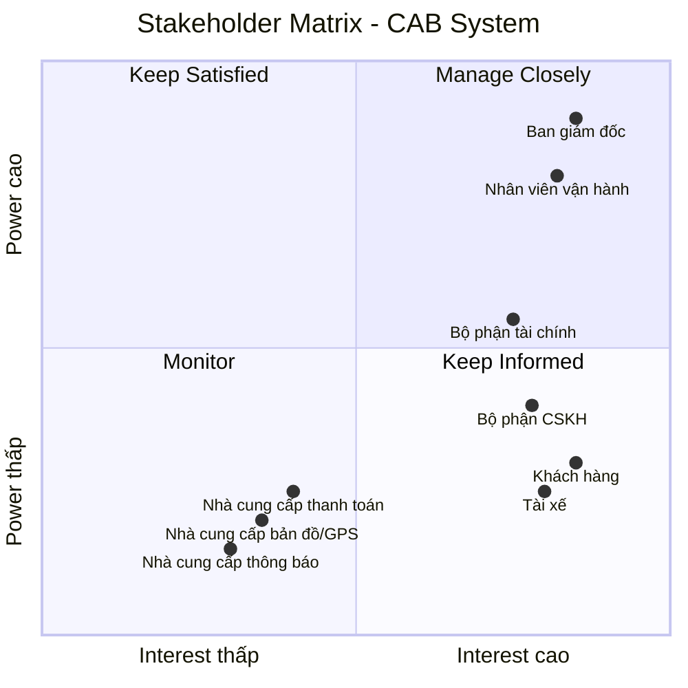

# 23634501_TranHuynhMinhNhat_Cabsystem
## Business Requirements
### Hiện tại, doanh nghiệp ABC đang cung cấp dịch vụ đặt xe nhưng hệ thống hiện có còn nhiều hạn chế. Việc phân công tài xế chủ yếu được thực hiện thủ công, gây mất thời gian, dễ xảy ra sai sót và khó xử lý khi số lượng khách hàng và tài xế tăng cao. Khách hàng khó theo dõi trạng thái chuyến đi, không biết hệ thống đang tìm tài xế, tài xế nào đã nhận chuyến hoặc chuyến đang ở trạng thái nào. Bên cạnh đó, thông tin thanh toán chưa được quản lý tập trung, gây khó khăn trong việc tra cứu và xử lý các giao dịch. Bộ phận vận hành cũng gặp khó khăn khi theo dõi các chuyến đang diễn ra, quản lý tài xế, xử lý các trường hợp chuyến bị lỗi và tổng hợp báo cáo.
### Vì vậy, doanh nghiệp có nhu cầu xây dựng một hệ thống CAB mới nhằm tự động hóa toàn bộ quy trình đặt xe, từ khi khách hàng tạo yêu cầu, hệ thống tìm và phân công tài xế, tài xế thực hiện chuyến, tính cước, thanh toán đến đánh giá sau chuyến. Hệ thống cần hỗ trợ khách hàng, tài xế và nhân viên vận hành, giúp quản lý tập trung thông tin và nâng cao hiệu quả hoạt động. Đồng thời, hệ thống phải ổn định, bảo mật, có khả năng mở rộng khi số lượng người dùng tăng và cho phép doanh nghiệp dễ dàng bổ sung các loại dịch vụ, phương thức thanh toán hoặc kênh thông báo mới trong tương lai.

## Stakeholder

| Stakeholder | Vai trò |
|---|---|
| **Ban giám đốc** | Đưa ra mục tiêu, yêu cầu kinh doanh; phê duyệt phạm vi và định hướng phát triển hệ thống; theo dõi báo cáo và hiệu quả hoạt động. |
| **Khách hàng** | Sử dụng hệ thống để đăng ký, đặt xe, theo dõi chuyến, thanh toán, xem lịch sử và đánh giá tài xế. |
| **Tài xế** | Nhận và thực hiện chuyến; cập nhật trạng thái hoạt động, thông tin phương tiện, vị trí và trạng thái chuyến đi. |
| **Nhà cung cấp thanh toán** | Xử lý thanh toán điện tử và trả kết quả giao dịch. |
| **Nhà cung cấp bản đồ/GPS** | Cung cấp vị trí, bản đồ, khoảng cách và ETA. |
| **Bộ phận CSKH** | Tiếp nhận khiếu nại, hỗ trợ khách hàng/tài xế, xử lý vấn đề chuyến đi. |
| **Nhà cung cấp thông báo** | Gửi SMS, email, push notification. |
| **Nhân viên vận hành** | Quản lý khách hàng, tài xế, phương tiện và chuyến đi; theo dõi hoạt động và xử lý các trường hợp chuyến bị lỗi. |
| **Bộ phận tài chính** | Theo dõi, kiểm tra và đối soát các giao dịch thanh toán, doanh thu từ các chuyến đi. |

## Stakeholder Matrix

Stakeholder Matrix được xây dựng dựa trên hai tiêu chí:

- **Power:** Mức độ quyền lực và khả năng ảnh hưởng đến dự án.
- **Interest:** Mức độ quan tâm và tham gia vào hệ thống CAB.


## Business Goals

| ID | Business Goal | Mô tả |
|---|---|---|
| **BG-01** | **Tự động hóa quy trình đặt xe** | Giảm việc tiếp nhận và phân công tài xế thủ công bằng cách tự động hóa quy trình đặt xe và tìm kiếm tài xế. |
| **BG-02** | **Nâng cao trải nghiệm khách hàng** | Giúp khách hàng dễ dàng đặt xe, theo dõi trạng thái chuyến, biết thông tin tài xế, thời gian dự kiến đến và đánh giá sau chuyến. |
| **BG-03** | **Tối ưu hóa việc phân công tài xế** | Tự động tìm và ưu tiên tài xế phù hợp, gần khách hàng; tiếp tục tìm tài xế khác nếu tài xế không phản hồi hoặc từ chối chuyến. |
| **BG-04** | **Hỗ trợ đa dạng phương thức thanh toán** | Cho phép khách hàng thanh toán bằng **tiền mặt hoặc thanh toán điện tử/chuyển khoản**, đồng thời tích hợp với nhà cung cấp thanh toán bên ngoài để xử lý giao dịch điện tử. |
| **BG-05** | **Quản lý tập trung hoạt động kinh doanh** | Tập trung quản lý thông tin khách hàng, tài xế, phương tiện, chuyến đi, thanh toán và lịch sử giao dịch trên một hệ thống. |
| **BG-06** | **Nâng cao hiệu quả vận hành** | Hỗ trợ nhân viên vận hành theo dõi chuyến đi, trạng thái tài xế, xử lý các trường hợp bất thường và tra cứu thông tin cần thiết. |


# B4. Xác định phạm vi dự án trong 7 tuần (MVP Scope)

## 1. Nguyên tắc xác định phạm vi MVP

Trong thời gian giới hạn **7 tuần**, dự án tập trung xây dựng **MVP (Minimum Viable Product)** nhằm chứng minh tính khả thi của mô hình và tự động hóa quy trình nghiệp vụ cốt lõi:

**Đăng ký → Đăng nhập → Đặt xe → Tìm tài xế → Thực hiện chuyến → Tính cước → Thanh toán → Đánh giá**

### Tiêu chí xác định phạm vi

* **In-Scope / Must Have:** Các chức năng cốt lõi bắt buộc để một chuyến xe có thể diễn ra thành công.
* **Should Have:** Các chức năng cần thiết nhưng có thể triển khai sau các chức năng cốt lõi nếu còn thời gian.
* **Out-of-Scope / Phase 2:** Các chức năng nâng cao chưa cần thiết cho MVP 7 tuần.


## 2. MVP Scope theo mô hình MoSCoW

| Module                           | Chức năng MVP                          | Mức độ      |
| -------------------------------- | -------------------------------------- | ----------- |
| **Quản lý người dùng**           | Đăng ký tài khoản                      | Must Have   |
|                                  | Đăng nhập / đăng xuất                  | Must Have   |
|                                  | Phân quyền 3 vai trò                   | Must Have   |
|                                  | Cập nhật thông tin cá nhân             | Should Have |
| **Quản lý tài xế & phương tiện** | Quản lý thông tin tài xế và xe         | Must Have   |
|                                  | Bật / tắt trạng thái nhận chuyến       | Must Have   |
|                                  | Ghi nhận tọa độ GPS                    | Must Have   |
|                                  | Khóa / kích hoạt tài khoản tài xế      | Should Have |
| **Quản lý chuyến đi**            | Chọn điểm đón và điểm đến              | Must Have   |
|                                  | Lựa chọn loại dịch vụ                  | Must Have   |
|                                  | Tạo yêu cầu đặt xe                     | Must Have   |
|                                  | Cập nhật tiến trình chuyến             | Must Have   |
|                                  | Theo dõi xe trên bản đồ                | Must Have   |
|                                  | Hủy chuyến                             | Should Have |
|                                  | Xem lịch sử chuyến                     | Should Have |
| **Phân công tài xế**             | Tìm tài xế gần nhất                    | Must Have   |
|                                  | Gửi yêu cầu nhận chuyến                | Must Have   |
|                                  | Tài xế chấp nhận / từ chối             | Must Have   |
|                                  | Tự động chuyển tài xế tiếp theo        | Must Have   |
|                                  | Thông báo khi không tìm được tài xế    | Must Have   |
| **Quản lý cước & thanh toán**    | Tính cước theo km và loại xe           | Must Have   |
|                                  | Hiển thị cước dự kiến / thực tế        | Must Have   |
|                                  | Thanh toán tiền mặt                    | Must Have   |
|                                  | Tích hợp 01 cổng thanh toán trực tuyến | Must Have   |
|                                  | Xử lý giao dịch thất bại               | Must Have   |
| **Thông báo**                    | Thông báo trạng thái chuyến            | Must Have   |
|                                  | Thông báo phát cuốc cho tài xế         | Must Have   |
|                                  | Thông báo kết quả thanh toán           | Must Have   |
| **Quản lý vận hành**             | Giám sát chuyến đang diễn ra           | Must Have   |
|                                  | Theo dõi trạng thái tài xế             | Must Have   |
|                                  | Can thiệp xử lý chuyến lỗi             | Must Have   |
|                                  | Tra cứu lịch sử chuyến và giao dịch    | Should Have |
| **Đánh giá & báo cáo**           | Đánh giá tài xế 1–5 sao                | Must Have   |
|                                  | Tính điểm đánh giá trung bình          | Must Have   |
|                                  | Thống kê số lượng chuyến               | Should Have |
|                                  | Thống kê doanh thu cơ bản              | Should Have |
| **Bảo mật & quản trị**           | Xác thực tài khoản                     | Must Have   |
|                                  | Kiểm soát quyền truy cập               | Must Have   |
|                                  | Bảo vệ dữ liệu cá nhân và vị trí       | Must Have   |
|                                  | Không lưu thông tin thẻ                | Must Have   |
|                                  | Lưu mã tham chiếu giao dịch            | Must Have   |

---

## 3. Lộ trình triển khai 7 tuần

```text
[Tuần 1] Phân tích yêu cầu, thiết kế CSDL, Setup môi trường
    │
[Tuần 2] Module Người dùng & Phân quyền
    │
[Tuần 3] Module Tài xế, GPS & Bản đồ
    │
[Tuần 4] Module Chuyến đi & Matching
    │
[Tuần 5] Tính cước, Thanh toán & Đánh giá
    │
[Tuần 6] Portal Vận hành & Báo cáo cơ bản
    │
[Tuần 7] Kiểm thử End-to-End, sửa lỗi & đóng gói
```

---

# B5. Chuyển các yêu cầu thành yêu cầu nghiệp vụ

## 1. Quản lý người dùng

| ID        | Yêu cầu nghiệp vụ                                                                                                   | Mức độ      |
| --------- | ------------------------------------------------------------------------------------------------------------------- | ----------- |
| **BR-01** | Khách hàng và Tài xế có thể đăng ký, đăng nhập và đăng xuất khỏi hệ thống. Tài khoản Vận hành được cấp phát nội bộ. | Must Have   |
| **BR-02** | Hệ thống xác thực và phân quyền truy cập theo 3 vai trò: **Khách hàng**, **Tài xế** và **Nhân viên vận hành**.      | Must Have   |
| **BR-03** | Người dùng có thể cập nhật thông tin cá nhân cơ bản.                                                                | Should Have |

## 2. Quản lý tài xế & phương tiện

| ID        | Yêu cầu nghiệp vụ                                                                                 | Mức độ      |
| --------- | ------------------------------------------------------------------------------------------------- | ----------- |
| **BR-04** | Hệ thống cho phép quản lý hồ sơ tài xế và thông tin phương tiện liên kết.                         | Must Have   |
| **BR-05** | Tài xế có thể bật hoặc tắt trạng thái sẵn sàng nhận chuyến và hệ thống ghi nhận vị trí hoạt động. | Must Have   |
| **BR-06** | Nhân viên vận hành có thể khóa hoặc kích hoạt lại tài khoản tài xế.                               | Should Have |

## 3. Quản lý chuyến đi

| ID        | Yêu cầu nghiệp vụ                                                                                                                | Mức độ      |
| --------- | -------------------------------------------------------------------------------------------------------------------------------- | ----------- |
| **BR-07** | Khách hàng có thể chọn điểm đón, điểm đến, loại dịch vụ và tạo yêu cầu đặt chuyến.                                               | Must Have   |
| **BR-08** | Khách hàng có thể theo dõi tiến trình chuyến đi; Tài xế có thể cập nhật trạng thái chuyến từ lúc nhận chuyến đến khi hoàn thành. | Must Have   |
| **BR-09** | Khách hàng hoặc Tài xế có thể hủy chuyến trước khi chuyến đi bắt đầu; hệ thống ghi nhận lý do.                                   | Should Have |
| **BR-10** | Khách hàng và Tài xế có thể xem lịch sử các chuyến đi đã thực hiện.                                                              | Should Have |

## 4. Phân công tài xế

| ID        | Yêu cầu nghiệp vụ                                                                                     | Mức độ    |
| --------- | ----------------------------------------------------------------------------------------------------- | --------- |
| **BR-11** | Hệ thống tự động tìm tài xế đang sẵn sàng trong bán kính gần điểm đón và phát yêu cầu nhận chuyến.    | Must Have |
| **BR-12** | Tài xế có thể chấp nhận hoặc từ chối yêu cầu nhận chuyến trong thời gian quy định.                    | Must Have |
| **BR-13** | Hệ thống tự động chuyển yêu cầu sang tài xế tiếp theo nếu tài xế từ chối hoặc hết thời gian phản hồi. | Must Have |

## 5. Quản lý cước & thanh toán

| ID        | Yêu cầu nghiệp vụ                                                                          | Mức độ    |
| --------- | ------------------------------------------------------------------------------------------ | --------- |
| **BR-14** | Hệ thống tự động tính toán, hiển thị và lưu cước phí dựa trên khoảng cách và loại dịch vụ. | Must Have |
| **BR-15** | Hệ thống hỗ trợ thanh toán bằng tiền mặt hoặc qua 01 cổng thanh toán trực tuyến.           | Must Have |
| **BR-16** | Hệ thống ghi nhận kết quả thanh toán và xử lý trường hợp giao dịch trực tuyến thất bại.    | Must Have |

## 6. Thông báo

| ID        | Yêu cầu nghiệp vụ                                                                          | Mức độ    |
| --------- | ------------------------------------------------------------------------------------------ | --------- |
| **BR-17** | Hệ thống gửi thông báo cập nhật tiến trình chuyến đi và kết quả thanh toán cho Khách hàng. | Must Have |
| **BR-18** | Hệ thống gửi thông báo phát cuốc xe mới và thông báo khi chuyến bị hủy cho Tài xế.         | Must Have |

## 7. Quản lý vận hành & đánh giá

| ID        | Yêu cầu nghiệp vụ                                                                           | Mức độ      |
| --------- | ------------------------------------------------------------------------------------------- | ----------- |
| **BR-19** | Nhân viên vận hành có thể giám sát các chuyến đi đang hoạt động và xử lý các chuyến bị lỗi. | Must Have   |
| **BR-20** | Khách hàng có thể chấm điểm 1–5 sao và để lại nhận xét cho tài xế sau chuyến đi.            | Must Have   |
| **BR-21** | Hệ thống cung cấp báo cáo số lượng chuyến và doanh thu cơ bản theo thời gian.               | Should Have |

## 8. Bảo mật & an toàn dữ liệu

| ID        | Yêu cầu nghiệp vụ                                                                                      | Mức độ    |
| --------- | ------------------------------------------------------------------------------------------------------ | --------- |
| **BR-22** | Hệ thống kiểm soát quyền truy cập và bảo vệ thông tin cá nhân, dữ liệu chuyến đi và vị trí người dùng. | Must Have |
| **BR-23** | Hệ thống không lưu trữ thông tin thẻ thanh toán nhạy cảm, chỉ lưu mã tham chiếu giao dịch.             | Must Have |

---

# B6. Yêu cầu chức năng (Functional Requirements)

## 1. Quản lý người dùng

### BR-01, BR-02 & BR-03 - Tài khoản, xác thực & phân quyền

| ID        | Functional Requirement | Mô tả                                                                                   |
| --------- | ---------------------- | --------------------------------------------------------------------------------------- |
| **FR-01** | Đăng ký tài khoản      | Khách hàng và Tài xế có thể đăng ký tài khoản mới bằng số điện thoại/email và mật khẩu. |
| **FR-02** | Đăng nhập / Đăng xuất  | Người dùng có thể đăng nhập và đăng xuất phiên làm việc.                                |
| **FR-03** | Phân quyền 3 vai trò   | Hệ thống kiểm soát quyền truy cập theo `Customer`, `Driver`, `Operator`.                |
| **FR-04** | Cập nhật hồ sơ cá nhân | Người dùng có thể xem và chỉnh sửa thông tin cá nhân cơ bản.                            |

---

# 2. Quản lý tài xế & phương tiện

### BR-04, BR-05 & BR-06 - Hồ sơ xe, trạng thái & vị trí

| ID        | Functional Requirement          | Mô tả                                                                               |
| --------- | ------------------------------- | ----------------------------------------------------------------------------------- |
| **FR-05** | Quản lý thông tin tài xế & xe   | Operator có thể thêm, cập nhật hồ sơ tài xế và thông tin phương tiện.               |
| **FR-06** | Bật/tắt trạng thái nhận chuyến  | Tài xế có thể chuyển đổi trạng thái `Online`, `Busy` hoặc `Offline`.                |
| **FR-07** | Cập nhật tọa độ GPS             | Thiết bị tài xế gửi dữ liệu tọa độ định kỳ khi `Online` hoặc đang thực hiện chuyến. |
| **FR-08** | Khóa/Kích hoạt tài khoản tài xế | Operator có thể khóa hoặc kích hoạt lại tài khoản tài xế.                           |

---

# 3. Quản lý chuyến đi

### BR-07, BR-08, BR-09 & BR-10 - Vòng đời chuyến đi

| ID        | Functional Requirement        | Mô tả                                                                 |
| --------- | ----------------------------- | --------------------------------------------------------------------- |
| **FR-09** | Chọn lộ trình di chuyển       | Khách hàng chọn điểm đón và điểm đến thông qua bản đồ số.             |
| **FR-10** | Lựa chọn loại dịch vụ         | Khách hàng lựa chọn loại phương tiện: xe máy hoặc ô tô.               |
| **FR-11** | Tạo yêu cầu đặt xe            | Hệ thống tạo bản ghi chuyến và chuyển sang trạng thái tìm tài xế.     |
| **FR-12** | Cập nhật tiến trình đón khách | Tài xế cập nhật trạng thái đang đến điểm đón và đã có mặt.            |
| **FR-13** | Bắt đầu và hoàn thành cuốc    | Tài xế xác nhận bắt đầu và hoàn thành chuyến đi.                      |
| **FR-14** | Theo dõi xe trên bản đồ       | Khách hàng xem vị trí xe tài xế theo thời gian thực trong chuyến đi.  |
| **FR-15** | Hủy chuyến đi                 | Khách hàng hoặc Tài xế có thể hủy chuyến trước khi bắt đầu di chuyển. |
| **FR-16** | Xem lịch sử chuyến            | Khách hàng và Tài xế có thể xem lịch sử chuyến đi.                    |

> **Lưu ý:** ETA theo traffic thời gian thực đã được loại khỏi MVP, do đó không có Functional Requirement riêng cho ETA.

---

# 4. Phân công tài xế (Matching)

### BR-11, BR-12 & BR-13 - Tìm và gán tài xế

| ID        | Functional Requirement    | Mô tả                                                                              |
| --------- | ------------------------- | ---------------------------------------------------------------------------------- |
| **FR-17** | Quét tài xế gần nhất      | Hệ thống lọc tài xế `Online`, đúng loại xe và gần điểm đón trong bán kính cố định. |
| **FR-18** | Phát yêu cầu nhận chuyến  | Hệ thống gửi thông tin chuyến đến tài xế phù hợp kèm thời gian đếm ngược.          |
| **FR-19** | Phản hồi nhận chuyến      | Tài xế có thể chấp nhận hoặc từ chối yêu cầu.                                      |
| **FR-20** | Tự động chuyển tài xế     | Hệ thống chuyển yêu cầu sang tài xế tiếp theo nếu tài xế từ chối hoặc hết giờ.     |
| **FR-21** | Thông báo không có tài xế | Hệ thống thông báo cho khách hàng khi không tìm được tài xế.                       |

---

# 5. Quản lý cước & thanh toán

### BR-14, BR-15 & BR-16 - Tính giá & xử lý thanh toán

| ID        | Functional Requirement       | Mô tả                                                                                          |
| --------- | ---------------------------- | ---------------------------------------------------------------------------------------------- |
| **FR-22** | Tính cước cố định            | Hệ thống tính giá theo công thức: `Cước = Giá mở cửa + (Quãng đường × Đơn giá/km)`.            |
| **FR-23** | Hiển thị & lưu cước phí      | Hệ thống hiển thị cước dự kiến trước khi đặt xe và lưu cước thực tế sau khi hoàn thành chuyến. |
| **FR-24** | Chọn phương thức thanh toán  | Khách hàng lựa chọn tiền mặt hoặc thanh toán trực tuyến.                                       |
| **FR-25** | Xác nhận thanh toán tiền mặt | Tài xế xác nhận đã thu đủ tiền mặt khi hoàn thành chuyến.                                      |
| **FR-26** | Xử lý thanh toán trực tuyến  | Hệ thống gửi yêu cầu đến cổng thanh toán và tiếp nhận kết quả.                                 |
| **FR-27** | Quản lý trạng thái giao dịch | Hệ thống lưu trạng thái `Pending`, `Success`, `Failed` của giao dịch.                          |
| **FR-28** | Xử lý thanh toán lỗi         | Hệ thống thông báo giao dịch thất bại và cho phép thực hiện lại hoặc đổi phương thức.          |

---

# 6. Thông báo

### BR-17 & BR-18 - Thông báo sự kiện

| ID        | Functional Requirement            | Mô tả                                                          |
| --------- | --------------------------------- | -------------------------------------------------------------- |
| **FR-29** | Thông báo nhận chuyến             | Hệ thống thông báo cho khách hàng khi tài xế chấp nhận chuyến. |
| **FR-30** | Thông báo tài xế đến điểm đón     | Hệ thống thông báo khi tài xế đã có mặt tại điểm đón.          |
| **FR-31** | Thông báo hoàn thành & thanh toán | Hệ thống thông báo kết thúc chuyến và kết quả thanh toán.      |
| **FR-32** | Thông báo phát cuốc cho tài xế    | Hệ thống thông báo cho tài xế khi có yêu cầu chuyến mới.       |
| **FR-33** | Thông báo hủy chuyến              | Hệ thống thông báo cho bên còn lại khi chuyến bị hủy.          |

---

# 7. Quản lý vận hành, đánh giá & báo cáo

### BR-19, BR-20 & BR-21 - Giám sát, đánh giá & báo cáo

| ID        | Functional Requirement             | Mô tả                                                                            |
| --------- | ---------------------------------- | -------------------------------------------------------------------------------- |
| **FR-34** | Giám sát chuyến đang diễn ra       | Operator có thể xem danh sách và tiến trình các chuyến đang hoạt động.           |
| **FR-35** | Giám sát trạng thái tài xế         | Operator có thể theo dõi tài xế `Online`, `Busy`, `Offline`.                     |
| **FR-36** | Can thiệp xử lý chuyến lỗi         | Operator có thể hủy hoặc kết thúc chuyến gặp sự cố.                              |
| **FR-37** | Lưu vết xử lý sự cố                | Hệ thống ghi nhận người xử lý, thời gian và kết quả xử lý.                       |
| **FR-38** | Tra cứu lịch sử chuyến & giao dịch | Operator có thể tìm kiếm và xem lịch sử chuyến và giao dịch.                     |
| **FR-39** | Đánh giá sau chuyến đi             | Khách hàng có thể chấm điểm 1–5 sao và để lại nhận xét.                          |
| **FR-40** | Tính điểm đánh giá trung bình      | Hệ thống tự động tính điểm đánh giá trung bình của tài xế.                       |
| **FR-41** | Báo cáo số lượng chuyến            | Hệ thống thống kê số chuyến hoàn thành và hủy theo thời gian.                    |
| **FR-42** | Báo cáo tổng doanh thu             | Hệ thống thống kê doanh thu từ các chuyến hoàn thành theo ngày, tuần hoặc tháng. |

---

# 8. Bảo mật & an toàn dữ liệu

### BR-22 & BR-23 - An toàn dữ liệu

| ID        | Functional Requirement            | Mô tả                                                                        |
| --------- | --------------------------------- | ---------------------------------------------------------------------------- |
| **FR-43** | Xác thực trước khi thực thi       | Hệ thống kiểm tra phiên đăng nhập trước khi thực hiện tác vụ nghiệp vụ.      |
| **FR-44** | Kiểm soát quyền truy cập dữ liệu  | Hệ thống ngăn người dùng xem hoặc chỉnh sửa dữ liệu không thuộc quyền.       |
| **FR-45** | Bảo vệ dữ liệu vị trí             | Tọa độ GPS chỉ được chia sẻ cho khách hàng liên kết với chuyến đang diễn ra. |
| **FR-46** | Không lưu thông tin thẻ ngân hàng | Hệ thống không lưu số thẻ, ngày hết hạn hoặc mã bảo mật thẻ.                 |
| **FR-47** | Lưu mã tham chiếu giao dịch       | Hệ thống chỉ lưu mã tham chiếu do cổng thanh toán cung cấp để tra soát.      |
# B7 Usecase tổng quát


# B8 ĐẶC TẢ USE CASE – CAB SYSTEM

---
## UC01 – Đăng ký tài khoản


### Actor chính

Khách hàng, Tài xế

### Actor phụ

Không

### Tiền điều kiện

1. Khách hàng hoặc Tài xế chưa có tài khoản trên hệ thống.
2. Khách hàng hoặc Tài xế chưa đăng nhập vào hệ thống.

### Hậu điều kiện

- Nếu use case thành công, tài khoản của Khách hàng hoặc Tài xế được tạo và lưu vào hệ thống.
- Nếu use case không thành công, tài khoản không được tạo và trạng thái dữ liệu hiện tại của hệ thống không thay đổi.

### Dòng sự kiện

#### Basic Flow

| STT | Actor | Hệ thống |
|---|---|---|
| 1 | Khách hàng hoặc Tài xế chọn chức năng **Đăng ký tài khoản**. | |
| 2 | | Hệ thống yêu cầu cung cấp số điện thoại hoặc email và mật khẩu. |
| 3 | Khách hàng hoặc Tài xế nhập thông tin đăng ký và xác nhận đăng ký. | |
| 4 | | Hệ thống kiểm tra tính hợp lệ của thông tin đăng ký. |
| 5 | | Hệ thống kiểm tra số điện thoại hoặc email đã tồn tại hay chưa. |
| 6 | | Hệ thống kiểm tra mật khẩu có đáp ứng quy định đăng ký hay không. |
| 7 | | Hệ thống tạo tài khoản mới. |
| 8 | | Hệ thống lưu thông tin tài khoản. |
| 9 | | Hệ thống thông báo đăng ký tài khoản thành công. |

#### Alternative Flow

**A1. Số điện thoại hoặc email đã tồn tại**

*Điểm bắt đầu: Bước 5 của Basic Flow.*

1. Hệ thống thông báo số điện thoại hoặc email đã được sử dụng.
2. Khách hàng hoặc Tài xế nhập lại thông tin đăng ký.
3. Quay lại bước 4 của Basic Flow.

**A2. Mật khẩu không hợp lệ**

*Điểm bắt đầu: Bước 6 của Basic Flow.*

1. Hệ thống thông báo mật khẩu không đáp ứng quy định.
2. Khách hàng hoặc Tài xế nhập lại mật khẩu.
3. Quay lại bước 3 của Basic Flow.

#### Exception Flow

**E1. Không thể lưu tài khoản**

*Điểm bắt đầu: Bước 8 của Basic Flow.*

1. Hệ thống phát hiện lỗi trong quá trình lưu thông tin tài khoản.
2. Hệ thống thông báo đăng ký tài khoản không thành công.
3. Hệ thống không tạo tài khoản mới.
4. Use case kết thúc.

## UC02 – Đăng nhập / Đăng xuất

### Tóm tắt

Use case này cho phép Khách hàng, Tài xế và Nhân viên vận hành đăng nhập vào hệ thống để sử dụng các chức năng theo quyền được cấp và đăng xuất khỏi hệ thống khi kết thúc sử dụng.

### Actor chính

Khách hàng, Tài xế, Nhân viên vận hành

### Actor phụ

Không

### Tiền điều kiện

1. Khách hàng, Tài xế hoặc Nhân viên vận hành đã có tài khoản trên hệ thống.
2. Tài khoản đang ở trạng thái hoạt động.
3. Người dùng chưa đăng nhập vào hệ thống.

### Hậu điều kiện

- Nếu đăng nhập thành công, người dùng được xác thực và có thể sử dụng các chức năng tương ứng với vai trò.
- Nếu đăng xuất thành công, phiên đăng nhập của người dùng được kết thúc.
- Nếu đăng nhập hoặc đăng xuất không thành công, trạng thái tài khoản và dữ liệu nghiệp vụ không thay đổi.

### Dòng sự kiện

#### Basic Flow – Đăng nhập

| STT | Actor | Hệ thống |
|---|---|---|
| 1 | Khách hàng, Tài xế hoặc Nhân viên vận hành chọn chức năng **Đăng nhập**. | |
| 2 | | Hệ thống yêu cầu cung cấp thông tin đăng nhập. |
| 3 | Khách hàng, Tài xế hoặc Nhân viên vận hành nhập thông tin đăng nhập và xác nhận. | |
| 4 | | Hệ thống kiểm tra thông tin đăng nhập. |
| 5 | | Hệ thống xác thực tài khoản. |
| 6 | | Hệ thống xác định vai trò của tài khoản. |
| 7 | | Hệ thống tạo phiên đăng nhập cho người dùng. |
| 8 | | Hệ thống cho phép người dùng truy cập các chức năng tương ứng với vai trò. |

#### Basic Flow – Đăng xuất

| STT | Actor | Hệ thống |
|---|---|---|
| 1 | Khách hàng, Tài xế hoặc Nhân viên vận hành chọn chức năng **Đăng xuất**. | |
| 2 | | Hệ thống kiểm tra phiên đăng nhập hiện tại. |
| 3 | | Hệ thống yêu cầu xác nhận đăng xuất. |
| 4 | Khách hàng, Tài xế hoặc Nhân viên vận hành xác nhận đăng xuất. | |
| 5 | | Hệ thống kết thúc phiên đăng nhập. |
| 6 | | Hệ thống thông báo đăng xuất thành công. |

### Alternative Flow

#### A1. Thông tin đăng nhập không chính xác

*Điểm bắt đầu: Bước 4 của Basic Flow – Đăng nhập.*

1. Hệ thống thông báo thông tin đăng nhập không chính xác.
2. Khách hàng, Tài xế hoặc Nhân viên vận hành nhập lại thông tin đăng nhập.
3. Quay lại bước 3 của Basic Flow – Đăng nhập.

#### A2. Tài khoản bị khóa

*Điểm bắt đầu: Bước 5 của Basic Flow – Đăng nhập.*

1. Hệ thống phát hiện tài khoản đang bị khóa.
2. Hệ thống thông báo tài khoản không thể đăng nhập.
3. Use case kết thúc.

#### A3. Người dùng hủy đăng xuất

*Điểm bắt đầu: Bước 3 của Basic Flow – Đăng xuất.*

1. Khách hàng, Tài xế hoặc Nhân viên vận hành hủy xác nhận đăng xuất.
2. Hệ thống giữ nguyên phiên đăng nhập.
3. Use case kết thúc.

### Exception Flow

#### E1. Phiên đăng nhập không hợp lệ hoặc đã hết hạn

*Điểm bắt đầu: Bước 2 của Basic Flow – Đăng xuất.*

1. Hệ thống phát hiện phiên đăng nhập không hợp lệ hoặc đã hết hạn.
2. Hệ thống yêu cầu người dùng đăng nhập lại.
3. Use case kết thúc.
---
#### E2. Lỗi hệ thống khi xác thực tài khoản

*Điểm bắt đầu: Bước 5 của Basic Flow – Đăng nhập.*

1. Hệ thống không thể hoàn tất quá trình xác thực tài khoản.
2. Hệ thống thông báo đăng nhập không thành công.
3. Hệ thống không tạo phiên đăng nhập.
4. Use case kết thúc.

---
## UC03 – Quản lý hồ sơ cá nhân

### Actor chính

Khách hàng, Tài xế

### Actor phụ

Không

### Tiền điều kiện

1. Khách hàng hoặc Tài xế đã đăng nhập thành công.
2. Tài khoản của Khách hàng hoặc Tài xế đang ở trạng thái hoạt động.
3. Hồ sơ cá nhân của Khách hàng hoặc Tài xế đã tồn tại trên hệ thống.

### Post-Conditions

Nếu use case thành công, thông tin hồ sơ cá nhân được xem hoặc cập nhật theo chức năng được lựa chọn. Ngược lại, thông tin hồ sơ cá nhân không thay đổi.

### Dòng sự kiện

### Basic Flow

| STT | Actor | Hệ thống |
|---|---|---|
| 1 | | Hệ thống hiển thị các chức năng quản lý hồ sơ cá nhân, gồm **“Xem hồ sơ cá nhân”** và **“Cập nhật hồ sơ cá nhân”**. |
| 2 | Khách hàng hoặc Tài xế chọn chức năng muốn thực hiện. | |
| 3 | | Hệ thống xác định chức năng được lựa chọn.<br><br>Nếu Khách hàng hoặc Tài xế chọn **“Xem hồ sơ cá nhân”**, subflow **Xem hồ sơ cá nhân** được thực hiện.<br><br>Nếu Khách hàng hoặc Tài xế chọn **“Cập nhật hồ sơ cá nhân”**, subflow **Cập nhật hồ sơ cá nhân** được thực hiện. |


### Xem hồ sơ cá nhân

| Người dùng | Hệ thống |
|---|---|
| 1. Khách hàng hoặc Tài xế chọn chức năng xem hồ sơ cá nhân. | |
| | 2. Hệ thống xác định hồ sơ cá nhân tương ứng với tài khoản đang đăng nhập. |
| | 3. Hệ thống hiển thị thông tin hồ sơ cá nhân hiện tại. |
| 4. Khách hàng hoặc Tài xế xem thông tin hồ sơ cá nhân. | |
| | 5. Hệ thống kết thúc chức năng xem hồ sơ cá nhân. |

### Cập nhật hồ sơ cá nhân

| Người dùng | Hệ thống |
|---|---|
| 1. Khách hàng hoặc Tài xế chọn chức năng cập nhật hồ sơ cá nhân. | |
| | 2. Hệ thống yêu cầu nhập thông tin hồ sơ cá nhân cần cập nhật. |
| 3. Khách hàng hoặc Tài xế nhập thông tin cần cập nhật. | |
| 4. Khách hàng hoặc Tài xế xác nhận lưu thông tin. | |
| | 5. Hệ thống kiểm tra dữ liệu nhập. |
| | 6. Hệ thống hiển thị thông tin đã cập nhật để Khách hàng hoặc Tài xế kiểm tra. |
| 7. Khách hàng hoặc Tài xế xác nhận thông tin cập nhật. | |
| | 8. Hệ thống cập nhật thông tin hồ sơ cá nhân. |
| | 9. Hệ thống thông báo cập nhật hồ sơ cá nhân thành công. |

### Alternative Flow

#### Subflow Cập nhật hồ sơ cá nhân

**5.1. Dữ liệu nhập không hợp lệ**

| Người dùng | Hệ thống |
|---|---|
| | 1. Hệ thống phát hiện dữ liệu hồ sơ cá nhân không hợp lệ. |
| | 2. Hệ thống thông báo dữ liệu nhập không hợp lệ. |
| 3. Khách hàng hoặc Tài xế chỉnh sửa lại thông tin. | |
| | 4. Quay lại bước 5 của subflow **Cập nhật hồ sơ cá nhân**. |

**7.1. Khách hàng hoặc Tài xế không xác nhận cập nhật**

| Người dùng | Hệ thống |
|---|---|
| 1. Khách hàng hoặc Tài xế hủy xác nhận cập nhật. | |
| | 2. Hệ thống không cập nhật thông tin hồ sơ cá nhân. |
| | 3. Quay lại bước 1 của Basic Flow. |

### Exception Flow

#### Subflow Cập nhật hồ sơ cá nhân

**8.1. Không thể cập nhật thông tin hồ sơ**

| Người dùng | Hệ thống |
|---|---|
| | 1. Hệ thống phát hiện không thể cập nhật thông tin hồ sơ cá nhân. |
| | 2. Hệ thống thông báo cập nhật hồ sơ không thành công. |
| | 3. Hệ thống giữ nguyên thông tin hồ sơ cá nhân hiện tại. |
| | 4. Use case kết thúc. |

---

## UC04 – Quản lý tài xế & phương tiện

### Actor chính

Nhân viên vận hành

### Actor phụ

Không

### Tiền điều kiện

1. Nhân viên vận hành đã đăng nhập thành công.
2. Nhân viên vận hành có quyền quản lý tài xế và phương tiện.

### Post-Conditions

Nếu use case thành công, thông tin tài xế và phương tiện được thêm mới hoặc cập nhật theo chức năng được lựa chọn. Ngược lại, thông tin tài xế và phương tiện không thay đổi.

### Dòng sự kiện

#### Basic Flow

| Người dùng | Hệ thống |
|---|---|
| | 1. Hệ thống hiển thị các chức năng quản lý tài xế & phương tiện, gồm **“Thêm tài xế & phương tiện”** và **“Cập nhật tài xế & phương tiện”**. |
| 2. Nhân viên vận hành chọn chức năng muốn thực hiện. | |
| | 3. Hệ thống xác định chức năng được lựa chọn.<br><br>Nếu Nhân viên vận hành chọn **“Thêm tài xế & phương tiện”**, subflow **Thêm tài xế & phương tiện** được thực hiện.<br><br>Nếu Nhân viên vận hành chọn **“Cập nhật tài xế & phương tiện”**, subflow **Cập nhật tài xế & phương tiện** được thực hiện. |

### Thêm tài xế & phương tiện

| Người dùng | Hệ thống |
|---|---|
| 1. Nhân viên vận hành chọn chức năng thêm tài xế và phương tiện. | |
| | 2. Hệ thống yêu cầu nhập thông tin tài xế và phương tiện. |
| 3. Nhân viên vận hành nhập thông tin tài xế và phương tiện. | |
| 4. Nhân viên vận hành xác nhận lưu thông tin. | |
| | 5. Hệ thống kiểm tra thông tin tài xế và phương tiện. |
| | 6. Hệ thống tạo thông tin tài xế và liên kết với thông tin phương tiện tương ứng. |
| | 7. Hệ thống lưu thông tin tài xế và phương tiện. |
| | 8. Hệ thống thông báo thêm tài xế và phương tiện thành công. |

### Cập nhật tài xế & phương tiện

| Người dùng | Hệ thống |
|---|---|
| 1. Nhân viên vận hành chọn chức năng cập nhật tài xế và phương tiện. | |
| | 2. Hệ thống yêu cầu nhập thông tin tìm kiếm tài xế hoặc phương tiện cần cập nhật. |
| 3. Nhân viên vận hành nhập thông tin tìm kiếm. | |
| | 4. Hệ thống tìm kiếm và hiển thị thông tin tài xế và phương tiện tương ứng. |
| 5. Nhân viên vận hành thay đổi các thông tin cần cập nhật. | |
| 6. Nhân viên vận hành xác nhận cập nhật thông tin. | |
| | 7. Hệ thống kiểm tra thông tin cập nhật. |
| | 8. Hệ thống cập nhật thông tin tài xế và phương tiện. |
| | 9. Hệ thống thông báo cập nhật tài xế và phương tiện thành công. |

### Alternative Flow

#### Subflow Thêm tài xế & phương tiện

**5.1. Thông tin nhập không hợp lệ**

| Người dùng | Hệ thống |
|---|---|
| | 1. Hệ thống phát hiện thông tin tài xế hoặc phương tiện không hợp lệ. |
| | 2. Hệ thống thông báo thông tin không hợp lệ. |
| 3. Nhân viên vận hành chỉnh sửa lại thông tin. | |
| | 4. Quay lại bước 5 của subflow **Thêm tài xế & phương tiện**. |

#### Subflow Cập nhật tài xế & phương tiện

**4.1. Không tìm thấy thông tin**

| Người dùng | Hệ thống |
|---|---|
| | 1. Hệ thống không tìm thấy tài xế hoặc phương tiện phù hợp. |
| | 2. Hệ thống thông báo không tìm thấy thông tin cần cập nhật. |
| 3. Nhân viên vận hành nhập lại thông tin tìm kiếm. | |
| | 4. Quay lại bước 2 của subflow **Cập nhật tài xế & phương tiện**. |

**7.1. Thông tin cập nhật không hợp lệ**

| Người dùng | Hệ thống |
|---|---|
| | 1. Hệ thống phát hiện thông tin cập nhật không hợp lệ. |
| | 2. Hệ thống thông báo thông tin không hợp lệ. |
| 3. Nhân viên vận hành chỉnh sửa lại thông tin. | |
| | 4. Quay lại bước 7 của subflow **Cập nhật tài xế & phương tiện**. |

**6.1. Hủy cập nhật**

| Người dùng | Hệ thống |
|---|---|
| 1. Nhân viên vận hành hủy xác nhận cập nhật. | |
| | 2. Hệ thống không cập nhật thông tin tài xế và phương tiện. |
| | 3. Quay lại bước 1 của Basic Flow. |

### Exception Flow

#### Subflow Thêm tài xế & phương tiện

**7.1. Không thể lưu thông tin**

| Người dùng | Hệ thống |
|---|---|
| | 1. Hệ thống phát hiện không thể lưu thông tin tài xế và phương tiện. |
| | 2. Hệ thống thông báo thêm tài xế và phương tiện không thành công. |
| | 3. Hệ thống không tạo thông tin tài xế và phương tiện mới. |
| | 4. Use case kết thúc. |

#### Subflow Cập nhật tài xế & phương tiện

**8.1. Không thể cập nhật thông tin**

| Người dùng | Hệ thống |
|---|---|
| | 1. Hệ thống phát hiện không thể cập nhật thông tin tài xế và phương tiện. |
| | 2. Hệ thống thông báo cập nhật không thành công. |
| | 3. Hệ thống giữ nguyên thông tin tài xế và phương tiện hiện tại. |
| | 4. Use case kết thúc. |

---

## UC05 – Quản lý trạng thái tài xế

### Actor chính

Tài xế

### Actor phụ

Không

### Tiền điều kiện

1. Tài xế đã đăng nhập thành công.
2. Tài khoản Tài xế đang ở trạng thái hoạt động.
3. Tài xế chưa bị khóa khỏi hệ thống.

### Post-Conditions

Nếu use case thành công, trạng thái hoạt động của Tài xế được cập nhật theo lựa chọn. Khi Tài xế nhận và thực hiện chuyến, hệ thống có thể chuyển trạng thái sang **Busy**. Ngược lại, trạng thái của Tài xế không thay đổi.

### Dòng sự kiện

#### Basic Flow

| Người dùng | Hệ thống |
|---|---|
| | 1. Hệ thống hiển thị chức năng **Quản lý trạng thái tài xế** và các trạng thái có thể lựa chọn, gồm **“Online”** và **“Offline”**. |
| 2. Tài xế chọn trạng thái muốn thực hiện. | |
| | 3. Hệ thống xác định trạng thái được lựa chọn.<br><br>Nếu Tài xế chọn **“Online”**, subflow **Chuyển sang Online** được thực hiện.<br><br>Nếu Tài xế chọn **“Offline”**, subflow **Chuyển sang Offline** được thực hiện. |

### Chuyển sang Online

| Người dùng | Hệ thống |
|---|---|
| 1. Tài xế chọn trạng thái **Online**. | |
| | 2. Hệ thống kiểm tra tài khoản Tài xế đang hoạt động và cho phép nhận chuyến. |
| | 3. Hệ thống cập nhật trạng thái Tài xế thành **Online**. |
| | 4. Hệ thống thông báo trạng thái Online được cập nhật thành công. |

### Chuyển sang Offline

| Người dùng | Hệ thống |
|---|---|
| 1. Tài xế chọn trạng thái **Offline**. | |
| | 2. Hệ thống kiểm tra trạng thái chuyến hiện tại của Tài xế. |
| | 3. Hệ thống xác định Tài xế không có chuyến đang thực hiện. |
| | 4. Hệ thống cập nhật trạng thái Tài xế thành **Offline**. |
| | 5. Hệ thống thông báo trạng thái Offline được cập nhật thành công. |

### Alternative Flow

#### Subflow Chuyển sang Offline

**3.1. Tài xế đang thực hiện chuyến**

| Người dùng | Hệ thống |
|---|---|
| | 1. Hệ thống phát hiện Tài xế đang thực hiện chuyến. |
| | 2. Hệ thống thông báo Tài xế không thể chuyển sang trạng thái Offline khi đang thực hiện chuyến. |
| | 3. Hệ thống giữ nguyên trạng thái hiện tại của Tài xế. |
| | 4. Use case kết thúc. |

### Exception Flow

#### Subflow Chuyển sang Online

**3.1. Không thể cập nhật trạng thái**

| Người dùng | Hệ thống |
|---|---|
| | 1. Hệ thống phát hiện không thể cập nhật trạng thái Tài xế. |
| | 2. Hệ thống thông báo cập nhật trạng thái không thành công. |
| | 3. Hệ thống giữ nguyên trạng thái hiện tại của Tài xế. |
| | 4. Use case kết thúc. |

#### Subflow Chuyển sang Offline

**4.1. Không thể cập nhật trạng thái**

| Người dùng | Hệ thống |
|---|---|
| | 1. Hệ thống phát hiện không thể cập nhật trạng thái Tài xế. |
| | 2. Hệ thống thông báo cập nhật trạng thái không thành công. |
| | 3. Hệ thống giữ nguyên trạng thái hiện tại của Tài xế. |
| | 4. Use case kết thúc. |

---

## UC06 – Cập nhật vị trí GPS

### Actor chính

Tài xế

### Actor phụ

Nhà cung cấp bản đồ/GPS

### Tiền điều kiện

1. Tài xế đã đăng nhập thành công.
2. Tài khoản Tài xế đang ở trạng thái hoạt động.
3. Tài xế đang ở trạng thái **Online** hoặc đang thực hiện chuyến.
4. Thiết bị của Tài xế có khả năng cung cấp vị trí GPS.

### Post-Conditions

Nếu use case thành công, vị trí GPS mới nhất của Tài xế được cập nhật và có thể được sử dụng cho việc tìm kiếm, phân công hoặc theo dõi chuyến đi. Ngược lại, vị trí hiện tại của Tài xế không được cập nhật.

### Dòng sự kiện

#### Basic Flow

| Người dùng | Hệ thống |
|---|---|
| 1. Tài xế bật chức năng cung cấp vị trí GPS khi Online hoặc đang thực hiện chuyến. | |
| | 2. Hệ thống nhận vị trí GPS hiện tại từ thiết bị của Tài xế. |
| | 3. Hệ thống kiểm tra tính hợp lệ của thông tin vị trí GPS. |
| | 4. Hệ thống cập nhật vị trí GPS mới nhất của Tài xế. |
| | 5. Hệ thống cung cấp thông tin vị trí cho chức năng tìm kiếm, phân công hoặc theo dõi chuyến đi tương ứng. |
| | 6. Hệ thống tiếp tục nhận vị trí GPS mới khi có thông tin vị trí được gửi từ thiết bị của Tài xế. |

### Alternative Flow

#### Bước 3.1. Vị trí GPS không hợp lệ

| Người dùng | Hệ thống |
|---|---|
| | 1. Hệ thống phát hiện thông tin vị trí GPS không hợp lệ. |
| | 2. Hệ thống không cập nhật vị trí GPS mới. |
| | 3. Hệ thống chờ thông tin vị trí GPS tiếp theo. |
| | 4. Quay lại bước 2 của Basic Flow. |

#### Bước 2.1. Không nhận được vị trí GPS

| Người dùng | Hệ thống |
|---|---|
| | 1. Hệ thống không nhận được thông tin vị trí GPS từ thiết bị của Tài xế. |
| | 2. Hệ thống giữ nguyên vị trí GPS gần nhất đã nhận được. |
| | 3. Hệ thống chờ thông tin vị trí GPS tiếp theo. |
| | 4. Quay lại bước 2 của Basic Flow. |

### Exception Flow

#### Bước 4.1. Không thể cập nhật vị trí GPS

| Người dùng | Hệ thống |
|---|---|
| | 1. Hệ thống phát hiện không thể cập nhật vị trí GPS mới. |
| | 2. Hệ thống thông báo cập nhật vị trí GPS không thành công. |
| | 3. Hệ thống giữ nguyên vị trí GPS gần nhất đã nhận được. |
| | 4. Use case kết thúc. |

---

## UC07 – Đặt xe

### Actor chính

Khách hàng

### Actor phụ

Nhà cung cấp bản đồ/GPS

### Tiền điều kiện

1. Khách hàng đã đăng nhập thành công.
2. Tài khoản Khách hàng đang ở trạng thái hoạt động.
3. Dịch vụ đặt xe đang sẵn sàng.

### Post-Conditions

Nếu use case thành công, yêu cầu đặt xe được tạo với trạng thái **Đang tìm tài xế** và hệ thống bắt đầu tìm kiếm tài xế phù hợp. Ngược lại, yêu cầu đặt xe không được tạo.

### Dòng sự kiện

#### Basic Flow

| Người dùng | Hệ thống |
|---|---|
| 1. Khách hàng chọn chức năng **Đặt xe**. | |
| | 2. Hệ thống xác định chức năng đặt xe và yêu cầu Khách hàng cung cấp điểm đón, điểm đến và loại dịch vụ. |
| 3. Khách hàng nhập hoặc lựa chọn **điểm đón** và **điểm đến**. | |
| | 4. Hệ thống kiểm tra và xác định vị trí điểm đón, điểm đến thông qua dịch vụ bản đồ/GPS. |
| | 5. Hệ thống xác định quãng đường dự kiến giữa điểm đón và điểm đến. |
| 6. Khách hàng chọn loại dịch vụ: **Xe máy** hoặc **Ô tô**. | |
| | 7. Hệ thống tính cước dự kiến dựa trên quãng đường và loại dịch vụ. |
| | 8. Hệ thống hiển thị thông tin đặt xe gồm điểm đón, điểm đến, loại dịch vụ và cước dự kiến. |
| 9. Khách hàng kiểm tra và xác nhận yêu cầu đặt xe. | |
| | 10. Hệ thống kiểm tra thông tin đặt xe. |
| | 11. Hệ thống tạo yêu cầu đặt xe với trạng thái **Đang tìm tài xế**. |
| | 12. Hệ thống lưu thông tin yêu cầu đặt xe. |
| | 13. Hệ thống bắt đầu chức năng **Tìm & phân công tài xế**. |

### Alternative Flow

#### Bước 4.1. Điểm đón hoặc điểm đến không hợp lệ

| Người dùng | Hệ thống |
|---|---|
| | 1. Hệ thống phát hiện điểm đón hoặc điểm đến không hợp lệ. |
| | 2. Hệ thống thông báo vị trí không hợp lệ. |
| 3. Khách hàng nhập hoặc lựa chọn lại điểm đón, điểm đến. | |
| | 4. Quay lại bước 4 của Basic Flow. |

#### Bước 7.1. Khách hàng thay đổi loại dịch vụ

| Người dùng | Hệ thống |
|---|---|
| 1. Khách hàng thay đổi loại dịch vụ. | |
| | 2. Hệ thống tính lại cước dự kiến theo loại dịch vụ mới. |
| | 3. Quay lại bước 8 của Basic Flow. |

#### Bước 9.1. Khách hàng không xác nhận đặt xe

| Người dùng | Hệ thống |
|---|---|
| 1. Khách hàng hủy xác nhận đặt xe. | |
| | 2. Hệ thống không tạo yêu cầu đặt xe. |
| | 3. Use case kết thúc. |

### Exception Flow

#### Bước 4.1. Không thể xác định vị trí

| Người dùng | Hệ thống |
|---|---|
| | 1. Hệ thống không thể xác định điểm đón hoặc điểm đến thông qua dịch vụ bản đồ/GPS. |
| | 2. Hệ thống thông báo không thể xác định vị trí. |
| | 3. Hệ thống không tạo yêu cầu đặt xe. |
| | 4. Use case kết thúc. |

#### Bước 12.1. Không thể tạo yêu cầu đặt xe

| Người dùng | Hệ thống |
|---|---|
| | 1. Hệ thống phát hiện không thể tạo yêu cầu đặt xe. |
| | 2. Hệ thống thông báo đặt xe không thành công. |
| | 3. Hệ thống không tạo yêu cầu đặt xe. |
| | 4. Use case kết thúc. |

---

## UC08 – Tìm & phân công tài xế

### Actor chính

Không có

### Actor phụ

Tài xế

### Tiền điều kiện

1. Yêu cầu đặt xe của Khách hàng đã được tạo thành công.
2. Yêu cầu đặt xe đang ở trạng thái **Đang tìm tài xế**.
3. Có thông tin điểm đón và loại phương tiện cần tìm.

### Post-Conditions

Nếu use case thành công, một Tài xế phù hợp được phân công cho yêu cầu đặt xe và trạng thái chuyến được cập nhật. Nếu không tìm được Tài xế phù hợp, hệ thống thông báo cho Khách hàng.

### Dòng sự kiện

#### Basic Flow

| Người dùng | Hệ thống |
|---|---|
| | 1. Hệ thống nhận yêu cầu tìm và phân công Tài xế từ yêu cầu đặt xe. |
| | 2. Hệ thống xác định các Tài xế đang ở trạng thái **Online**. |
| | 3. Hệ thống lọc các Tài xế có loại phương tiện phù hợp và đang ở gần điểm đón trong phạm vi quy định. |
| | 4. Hệ thống xác định Tài xế phù hợp để gửi yêu cầu nhận chuyến. |
| | 5. Hệ thống gửi yêu cầu nhận chuyến đến Tài xế được lựa chọn và chờ phản hồi trong thời gian quy định. |
| 6. Tài xế nhận yêu cầu nhận chuyến. | |
| | 7. Hệ thống nhận kết quả phản hồi từ Tài xế. |
| | 8. Hệ thống phân công chuyến cho Tài xế đã chấp nhận. |
| | 9. Hệ thống cập nhật trạng thái chuyến và thông báo cho Khách hàng về Tài xế được phân công. |

### Alternative Flow

#### Bước 7.1. Tài xế từ chối hoặc không phản hồi

| Người dùng | Hệ thống |
|---|---|
| 7. Tài xế từ chối yêu cầu hoặc không phản hồi trong thời gian quy định. | |
| | 8. Hệ thống ghi nhận kết quả từ chối hoặc hết thời gian phản hồi. |
| | 9. Hệ thống loại Tài xế này khỏi lần tìm kiếm hiện tại và tiếp tục tìm Tài xế phù hợp khác. |
| | 10. Quay lại bước 4 của Basic Flow. |

#### Bước 4.1. Có nhiều Tài xế phù hợp

| Người dùng | Hệ thống |
|---|---|
| | 1. Hệ thống xác định có nhiều Tài xế đáp ứng điều kiện tìm kiếm. |
| | 2. Hệ thống lựa chọn Tài xế phù hợp theo vị trí gần điểm đón. |
| | 3. Quay lại bước 5 của Basic Flow. |

### Exception Flow

#### Bước 3.1. Không tìm thấy Tài xế phù hợp

| Người dùng | Hệ thống |
|---|---|
| | 1. Hệ thống không tìm thấy Tài xế đang Online, có phương tiện phù hợp và ở trong phạm vi tìm kiếm. |
| | 2. Hệ thống thông báo cho Khách hàng rằng hiện không có Tài xế phù hợp. |
| | 3. Hệ thống kết thúc quá trình tìm và phân công Tài xế. |
| | 4. Use case kết thúc. |
---

## UC09 – Nhận / từ chối chuyến

### Actor chính

Tài xế

### Actor phụ

Không

### Tiền điều kiện

1. Tài xế đã đăng nhập thành công.
2. Tài khoản Tài xế đang ở trạng thái hoạt động.
3. Tài xế đang ở trạng thái **Online**.
4. Tài xế đã nhận được yêu cầu nhận chuyến từ hệ thống.

### Post-Conditions

Nếu Tài xế chấp nhận, chuyến xe được phân công cho Tài xế và trạng thái chuyến được cập nhật. Nếu Tài xế từ chối hoặc không phản hồi trong thời gian quy định, hệ thống ghi nhận kết quả và tiếp tục xử lý tìm Tài xế khác. 

### Dòng sự kiện

#### Basic Flow

| Người dùng | Hệ thống |
|---|---|
| 1. Tài xế chọn chức năng **Nhận / từ chối chuyến** từ yêu cầu chuyến được gửi đến. | |
| | 2. Hệ thống hiển thị thông tin chuyến gồm điểm đón, điểm đến và loại phương tiện.<br><br>Nếu Tài xế chọn **“Chấp nhận”**, subflow **Chấp nhận chuyến** được thực hiện.<br><br>Nếu Tài xế chọn **“Từ chối”**, subflow **Từ chối chuyến** được thực hiện. |

### Chấp nhận chuyến

| Người dùng | Hệ thống |
|---|---|
| 1. Tài xế chọn **Chấp nhận chuyến**. | |
| | 2. Hệ thống kiểm tra yêu cầu chuyến vẫn còn hiệu lực và Tài xế vẫn có thể nhận chuyến. |
| | 3. Hệ thống xác nhận Tài xế nhận chuyến. |
| | 4. Hệ thống cập nhật trạng thái Tài xế thành **Busy**. |
| | 5. Hệ thống cập nhật trạng thái chuyến thành **Đã nhận chuyến**. |
| | 6. Hệ thống thông báo cho Khách hàng về Tài xế đã nhận chuyến. |

### Từ chối chuyến

| Người dùng | Hệ thống |
|---|---|
| 1. Tài xế chọn **Từ chối chuyến**. | |
| | 2. Hệ thống ghi nhận kết quả từ chối của Tài xế. |
| | 3. Hệ thống kết thúc yêu cầu nhận chuyến đối với Tài xế này. |
| | 4. Hệ thống trả kết quả về chức năng **Tìm & phân công tài xế** để tiếp tục tìm Tài xế khác. |

### Alternative Flow

#### Subflow Chấp nhận chuyến

**2.1. Yêu cầu chuyến không còn hiệu lực**

| Người dùng | Hệ thống |
|---|---|
| | 1. Hệ thống phát hiện yêu cầu chuyến không còn hiệu lực hoặc đã được Tài xế khác nhận. |
| | 2. Hệ thống thông báo Tài xế không thể nhận chuyến. |
| | 3. Hệ thống kết thúc yêu cầu nhận chuyến. |
| | 4. Use case kết thúc. |

#### Basic Flow – Không phản hồi yêu cầu

**Bước 2.1. Tài xế không phản hồi trong thời gian quy định**

| Người dùng | Hệ thống |
|---|---|
| | 1. Hệ thống phát hiện Tài xế không phản hồi trong thời gian quy định. |
| | 2. Hệ thống ghi nhận yêu cầu nhận chuyến đã hết thời gian phản hồi. |
| | 3. Hệ thống kết thúc yêu cầu nhận chuyến đối với Tài xế này. |
| | 4. Hệ thống trả kết quả về chức năng **Tìm & phân công tài xế** để tiếp tục tìm Tài xế khác. |

### Exception Flow

#### Subflow Chấp nhận chuyến

**3.1. Không thể xác nhận nhận chuyến**

| Người dùng | Hệ thống |
|---|---|
| | 1. Hệ thống phát hiện không thể xác nhận Tài xế nhận chuyến. |
| | 2. Hệ thống thông báo nhận chuyến không thành công. |
| | 3. Hệ thống không thay đổi trạng thái chuyến. |
| | 4. Use case kết thúc. |

#### Subflow Từ chối chuyến

**2.1. Không thể ghi nhận kết quả từ chối**

| Người dùng | Hệ thống |
|---|---|
| | 1. Hệ thống phát hiện không thể ghi nhận kết quả từ chối của Tài xế. |
| | 2. Hệ thống thông báo xử lý yêu cầu không thành công. |
| | 3. Use case kết thúc. |
---

## UC10 – Thực hiện chuyến

### Actor chính

Tài xế

### Actor phụ

Nhà cung cấp bản đồ/GPS

### Tiền điều kiện

1. Tài xế đã đăng nhập thành công.
2. Tài xế đã chấp nhận chuyến.
3. Chuyến xe đang ở trạng thái **Đã nhận chuyến**.
4. Thông tin điểm đón và điểm đến của chuyến đã tồn tại.

### Post-Conditions

Nếu use case thành công, chuyến xe được cập nhật trạng thái **Hoàn thành**, thông tin thực hiện chuyến được ghi nhận và hệ thống chuyển sang chức năng **Tính cước**. Nếu không thành công, trạng thái chuyến được giữ nguyên tại thời điểm xảy ra lỗi.

### Dòng sự kiện

#### Basic Flow

| Người dùng | Hệ thống |
|---|---|
| 1. Tài xế chọn chức năng **Thực hiện chuyến**. | |
| | 2. Hệ thống xác định chuyến xe mà Tài xế đã nhận và hiển thị thông tin điểm đón, điểm đến và trạng thái chuyến.<br><br>Tài xế thực hiện di chuyển đến điểm đón → subflow **Đến điểm đón** được thực hiện.<br><br>Sau khi Tài xế có mặt tại điểm đón → subflow **Bắt đầu chuyến** được thực hiện.<br><br>Sau khi chuyến được bắt đầu → subflow **Hoàn thành chuyến** được thực hiện. |

### Đến điểm đón

| Người dùng | Hệ thống |
|---|---|
| 1. Tài xế di chuyển đến điểm đón của Khách hàng. | |
| | 2. Hệ thống nhận vị trí GPS hiện tại của Tài xế. |
| | 3. Hệ thống cập nhật vị trí của Tài xế trên bản đồ. |
| | 4. Khi Tài xế đến điểm đón, hệ thống cập nhật trạng thái chuyến thành **Đã có mặt**. |
| | 5. Hệ thống thông báo cho Khách hàng rằng Tài xế đã đến điểm đón. |

### Bắt đầu chuyến

| Người dùng | Hệ thống |
|---|---|
| 1. Tài xế xác nhận bắt đầu chuyến sau khi đón Khách hàng. | |
| | 2. Hệ thống kiểm tra chuyến vẫn ở trạng thái **Đã có mặt**. |
| | 3. Hệ thống cập nhật trạng thái chuyến thành **Đang thực hiện**. |
| | 4. Hệ thống bắt đầu ghi nhận thông tin thực hiện chuyến. |

### Hoàn thành chuyến

| Người dùng | Hệ thống |
|---|---|
| 1. Tài xế di chuyển đến điểm đến của Khách hàng. | |
| | 2. Hệ thống nhận thông tin vị trí GPS của Tài xế trong quá trình thực hiện chuyến. |
| 3. Tài xế xác nhận đã đến điểm đến và hoàn thành chuyến. | |
| | 4. Hệ thống xác nhận chuyến đã hoàn thành. |
| | 5. Hệ thống cập nhật trạng thái chuyến thành **Hoàn thành**. |
| | 6. Hệ thống ghi nhận thông tin chuyến đã thực hiện. |
| | 7. Hệ thống chuyển sang chức năng **Tính cước**. |

### Alternative Flow

#### Subflow Đến điểm đón

**2.1. Không nhận được vị trí GPS**

| Người dùng | Hệ thống |
|---|---|
| | 1. Hệ thống không nhận được vị trí GPS hiện tại của Tài xế. |
| | 2. Hệ thống giữ thông tin vị trí gần nhất đã nhận được. |
| | 3. Hệ thống tiếp tục chờ thông tin vị trí GPS mới. |
| | 4. Khi nhận được vị trí GPS mới, quay lại bước 2 của subflow **Đến điểm đón**. |

#### Subflow Bắt đầu chuyến

**2.1. Chuyến không còn ở trạng thái Đã có mặt**

| Người dùng | Hệ thống |
|---|---|
| | 1. Hệ thống phát hiện chuyến không còn ở trạng thái **Đã có mặt**. |
| | 2. Hệ thống thông báo Tài xế không thể bắt đầu chuyến. |
| | 3. Use case kết thúc. |

### Exception Flow

#### Subflow Hoàn thành chuyến

**4.1. Không thể cập nhật trạng thái chuyến**

| Người dùng | Hệ thống |
|---|---|
| | 1. Hệ thống phát hiện không thể cập nhật trạng thái chuyến thành **Hoàn thành**. |
| | 2. Hệ thống thông báo hoàn thành chuyến không thành công. |
| | 3. Hệ thống giữ nguyên trạng thái chuyến hiện tại. |
| | 4. Use case kết thúc. |

---

## UC11 – Theo dõi chuyến

### Actor chính

Khách hàng

### Actor phụ

Nhà cung cấp bản đồ/GPS

### Tiền điều kiện

1. Khách hàng đã đăng nhập thành công.
2. Khách hàng có chuyến xe đang được xử lý.
3. Chuyến xe đã được Tài xế chấp nhận.

### Post-Conditions

Nếu use case thành công, Khách hàng xem được trạng thái hiện tại của chuyến xe, thông tin Tài xế và vị trí của Tài xế trong quá trình thực hiện chuyến. Nếu không thể cập nhật vị trí, hệ thống vẫn hiển thị thông tin chuyến đã nhận được gần nhất.

### Dòng sự kiện

#### Basic Flow

| Người dùng | Hệ thống |
|---|---|
| 1. Khách hàng chọn chức năng **Theo dõi chuyến**. | |
| | 2. Hệ thống xác định chuyến xe đang được Khách hàng theo dõi và hiển thị thông tin chuyến.<br><br>Hệ thống hiển thị **trạng thái chuyến** và **thông tin Tài xế**.<br><br>Hệ thống nhận vị trí GPS hiện tại của Tài xế từ Nhà cung cấp bản đồ/GPS và hiển thị vị trí Tài xế trên bản đồ.<br><br>Hệ thống tiếp tục cập nhật trạng thái chuyến và vị trí Tài xế trong quá trình chuyến đang được thực hiện. |

### Alternative Flow

#### Bước 2.1. Không nhận được vị trí GPS mới

| Người dùng | Hệ thống |
|---|---|
| | 1. Hệ thống không nhận được vị trí GPS mới của Tài xế. |
| | 2. Hệ thống giữ và hiển thị vị trí gần nhất đã nhận được. |
| | 3. Hệ thống tiếp tục chờ thông tin vị trí GPS mới. |
| | 4. Khi nhận được vị trí GPS mới, hệ thống cập nhật vị trí Tài xế. |

#### Bước 2.2. Chuyến xe đã hoàn thành

| Người dùng | Hệ thống |
|---|---|
| | 1. Hệ thống phát hiện chuyến xe đã chuyển sang trạng thái **Hoàn thành**. |
| | 2. Hệ thống hiển thị trạng thái chuyến **Hoàn thành** và thông tin chuyến cuối cùng. |
| | 3. Use case kết thúc. |

### Exception Flow

#### Bước 2.3. Không thể lấy thông tin vị trí từ Nhà cung cấp bản đồ/GPS

| Người dùng | Hệ thống |
|---|---|
| | 1. Hệ thống phát hiện không thể nhận thông tin vị trí từ Nhà cung cấp bản đồ/GPS. |
| | 2. Hệ thống thông báo không thể cập nhật vị trí Tài xế. |
| | 3. Hệ thống vẫn hiển thị trạng thái chuyến và thông tin Tài xế đã nhận được gần nhất. |
| | 4. Use case tiếp tục theo dõi trạng thái chuyến. |

---

## UC12 – Hủy chuyến

### Actor chính

Khách hàng, Tài xế

### Actor phụ

Không

### Tiền điều kiện

1. Khách hàng hoặc Tài xế đã đăng nhập thành công.
2. Chuyến xe đã được tạo và đang được xử lý.
3. Chuyến xe chưa bắt đầu di chuyển.

### Post-Conditions

Nếu use case thành công, chuyến xe được cập nhật trạng thái **Đã hủy**, lý do hủy được ghi nhận và bên còn lại được thông báo. Nếu hủy không thành công, trạng thái chuyến xe không thay đổi.

### Dòng sự kiện

#### Basic Flow

| Người dùng | Hệ thống |
|---|---|
| 1. Khách hàng hoặc Tài xế chọn chức năng **Hủy chuyến**. | |
| | 2. Hệ thống kiểm tra trạng thái hiện tại của chuyến.<br><br>Nếu chuyến xe chưa bắt đầu di chuyển, subflow **Xác nhận hủy chuyến** được thực hiện.<br><br>Nếu chuyến xe đã bắt đầu di chuyển, hệ thống thực hiện Alternative Flow **Chuyến xe đã bắt đầu di chuyển**. |

### Xác nhận hủy chuyến

| Người dùng | Hệ thống |
|---|---|
| | 1. Hệ thống yêu cầu Khách hàng hoặc Tài xế cung cấp lý do hủy chuyến. |
| 2. Khách hàng hoặc Tài xế nhập lý do hủy chuyến. | |
| 3. Khách hàng hoặc Tài xế xác nhận hủy chuyến. | |
| | 4. Hệ thống kiểm tra thông tin hủy chuyến. |
| | 5. Hệ thống cập nhật trạng thái chuyến thành **Đã hủy**. |
| | 6. Hệ thống ghi nhận lý do hủy chuyến. |
| | 7. Hệ thống thông báo cho bên còn lại về việc chuyến xe đã bị hủy. |
| | 8. Hệ thống kết thúc chức năng hủy chuyến. |

### Alternative Flow

#### Bước 2.1. Chuyến xe đã bắt đầu di chuyển

| Người dùng | Hệ thống |
|---|---|
| | 1. Hệ thống phát hiện chuyến xe đã bắt đầu di chuyển. |
| | 2. Hệ thống thông báo không thể hủy chuyến ở trạng thái hiện tại. |
| | 3. Hệ thống giữ nguyên trạng thái chuyến xe. |
| | 4. Use case kết thúc. |

#### Bước 3.1. Khách hàng hoặc Tài xế không xác nhận hủy

| Người dùng | Hệ thống |
|---|---|
| 1. Khách hàng hoặc Tài xế không xác nhận hủy chuyến. | |
| | 2. Hệ thống không thực hiện hủy chuyến. |
| | 3. Hệ thống giữ nguyên trạng thái chuyến xe. |
| | 4. Use case kết thúc. |

### Exception Flow

#### Bước 5.1. Không thể cập nhật trạng thái chuyến

| Người dùng | Hệ thống |
|---|---|
| | 1. Hệ thống phát hiện không thể cập nhật trạng thái chuyến thành **Đã hủy**. |
| | 2. Hệ thống thông báo hủy chuyến không thành công. |
| | 3. Hệ thống giữ nguyên trạng thái chuyến xe. |
| | 4. Use case kết thúc. |

---

## UC13 – Tính cước
### Actor chính

Không có

### Actor phụ

Không

### Tiền điều kiện

1. Đối với tính cước dự kiến: thông tin điểm đón, điểm đến và loại phương tiện đã được cung cấp.
2. Đối với tính cước thực tế: chuyến xe đã hoàn thành và có thông tin quãng đường thực tế.
3. Mức giá mở cửa và đơn giá theo quãng đường của loại phương tiện đã được xác định.

### Post-Conditions

Nếu use case thành công, hệ thống tính được cước chuyến xe, hiển thị cước tương ứng và ghi nhận cước để sử dụng cho các bước tiếp theo. Nếu không thể tính cước, cước chuyến xe không được xác định.

### Dòng sự kiện

#### Basic Flow

| Người dùng | Hệ thống |
|---|---|
| | 1. Hệ thống nhận yêu cầu tính cước.<br><br>Nếu yêu cầu tính **cước dự kiến trước khi đặt xe**, subflow **Tính cước dự kiến** được thực hiện.<br><br>Nếu chuyến xe đã **hoàn thành**, subflow **Tính cước thực tế** được thực hiện. |

### Tính cước dự kiến

| Người dùng | Hệ thống |
|---|---|
| | 1. Hệ thống nhận điểm đón, điểm đến và loại phương tiện đã được Khách hàng lựa chọn. |
| | 2. Hệ thống xác định quãng đường giữa điểm đón và điểm đến. |
| | 3. Hệ thống xác định giá mở cửa và đơn giá theo quãng đường tương ứng với loại phương tiện. |
| | 4. Hệ thống tính cước dự kiến theo công thức:<br>**Cước = Giá mở cửa + (Quãng đường × Đơn giá/km)** |
| | 5. Hệ thống hiển thị cước dự kiến cho Khách hàng. |

### Tính cước thực tế

| Người dùng | Hệ thống |
|---|---|
| | 1. Hệ thống nhận thông tin chuyến xe đã hoàn thành và quãng đường thực tế. |
| | 2. Hệ thống xác định loại phương tiện của chuyến xe. |
| | 3. Hệ thống xác định giá mở cửa và đơn giá theo quãng đường tương ứng với loại phương tiện. |
| | 4. Hệ thống tính cước thực tế theo công thức:<br>**Cước = Giá mở cửa + (Quãng đường × Đơn giá/km)** |
| | 5. Hệ thống ghi nhận cước thực tế của chuyến xe. |
| | 6. Hệ thống hiển thị cước thực tế để sử dụng cho chức năng **Thanh toán chuyến đi**. |

### Alternative Flow

#### Subflow Tính cước dự kiến

**Bước 2.1. Không xác định được quãng đường**

| Người dùng | Hệ thống |
|---|---|
| | 1. Hệ thống không xác định được quãng đường giữa điểm đón và điểm đến. |
| | 2. Hệ thống thông báo không thể tính cước dự kiến. |
| | 3. Hệ thống kết thúc quá trình tính cước dự kiến. |

#### Subflow Tính cước thực tế

**Bước 1.1. Chưa có quãng đường thực tế**

| Người dùng | Hệ thống |
|---|---|
| | 1. Hệ thống phát hiện chưa có thông tin quãng đường thực tế của chuyến xe. |
| | 2. Hệ thống chưa xác định cước thực tế. |
| | 3. Hệ thống chờ thông tin quãng đường thực tế. |

### Exception Flow

#### Subflow Tính cước dự kiến

**Bước 3.1. Không xác định được mức giá**

| Người dùng | Hệ thống |
|---|---|
| | 1. Hệ thống không xác định được giá mở cửa hoặc đơn giá theo quãng đường. |
| | 2. Hệ thống thông báo không thể tính cước. |
| | 3. Hệ thống không hiển thị cước dự kiến. |
| | 4. Use case kết thúc. |

#### Subflow Tính cước thực tế

**Bước 3.1. Không xác định được mức giá**

| Người dùng | Hệ thống |
|---|---|
| | 1. Hệ thống không xác định được giá mở cửa hoặc đơn giá theo quãng đường. |
| | 2. Hệ thống thông báo không thể tính cước thực tế. |
| | 3. Hệ thống không xác định cước thực tế để thanh toán. |
| | 4. Use case kết thúc. |

---

## UC14 – Thanh toán chuyến đi

### Actor chính

Khách hàng

### Actor phụ

Nhà cung cấp thanh toán

### Tiền điều kiện

1. Khách hàng đã đăng nhập thành công.
2. Chuyến xe đã hoàn thành.
3. Cước thực tế của chuyến xe đã được xác định.
4. Khách hàng chưa hoàn tất thanh toán cho chuyến xe.

### Post-Conditions

Nếu use case thành công, khoản thanh toán được ghi nhận với trạng thái **Thành công** và Khách hàng nhận được thông báo kết quả thanh toán.

Nếu thanh toán trực tuyến thất bại, hệ thống ghi nhận trạng thái **Thất bại**, thông báo cho Khách hàng và cho phép Khách hàng thử lại hoặc thay đổi phương thức thanh toán.

### Dòng sự kiện

#### Basic Flow

| Người dùng | Hệ thống |
|---|---|
| 1. Khách hàng chọn chức năng **Thanh toán chuyến đi**. | |
| | 2. Hệ thống xác định chuyến xe cần thanh toán và hiển thị cước thực tế cùng các phương thức thanh toán.<br><br>Nếu Khách hàng chọn **“Tiền mặt”**, subflow **Thanh toán bằng tiền mặt** được thực hiện.<br><br>Nếu Khách hàng chọn **“Thanh toán trực tuyến”**, subflow **Thanh toán trực tuyến** được thực hiện. |

### Thanh toán bằng tiền mặt

| Người dùng | Hệ thống |
|---|---|
| 1. Khách hàng chọn phương thức **Tiền mặt** và thanh toán cước cho Tài xế. | |
| 2. Tài xế xác nhận đã nhận đủ tiền. | |
| | 3. Hệ thống ghi nhận kết quả thanh toán tiền mặt là **Thành công**. |
| | 4. Hệ thống cập nhật trạng thái thanh toán của chuyến xe. |
| | 5. Hệ thống thông báo kết quả thanh toán cho Khách hàng. |

### Thanh toán trực tuyến

| Người dùng | Hệ thống |
|---|---|
| 1. Khách hàng chọn phương thức **Thanh toán trực tuyến**. | |
| | 2. Hệ thống tạo yêu cầu thanh toán với số tiền bằng cước thực tế của chuyến xe. |
| | 3. Hệ thống gửi yêu cầu thanh toán đến **Nhà cung cấp thanh toán**. |
| | 4. Nhà cung cấp thanh toán xử lý giao dịch và trả kết quả thanh toán. |
| | 5. Hệ thống nhận kết quả giao dịch và xác định trạng thái **Pending**, **Success** hoặc **Failed**. |
| | 6. Nếu trạng thái là **Success**, hệ thống ghi nhận thanh toán thành công và thông báo cho Khách hàng. |

### Alternative Flow

#### Bước 5.1. Thanh toán trực tuyến đang xử lý

| Người dùng | Hệ thống |
|---|---|
| | 1. Hệ thống nhận kết quả thanh toán có trạng thái **Pending** từ Nhà cung cấp thanh toán. |
| | 2. Hệ thống ghi nhận trạng thái thanh toán là **Pending**. |
| | 3. Hệ thống thông báo cho Khách hàng rằng giao dịch đang được xử lý. |
| | 4. Hệ thống chờ kết quả thanh toán cuối cùng từ Nhà cung cấp thanh toán. |

#### Bước 5.2. Thanh toán trực tuyến thất bại

| Người dùng | Hệ thống |
|---|---|
| | 1. Hệ thống nhận kết quả thanh toán có trạng thái **Failed** từ Nhà cung cấp thanh toán. |
| | 2. Hệ thống ghi nhận trạng thái thanh toán là **Failed**. |
| | 3. Hệ thống thông báo cho Khách hàng rằng thanh toán không thành công. |
| | 4. Hệ thống cho phép Khách hàng **thử lại thanh toán hoặc thay đổi phương thức thanh toán**. |
| 5. Khách hàng chọn thử lại hoặc thay đổi phương thức thanh toán. | |
| | 6. Nếu Khách hàng chọn **thử lại**, quay lại bước 2 của subflow **Thanh toán trực tuyến**.<br><br>Nếu Khách hàng chọn **thay đổi phương thức thanh toán**, quay lại bước 2 của Basic Flow. |

### Exception Flow

#### Subflow Thanh toán bằng tiền mặt

**Bước 2.1. Tài xế không xác nhận đã nhận tiền**

| Người dùng | Hệ thống |
|---|---|
| | 1. Hệ thống không nhận được xác nhận thanh toán tiền mặt từ Tài xế. |
| | 2. Hệ thống không ghi nhận thanh toán thành công. |
| | 3. Hệ thống thông báo chưa thể xác nhận thanh toán. |
| | 4. Use case kết thúc. |

#### Subflow Thanh toán trực tuyến

**Bước 3.1. Không thể gửi yêu cầu đến Nhà cung cấp thanh toán**

| Người dùng | Hệ thống |
|---|---|
| | 1. Hệ thống phát hiện không thể gửi yêu cầu thanh toán đến Nhà cung cấp thanh toán. |
| | 2. Hệ thống ghi nhận giao dịch không thực hiện thành công. |
| | 3. Hệ thống thông báo cho Khách hàng rằng không thể thực hiện thanh toán trực tuyến. |
| | 4. Use case kết thúc. |

#### Subflow Thanh toán trực tuyến

**Bước 4.1. Không nhận được kết quả giao dịch**

| Người dùng | Hệ thống |
|---|---|
| | 1. Hệ thống không nhận được kết quả giao dịch từ Nhà cung cấp thanh toán. |
| | 2. Hệ thống ghi nhận trạng thái thanh toán là **Pending**. |
| | 3. Hệ thống thông báo cho Khách hàng rằng giao dịch đang được xử lý. |
| | 4. Use case kết thúc. |

---

## UC15 – Gửi thông báo

### Actor chính

Không có

### Actor phụ

Nhà cung cấp thông báo

### Tiền điều kiện

1. Hệ thống đã phát sinh một sự kiện cần gửi thông báo.
2. Có thông tin người nhận thông báo.
3. Nội dung thông báo tương ứng với sự kiện đã được xác định.

### Post-Conditions

Nếu use case thành công, thông báo được gửi đến đúng người nhận và hệ thống ghi nhận kết quả gửi thông báo.

Nếu gửi thông báo không thành công, hệ thống ghi nhận kết quả gửi thất bại và không làm thay đổi trạng thái nghiệp vụ của chuyến xe.

### Dòng sự kiện

#### Basic Flow

| Người dùng | Hệ thống |
|---|---|
| | 1. Hệ thống nhận sự kiện cần gửi thông báo.<br><br>Nếu sự kiện là **Tài xế nhận chuyến**, subflow **Thông báo Tài xế nhận chuyến** được thực hiện.<br><br>Nếu sự kiện là **Tài xế đã đến điểm đón**, subflow **Thông báo Tài xế đã đến** được thực hiện.<br><br>Nếu sự kiện là **Hoàn thành chuyến hoặc có kết quả thanh toán**, subflow **Thông báo hoàn thành và thanh toán** được thực hiện.<br><br>Nếu sự kiện là **Hủy chuyến**, subflow **Thông báo hủy chuyến** được thực hiện.<br><br>Nếu sự kiện là **Có chuyến mới cần nhận**, subflow **Thông báo chuyến mới cho Tài xế** được thực hiện. |

### Thông báo Tài xế nhận chuyến

| Người dùng | Hệ thống |
|---|---|
| | 1. Hệ thống xác định Khách hàng của chuyến xe. |
| | 2. Hệ thống tạo nội dung thông báo Tài xế đã nhận chuyến. |
| | 3. Hệ thống gửi thông báo đến Khách hàng thông qua Nhà cung cấp thông báo. |
| | 4. Hệ thống ghi nhận kết quả gửi thông báo. |

### Thông báo Tài xế đã đến

| Người dùng | Hệ thống |
|---|---|
| | 1. Hệ thống xác định Khách hàng của chuyến xe. |
| | 2. Hệ thống tạo nội dung thông báo Tài xế đã đến điểm đón. |
| | 3. Hệ thống gửi thông báo đến Khách hàng thông qua Nhà cung cấp thông báo. |
| | 4. Hệ thống ghi nhận kết quả gửi thông báo. |

### Thông báo hoàn thành và thanh toán

| Người dùng | Hệ thống |
|---|---|
| | 1. Hệ thống xác định Khách hàng của chuyến xe. |
| | 2. Hệ thống tạo nội dung thông báo chuyến xe đã hoàn thành và kết quả thanh toán. |
| | 3. Hệ thống gửi thông báo đến Khách hàng thông qua Nhà cung cấp thông báo. |
| | 4. Hệ thống ghi nhận kết quả gửi thông báo. |

### Thông báo hủy chuyến

| Người dùng | Hệ thống |
|---|---|
| | 1. Hệ thống xác định bên còn lại của chuyến xe cần nhận thông báo. |
| | 2. Hệ thống tạo nội dung thông báo chuyến xe đã bị hủy. |
| | 3. Hệ thống gửi thông báo đến người nhận thông qua Nhà cung cấp thông báo. |
| | 4. Hệ thống ghi nhận kết quả gửi thông báo. |

### Thông báo chuyến mới cho Tài xế

| Người dùng | Hệ thống |
|---|---|
| | 1. Hệ thống xác định Tài xế được phân công nhận yêu cầu chuyến. |
| | 2. Hệ thống tạo nội dung thông báo có chuyến mới. |
| | 3. Hệ thống gửi thông báo đến Tài xế thông qua Nhà cung cấp thông báo. |
| | 4. Hệ thống ghi nhận kết quả gửi thông báo. |

### Alternative Flow

#### Bước 3.1. Người nhận không còn hợp lệ

| Người dùng | Hệ thống |
|---|---|
| | 1. Hệ thống phát hiện người nhận không còn đủ điều kiện nhận thông báo. |
| | 2. Hệ thống không gửi thông báo đến người nhận. |
| | 3. Hệ thống ghi nhận thông báo không được gửi. |
| | 4. Use case kết thúc. |

#### Bước 3.2. Người nhận đã nhận được thông báo

| Người dùng | Hệ thống |
|---|---|
| | 1. Hệ thống nhận kết quả thông báo đã được gửi thành công. |
| | 2. Hệ thống ghi nhận kết quả gửi thành công. |
| | 3. Use case kết thúc. |

### Exception Flow

#### Bước 3.3. Nhà cung cấp thông báo không thể gửi thông báo

| Người dùng | Hệ thống |
|---|---|
| | 1. Hệ thống phát hiện Nhà cung cấp thông báo không thể thực hiện việc gửi thông báo. |
| | 2. Hệ thống ghi nhận kết quả gửi thông báo là **Thất bại**. |
| | 3. Hệ thống không thay đổi trạng thái chuyến xe hoặc kết quả nghiệp vụ đã phát sinh. |
| | 4. Use case kết thúc. |

---

## UC16 – Giám sát & xử lý chuyến
### Actor chính

Nhân viên vận hành

### Actor phụ

Không

### Tiền điều kiện

1. Nhân viên vận hành đã đăng nhập thành công.
2. Nhân viên vận hành có quyền giám sát và xử lý chuyến.
3. Hệ thống có thông tin các chuyến xe đang được xử lý hoặc các chuyến xe cần xử lý.

### Post-Conditions

Nếu use case thành công, Nhân viên vận hành xem được tình trạng chuyến xe và có thể xử lý chuyến xe gặp sự cố. Kết quả xử lý, thời gian xử lý và người xử lý được ghi nhận.

Nếu xử lý không thành công, trạng thái chuyến xe được giữ nguyên và hệ thống thông báo cho Nhân viên vận hành.

### Dòng sự kiện

#### Basic Flow

| Người dùng | Hệ thống |
|---|---|
| 1. Nhân viên vận hành chọn chức năng **Giám sát & xử lý chuyến**. | |
| | 2. Hệ thống xác định chức năng được lựa chọn.<br><br>Nếu Nhân viên vận hành chọn **“Giám sát chuyến đang hoạt động”**, subflow **Giám sát chuyến** được thực hiện.<br><br>Nếu Nhân viên vận hành chọn **“Xử lý chuyến gặp sự cố”**, subflow **Xử lý chuyến** được thực hiện. |

### Giám sát chuyến

| Người dùng | Hệ thống |
|---|---|
| | 1. Hệ thống hiển thị danh sách các chuyến xe đang hoạt động. |
| | 2. Hệ thống hiển thị thông tin và trạng thái hiện tại của từng chuyến xe. |
| | 3. Hệ thống cập nhật thông tin tiến trình chuyến xe khi có thay đổi. |
| | 4. Nhân viên vận hành theo dõi tình trạng các chuyến xe đang hoạt động. |
| | 5. Hệ thống tiếp tục cập nhật thông tin chuyến xe. |

### Xử lý chuyến

| Người dùng | Hệ thống |
|---|---|
| 1. Nhân viên vận hành chọn chuyến xe cần xử lý. | |
| | 2. Hệ thống hiển thị thông tin và trạng thái hiện tại của chuyến xe. |
| | 3. Hệ thống xác định chuyến xe đang gặp sự cố hoặc cần can thiệp. |
| 4. Nhân viên vận hành xác định phương án xử lý chuyến xe. | |
| 5. Nhân viên vận hành xác nhận xử lý chuyến xe. | |
| | 6. Hệ thống thực hiện xử lý theo phương án đã được xác nhận. |
| | 7. Hệ thống cập nhật trạng thái chuyến xe sau khi xử lý. |
| | 8. Hệ thống ghi nhận người xử lý, thời gian và kết quả xử lý. |
| | 9. Hệ thống thông báo kết quả xử lý cho Nhân viên vận hành. |

### Alternative Flow

#### Bước 2.1. Không có chuyến xe đang hoạt động

| Người dùng | Hệ thống |
|---|---|
| | 1. Hệ thống không tìm thấy chuyến xe đang hoạt động. |
| | 2. Hệ thống thông báo hiện không có chuyến xe đang hoạt động. |
| | 3. Use case kết thúc. |

#### Bước 3.1. Chuyến xe không cần xử lý

| Người dùng | Hệ thống |
|---|---|
| | 1. Hệ thống xác định chuyến xe không có sự cố hoặc không cần Nhân viên vận hành can thiệp. |
| | 2. Hệ thống thông báo chuyến xe không cần xử lý. |
| | 3. Hệ thống giữ nguyên trạng thái chuyến xe. |
| | 4. Use case kết thúc. |

#### Bước 5.1. Nhân viên vận hành hủy thao tác xử lý

| Người dùng | Hệ thống |
|---|---|
| 1. Nhân viên vận hành không xác nhận xử lý chuyến xe. | |
| | 2. Hệ thống không thực hiện xử lý chuyến xe. |
| | 3. Hệ thống giữ nguyên trạng thái chuyến xe. |
| | 4. Use case kết thúc. |

### Exception Flow

#### Bước 6.1. Không thể xử lý chuyến xe

| Người dùng | Hệ thống |
|---|---|
| | 1. Hệ thống phát hiện không thể thực hiện phương án xử lý chuyến xe. |
| | 2. Hệ thống thông báo xử lý chuyến xe không thành công. |
| | 3. Hệ thống giữ nguyên trạng thái chuyến xe. |
| | 4. Hệ thống ghi nhận kết quả xử lý là **Thất bại**. |
| | 5. Use case kết thúc. |

#### Bước 8.1. Không thể ghi nhận kết quả xử lý

| Người dùng | Hệ thống |
|---|---|
| | 1. Hệ thống không thể ghi nhận thông tin người xử lý, thời gian hoặc kết quả xử lý. |
| | 2. Hệ thống thông báo không thể hoàn tất việc ghi nhận kết quả xử lý. |
| | 3. Trạng thái chuyến xe được giữ theo kết quả xử lý đã thực hiện. |
| | 4. Use case kết thúc. |

---

## UC17 – Tra cứu lịch sử

### Actor chính

Khách hàng, Tài xế

### Actor phụ

Không

### Tiền điều kiện

1. Khách hàng hoặc Tài xế đã đăng nhập thành công.
2. Khách hàng hoặc Tài xế có quyền xem lịch sử của các chuyến xe liên quan.
3. Hệ thống có thông tin lịch sử chuyến xe hoặc giao dịch cần tra cứu.

### Post-Conditions

Nếu use case thành công, Khách hàng hoặc Tài xế xem được thông tin lịch sử phù hợp với quyền truy cập.

Nếu không tìm thấy thông tin phù hợp, hệ thống thông báo không có dữ liệu lịch sử tương ứng.

### Dòng sự kiện

#### Basic Flow

| Người dùng | Hệ thống |
|---|---|
| 1. Khách hàng hoặc Tài xế chọn chức năng **Tra cứu lịch sử**. | |
| | 2. Hệ thống xác định chức năng được lựa chọn.<br><br>Nếu Khách hàng hoặc Tài xế chọn **“Lịch sử chuyến đi”**, subflow **Tra cứu lịch sử chuyến đi** được thực hiện.<br><br>Nếu Khách hàng hoặc Tài xế chọn **“Lịch sử giao dịch”**, subflow **Tra cứu lịch sử giao dịch** được thực hiện. |

### Tra cứu lịch sử chuyến đi

| Người dùng | Hệ thống |
|---|---|
| | 1. Hệ thống xác định các chuyến xe có liên quan đến Khách hàng hoặc Tài xế. |
| | 2. Hệ thống hiển thị danh sách lịch sử chuyến xe. |
| 3. Khách hàng hoặc Tài xế chọn một chuyến xe cần xem chi tiết. | |
| | 4. Hệ thống hiển thị thông tin chi tiết của chuyến xe gồm điểm đón, điểm đến, loại phương tiện, trạng thái chuyến và cước chuyến xe. |
| | 5. Use case kết thúc. |

### Tra cứu lịch sử giao dịch

| Người dùng | Hệ thống |
|---|---|
| | 1. Hệ thống xác định các giao dịch liên quan đến Khách hàng hoặc Tài xế. |
| | 2. Hệ thống hiển thị danh sách lịch sử giao dịch. |
| 3. Khách hàng hoặc Tài xế chọn một giao dịch cần xem chi tiết. | |
| | 4. Hệ thống hiển thị thông tin giao dịch gồm chuyến xe liên quan, số tiền và trạng thái thanh toán. |
| | 5. Use case kết thúc. |

### Alternative Flow

#### Bước 2.1. Không tìm thấy lịch sử chuyến đi

| Người dùng | Hệ thống |
|---|---|
| | 1. Hệ thống không tìm thấy chuyến xe nào liên quan đến Khách hàng hoặc Tài xế. |
| | 2. Hệ thống thông báo **Không có lịch sử chuyến đi**. |
| | 3. Use case kết thúc. |

#### Bước 2.2. Không tìm thấy lịch sử giao dịch

| Người dùng | Hệ thống |
|---|---|
| | 1. Hệ thống không tìm thấy giao dịch nào liên quan đến Khách hàng hoặc Tài xế. |
| | 2. Hệ thống thông báo **Không có lịch sử giao dịch**. |
| | 3. Use case kết thúc. |

#### Bước 3.1. Người dùng không chọn chuyến xe hoặc giao dịch

| Người dùng | Hệ thống |
|---|---|
| 1. Khách hàng hoặc Tài xế không chọn chuyến xe hoặc giao dịch cần xem chi tiết. | |
| | 2. Hệ thống giữ nguyên danh sách lịch sử đang hiển thị. |
| | 3. Use case kết thúc. |

### Exception Flow

#### Bước 2.3. Không thể tải thông tin lịch sử

| Người dùng | Hệ thống |
|---|---|
| | 1. Hệ thống phát hiện không thể tải thông tin lịch sử chuyến xe hoặc giao dịch. |
| | 2. Hệ thống thông báo **Không thể tải lịch sử**. |
| | 3. Hệ thống không hiển thị dữ liệu không đầy đủ hoặc không xác định. |
| | 4. Use case kết thúc. |

#### Bước 4.1. Không thể tải chi tiết lịch sử

| Người dùng | Hệ thống |
|---|---|
| | 1. Hệ thống không thể lấy thông tin chi tiết của chuyến xe hoặc giao dịch được chọn. |
| | 2. Hệ thống thông báo **Không thể hiển thị thông tin chi tiết**. |
| | 3. Use case kết thúc. |
---

## UC18 – Đánh giá tài xế

### Actor chính

Khách hàng

### Actor phụ

Không

### Tiền điều kiện

1. Khách hàng đã đăng nhập thành công.
2. Khách hàng đã hoàn thành một chuyến xe.
3. Chuyến xe đã được xác định Tài xế thực hiện.
4. Chuyến xe chưa hoàn tất quá trình đánh giá.

### Post-Conditions

Nếu use case thành công, đánh giá và nhận xét của Khách hàng được ghi nhận cho chuyến xe và hệ thống cập nhật điểm đánh giá trung bình của Tài xế.

Nếu đánh giá không thành công, thông tin đánh giá chưa được ghi nhận và điểm đánh giá của Tài xế không thay đổi.

### Dòng sự kiện

#### Basic Flow

| Người dùng | Hệ thống |
|---|---|
| 1. Khách hàng chọn chức năng **Đánh giá tài xế**. | |
| | 2. Hệ thống xác định chuyến xe đã hoàn thành và Tài xế liên quan.<br><br>Hệ thống thực hiện subflow **Đánh giá tài xế**. |

### Đánh giá tài xế

| Người dùng | Hệ thống |
|---|---|
| | 1. Hệ thống hiển thị thông tin chuyến xe và Tài xế. |
| | 2. Hệ thống yêu cầu Khách hàng chọn mức đánh giá từ **1 đến 5 sao** và nhập nhận xét. |
| 3. Khách hàng chọn số sao từ **1 đến 5** và nhập nhận xét. | |
| 4. Khách hàng xác nhận gửi đánh giá. | |
| | 5. Hệ thống kiểm tra thông tin đánh giá. |
| | 6. Hệ thống ghi nhận số sao và nhận xét của Khách hàng cho chuyến xe. |
| | 7. Hệ thống cập nhật điểm đánh giá trung bình của Tài xế. |
| | 8. Hệ thống thông báo Khách hàng đã đánh giá Tài xế thành công. |

### Alternative Flow

#### Bước 5.1. Số sao đánh giá không hợp lệ

| Người dùng | Hệ thống |
|---|---|
| | 1. Hệ thống phát hiện mức đánh giá không nằm trong phạm vi từ **1 đến 5 sao**. |
| | 2. Hệ thống thông báo mức đánh giá không hợp lệ. |
| | 3. Khách hàng được yêu cầu chọn lại mức đánh giá. |
| | 4. Quay lại bước 3 của subflow **Đánh giá tài xế**. |

#### Bước 4.1. Khách hàng hủy đánh giá

| Người dùng | Hệ thống |
|---|---|
| 1. Khách hàng hủy thao tác đánh giá trước khi xác nhận. | |
| | 2. Hệ thống không ghi nhận đánh giá và nhận xét. |
| | 3. Hệ thống giữ nguyên thông tin đánh giá của Tài xế. |
| | 4. Use case kết thúc. |

### Exception Flow

#### Bước 6.1. Không thể ghi nhận đánh giá

| Người dùng | Hệ thống |
|---|---|
| | 1. Hệ thống phát hiện không thể ghi nhận số sao hoặc nhận xét của Khách hàng. |
| | 2. Hệ thống thông báo đánh giá không thành công. |
| | 3. Hệ thống không cập nhật điểm đánh giá trung bình của Tài xế. |
| | 4. Use case kết thúc. |

#### Bước 7.1. Không thể cập nhật điểm đánh giá trung bình

| Người dùng | Hệ thống |
|---|---|
| | 1. Hệ thống phát hiện không thể cập nhật điểm đánh giá trung bình của Tài xế. |
| | 2. Hệ thống thông báo không thể hoàn tất việc cập nhật đánh giá. |
| | 3. Hệ thống giữ nguyên thông tin đánh giá hiện tại của Tài xế. |
| | 4. Use case kết thúc. |
---

## UC19 – Báo cáo chuyến đi & doanh thu

### Actor chính

Nhân viên vận hành

### Actor phụ

Không

### Tiền điều kiện

1. Nhân viên vận hành đã đăng nhập thành công.
2. Nhân viên vận hành có quyền xem báo cáo.
3. Khoảng thời gian cần lập báo cáo đã được xác định.

### Post-Conditions

Nếu use case thành công, hệ thống tạo và hiển thị báo cáo số lượng chuyến đi hoặc doanh thu theo khoảng thời gian được lựa chọn.

Nếu không có dữ liệu phù hợp, hệ thống thông báo không có dữ liệu để lập báo cáo.

### Dòng sự kiện

#### Basic Flow

| Người dùng | Hệ thống |
|---|---|
| 1. Nhân viên vận hành chọn chức năng **Báo cáo chuyến đi & doanh thu**. | |
| | 2. Hệ thống xác định chức năng được lựa chọn.<br><br>Nếu Nhân viên vận hành chọn **“Báo cáo số lượng chuyến đi”**, subflow **Báo cáo số lượng chuyến đi** được thực hiện.<br><br>Nếu Nhân viên vận hành chọn **“Báo cáo doanh thu”**, subflow **Báo cáo doanh thu** được thực hiện. |

### Báo cáo số lượng chuyến đi

| Người dùng | Hệ thống |
|---|---|
| 1. Nhân viên vận hành chọn khoảng thời gian cần báo cáo: **ngày, tuần hoặc tháng**. | |
| | 2. Hệ thống xác định khoảng thời gian được lựa chọn. |
| | 3. Hệ thống tổng hợp số lượng chuyến đi trong khoảng thời gian đã chọn. |
| | 4. Hệ thống tạo báo cáo số lượng chuyến đi. |
| | 5. Hệ thống hiển thị báo cáo cho Nhân viên vận hành. |

### Báo cáo doanh thu

| Người dùng | Hệ thống |
|---|---|
| 1. Nhân viên vận hành chọn khoảng thời gian cần báo cáo: **ngày, tuần hoặc tháng**. | |
| | 2. Hệ thống xác định khoảng thời gian được lựa chọn. |
| | 3. Hệ thống tổng hợp doanh thu trong khoảng thời gian đã chọn. |
| | 4. Hệ thống tạo báo cáo doanh thu. |
| | 5. Hệ thống hiển thị báo cáo cho Nhân viên vận hành. |

### Alternative Flow

#### Bước 3.1. Không có dữ liệu chuyến đi

| Người dùng | Hệ thống |
|---|---|
| | 1. Hệ thống không tìm thấy dữ liệu chuyến đi trong khoảng thời gian được lựa chọn. |
| | 2. Hệ thống thông báo **Không có dữ liệu chuyến đi trong khoảng thời gian đã chọn**. |
| | 3. Use case kết thúc. |

#### Bước 3.1. Không có dữ liệu doanh thu

| Người dùng | Hệ thống |
|---|---|
| | 1. Hệ thống không tìm thấy dữ liệu doanh thu trong khoảng thời gian được lựa chọn. |
| | 2. Hệ thống thông báo **Không có dữ liệu doanh thu trong khoảng thời gian đã chọn**. |
| | 3. Use case kết thúc. |

#### Bước 1.1. Khoảng thời gian không hợp lệ

| Người dùng | Hệ thống |
|---|---|
| 1. Nhân viên vận hành chọn khoảng thời gian không hợp lệ. | |
| | 2. Hệ thống thông báo khoảng thời gian không hợp lệ. |
| | 3. Nhân viên vận hành được yêu cầu chọn lại khoảng thời gian. |
| | 4. Quay lại bước 1 của subflow tương ứng. |

### Exception Flow

#### Bước 3.1. Không thể tổng hợp dữ liệu chuyến đi

| Người dùng | Hệ thống |
|---|---|
| | 1. Hệ thống phát hiện không thể tổng hợp dữ liệu chuyến đi. |
| | 2. Hệ thống thông báo **Không thể tạo báo cáo số lượng chuyến đi**. |
| | 3. Hệ thống không hiển thị báo cáo không đầy đủ. |
| | 4. Use case kết thúc. |

#### Bước 3.1. Không thể tổng hợp dữ liệu doanh thu

| Người dùng | Hệ thống |
|---|---|
| | 1. Hệ thống phát hiện không thể tổng hợp dữ liệu doanh thu. |
| | 2. Hệ thống thông báo **Không thể tạo báo cáo doanh thu**. |
| | 3. Hệ thống không hiển thị báo cáo không đầy đủ. |
| | 4. Use case kết thúc. |

# B9 Phân Tích Business Process
### Đăng ký tài khoản


### Đăng nhập/Đăng xuất


### Quản lý tài xế và phương tiện


### Quản lý trạng thái tài xế


### Cập nhật vị trí GPS


### Đặt xe


### Tìm và phân công tài xế


### Nhận/Từ chối chuyến


### Thực hiện chuyến


### Theo dõi chuyến


### Hủy chuyến(Thiếu)

### Tính cước (thiếu)

### Thanh toán chiếu đi (Thiếu)

### Gửi thông báo (thiếu)

### Giám sát & xử lý chuyến(Thiếu)

### Tra cứu lịch sử(Thiếu)

### Đánh giá tài xế ( Thiếu)

### Báo cáo chuyến đi & doanh thu(Thiếu)

# B10 Phân tích các quy tắc Business Rule

| Mã | Business Rule | Phân tích / Quy tắc |
|---|---|---|
| **BR-01** | Phân quyền người dùng | Hệ thống có 3 vai trò: **Khách hàng, Tài xế, Nhân viên vận hành**. Mỗi vai trò chỉ được thực hiện các chức năng được cấp quyền. |
| **BR-02** | Điều kiện tài xế Online | Chỉ tài xế có trạng thái **Online** mới được đưa vào danh sách tìm tài xế. |
| **BR-03** | Điều kiện tài xế phù hợp | Tài xế được chọn phải **Online, không bận, đúng loại xe và nằm trong bán kính tìm kiếm** từ điểm đón. |
| **BR-04** | Ưu tiên tài xế | Hệ thống **ưu tiên tài xế gần điểm đón nhất** để giảm thời gian chờ của khách hàng. |
| **BR-05** | Xếp hạng tài xế | Khi các tài xế có khoảng cách tương đương, hệ thống có thể **ưu tiên tài xế có điểm đánh giá cao hơn**. |
| **BR-06** | Phân công chuyến | Một chuyến chỉ được **phân công cho một tài xế** tại một thời điểm. |
| **BR-07** | Thời gian nhận chuyến | Tài xế phải phản hồi yêu cầu trong **15–30 giây**. Hết thời gian được xem là Timeout. |
| **BR-08** | Tài xế từ chối/Timeout | Nếu tài xế từ chối hoặc Timeout, hệ thống **loại tài xế đó khỏi lượt phân công hiện tại và chuyển sang tài xế phù hợp tiếp theo**. |
| **BR-09** | Không có tài xế | Nếu không còn tài xế phù hợp, hệ thống **thông báo cho khách hàng không tìm thấy tài xế**. |
| **BR-10** | Trạng thái chuyến | Chuyến đi phải tuân theo trạng thái: **Đang tìm tài xế → Đã nhận → Đang đến → Đã đến → Đang thực hiện → Hoàn thành**. |
| **BR-11** | Hủy chuyến | Khách hàng hoặc tài xế chỉ được hủy **trước khi chuyến bắt đầu**, đồng thời phải ghi nhận lý do hủy. |
| **BR-12** | Tính cước | Cước chuyến đi được tính theo công thức: **Cước = Giá mở cửa + (Quãng đường × Đơn giá/km)**. |
| **BR-13** | Cước dự kiến | Trước khi đặt xe, hệ thống phải hiển thị **cước dự kiến** cho khách hàng. |
| **BR-14** | Cước thực tế | Sau khi chuyến hoàn thành, hệ thống tính và lưu **cước thực tế** dựa trên quãng đường thực tế. |
| **BR-15** | Phương thức thanh toán | Hệ thống hỗ trợ **tiền mặt hoặc 01 cổng thanh toán trực tuyến**. |
| **BR-16** | Thanh toán tiền mặt | Khi khách trả tiền mặt, **tài xế phải xác nhận đã thu tiền** trước khi giao dịch được ghi nhận thành công. |
| **BR-17** | Thanh toán Online | Giao dịch Online có 3 trạng thái: **Pending, Success, Failed**. |
| **BR-18** | Thanh toán thất bại | Nếu thanh toán thất bại, hệ thống phải **thông báo lỗi và cho phép khách hàng thử lại hoặc đổi phương thức thanh toán**. |
| **BR-19** | Bảo mật thanh toán | Hệ thống **không lưu thông tin thẻ**, chỉ lưu mã tham chiếu giao dịch từ cổng thanh toán. |
| **BR-20** | Theo dõi vị trí | Vị trí GPS của tài xế chỉ được chia sẻ cho **khách hàng đang có chuyến đi liên quan**. |
| **BR-21** | Cập nhật GPS | Tài xế Online hoặc đang thực hiện chuyến phải **cập nhật vị trí định kỳ** cho hệ thống. |
| **BR-22** | Đánh giá tài xế | Khách hàng chỉ được đánh giá **sau khi chuyến đã hoàn thành**, với mức **1–5 sao**. |
| **BR-23** | Đánh giá một lần | Một khách hàng chỉ được **đánh giá một lần cho một chuyến đi**. |
| **BR-24** | Điểm đánh giá tài xế | Điểm trung bình của tài xế được cập nhật dựa trên các đánh giá hợp lệ đã nhận. |
| **BR-25** | Giám sát chuyến | Nhân viên vận hành được theo dõi các chuyến đang hoạt động và có quyền xử lý các chuyến gặp sự cố. |
| **BR-26** | Khóa tài xế | Nhân viên vận hành có thể **khóa tài xế**; khi bị khóa, tài xế không được nhận chuyến mới. |
| **BR-27** | Lịch sử | Người dùng chỉ được xem **lịch sử chuyến đi và giao dịch của chính mình**. |
| **BR-28** | Báo cáo | Báo cáo chuyến đi và doanh thu được tổng hợp từ **dữ liệu chuyến đi và giao dịch đã được ghi nhận**. |


